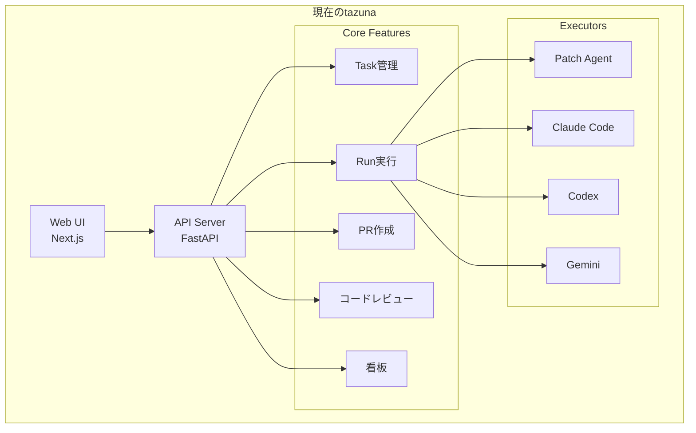
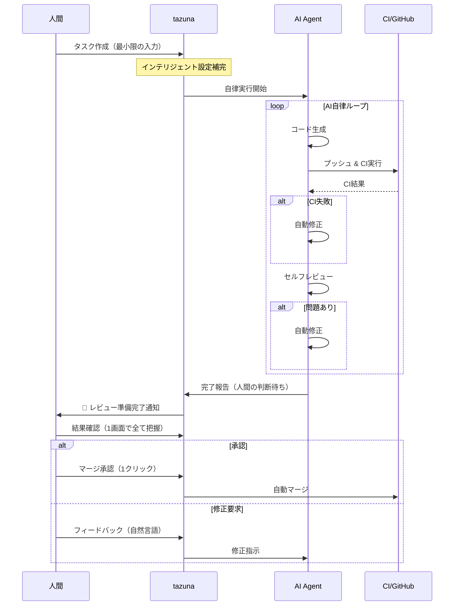

# tazuna Next Generation - 次世代設計ドキュメント

## 概要

このドキュメントは、tazunaを次世代のAIコーディングツールとして刷新するための設計指針と実装ロードマップを定義する。

### 設計コンセプト

1. **人間はAIにできず人間しかできないことだけをする**
2. **人間がやることを最小限、一目瞭然にする**
3. **AIが何をやっているか一目瞭然で確認できるようにする**
4. **ソフトウェアエンジニアリングにおける最高のUI/UX**
5. **PCでの開発体験を最高にする**
6. **AIの進歩はAI coding toolに任せて開発体験・開発効率の向上に努める**

---

## 目次

1. [現状分析](#現状分析)
2. [あるべき姿（Vision）](#あるべき姿vision)
3. [ギャップ分析](#ギャップ分析)
4. [優先度付き改善項目](#優先度付き改善項目)
5. [アーキテクチャ刷新](#アーキテクチャ刷新)
6. [UI/UX設計原則](#uiux設計原則)
7. [実装ロードマップ](#実装ロードマップ)

---

## 現状分析

### tazunaの現在の強み

| 強み | 説明 |
|-----|------|
| **マルチモデル並列実行** | GPT-4、Claude、Geminiを同時実行し比較可能 |
| **BYO API Key** | セルフホスト、自前APIキーでプライバシー確保 |
| **Web UIベース** | CLIやIDE不要、シンプルなインターフェース |
| **会話駆動開発** | チャットでPRを育てていくワークフロー |
| **CLI統合** | Claude Code、Codex、Gemini CLIをバックエンドで実行 |
| **3つのコーディングモード** | Interactive、Semi Auto、Full Auto |

### 現在の機能構成



### 現状の課題

#### 1. 人間の関与が多すぎる

| 操作 | 現状 | 問題点 |
|-----|------|--------|
| タスク作成 | 手動でリポジトリ、ブランチ、モデル、指示を入力 | 設定項目が多い |
| 実行トリガー | 毎回「Run」ボタンを押す | AIが自律的に動けない |
| CI失敗対応 | 人間がログを見て修正指示 | 本来AIが自動対応すべき |
| レビュー対応 | 人間がレビュー結果を見て修正指示 | 本来AIが自動対応すべき |
| PRマージ | 手動確認・マージ | Semi Autoでは適切、Full Autoでは不要 |

#### 2. AIの動作が不透明

| 問題 | 詳細 |
|-----|------|
| 進捗不明 | CLI実行中に何をしているか分からない |
| 判断理由不明 | AIがなぜその実装を選んだか分からない |
| エラー原因不明 | 失敗時の詳細が見えない |
| 比較困難 | マルチモデルの結果を比較しづらい |

#### 3. UI/UXの課題

| カテゴリ | 問題 |
|---------|------|
| 情報設計 | 重要な情報とそうでない情報が混在 |
| 操作効率 | キーボードショートカットが不十分 |
| フィードバック | 状態変化の通知が弱い |
| モバイル | レスポンシブ対応が不完全 |
| 一貫性 | コンポーネントのスタイルがバラバラ |

#### 4. ワークフローの断絶

```
現状のフロー（断続的）:
[指示] → 待機 → [結果確認] → 待機 → [追加指示] → 待機 → [PR作成] → 待機 → [CI確認] → ...

人間が各ステップで介入が必要
```

---

## あるべき姿（Vision）

### 人間中心設計の原則

```
「人間は意思決定に集中し、実行はAIに任せる」
```

#### 人間がやるべきこと（Human-Only）

| 役割 | 具体例 |
|-----|--------|
| **意思決定** | 何を作るか、どの方針を採用するか |
| **品質判断** | 最終的なコード品質の承認 |
| **ビジネス判断** | 優先順位、トレードオフの決定 |
| **創造的作業** | 新しいアイデア、アーキテクチャ設計 |

#### AIがやるべきこと（AI-Driven）

| 役割 | 具体例 |
|-----|--------|
| **実装** | コード生成、テスト作成 |
| **修正** | CI失敗の自動修正、レビュー指摘対応 |
| **検証** | テスト実行、リント、型チェック |
| **報告** | 進捗状況、問題点の可視化 |

### あるべき開発フロー



### 理想的なUI構成

```
┌─────────────────────────────────────────────────────────────────────────┐
│  tazuna                              🔔 2 件のレビュー待ち    [⌘K]    │
├─────────────────────────────────────────────────────────────────────────┤
│                                                                         │
│  ┌─────────────────┐  ┌───────────────────────────────────────────────┐│
│  │ 📋 タスク       │  │                                               ││
│  │                 │  │  🎯 認証機能の追加                            ││
│  │ ⏳ 実行中 (2)   │  │                                               ││
│  │ ├─ 認証機能追加  │  │  ┌─────────────────────────────────────────┐  ││
│  │ └─ APIリファクタ │  │  │ 📊 実行状況                              │  ││
│  │                 │  │  │                                         │  ││
│  │ 👀 レビュー待ち  │  │  │ Claude ████████████░░ 80% コード生成中   │  ││
│  │ ├─ バグ修正     │  │  │ GPT-4  ██████████████ 100% ✅ 完了       │  ││
│  │ └─ テスト追加   │  │  │ Gemini ██████░░░░░░░░ 45% テスト実行中   │  ││
│  │                 │  │  │                                         │  ││
│  │ ✅ 完了 (15)    │  │  └─────────────────────────────────────────┘  ││
│  │                 │  │                                               ││
│  └─────────────────┘  │  ┌─────────────────────────────────────────┐  ││
│                       │  │ 🔍 比較ビュー                            │  ││
│                       │  │                                         │  ││
│                       │  │ [GPT-4 ⭐] [Claude] [Gemini]             │  ││
│                       │  │                                         │  ││
│                       │  │ ファイル変更: 5 files (+120, -45)       │  ││
│                       │  │ テスト: 12/12 passed                    │  ││
│                       │  │ カバレッジ: 85%                         │  ││
│                       │  │                                         │  ││
│                       │  │ [Diff を見る] [この結果を採用] [再実行]   │  ││
│                       │  └─────────────────────────────────────────┘  ││
│                       │                                               ││
│                       │  ┌─────────────────────────────────────────┐  ││
│                       │  │ 💬 AIの判断理由                          │  ││
│                       │  │                                         │  ││
│                       │  │ 「JWTベースの認証を選択しました。        │  ││
│                       │  │  理由: 既存のセッション管理がなく、      │  ││
│                       │  │  APIファーストの設計に適しているため」   │  ││
│                       │  └─────────────────────────────────────────┘  ││
│                       └───────────────────────────────────────────────┘│
│                                                                         │
│  ┌─────────────────────────────────────────────────────────────────────┐│
│  │ ✍️ 追加指示...                                    [⌘ + Enter 送信] ││
│  └─────────────────────────────────────────────────────────────────────┘│
└─────────────────────────────────────────────────────────────────────────┘
```

---

## ギャップ分析

### コンセプト別ギャップ

#### 1. 「人間はAIにできず人間しかできないことだけをする」

| あるべき姿 | 現状 | ギャップ |
|-----------|------|---------|
| CI失敗はAIが自動修正 | 人間がログを見て指示 | 🔴 大 |
| レビュー指摘はAIが自動対応 | 人間が指示を出す | 🔴 大 |
| 定型タスクは完全自動化 | モード選択はあるがデフォルトがInteractive | 🟡 中 |
| 設定は一度だけ、以降は学習 | 毎回設定が必要 | 🟡 中 |

#### 2. 「人間がやることを最小限、一目瞭然にする」

| あるべき姿 | 現状 | ギャップ |
|-----------|------|---------|
| タスク作成は1行の指示のみ | リポジトリ、ブランチ、モデル選択が必要 | 🟡 中 |
| アクションは1クリック | 複数のステップが必要 | 🟡 中 |
| 「次にやるべきこと」が明確 | 画面ごとに探す必要あり | 🔴 大 |
| 通知で重要なことだけ伝わる | 通知システムが未整備 | 🔴 大 |

#### 3. 「AIが何をやっているか一目瞭然で確認できる」

| あるべき姿 | 現状 | ギャップ |
|-----------|------|---------|
| リアルタイム進捗表示 | ポーリングベース、詳細不明 | 🔴 大 |
| AIの判断理由が分かる | 結果のみ、理由は不明 | 🔴 大 |
| エラーの原因と対策が分かる | エラーメッセージのみ | 🟡 中 |
| 複数モデルの比較が容易 | カード羅列、比較ビューなし | 🔴 大 |

#### 4. 「ソフトウェアエンジニアリングにおける最高のUI/UX」

| あるべき姿 | 現状 | ギャップ |
|-----------|------|---------|
| 直感的でモダンなUI | 機能的だが洗練されていない | 🟡 中 |
| 情報の階層が明確 | 情報が混在 | 🟡 中 |
| エラー予防とリカバリー | 基本的なエラー処理のみ | 🟡 中 |
| アクセシビリティ対応 | 部分的な対応 | 🟡 中 |

#### 5. 「PCでの開発体験を最高にする」

| あるべき姿 | 現状 | ギャップ |
|-----------|------|---------|
| 豊富なキーボードショートカット | 基本的なもののみ | 🟡 中 |
| コマンドパレット | なし | 🔴 大 |
| 高速なレスポンス | 許容範囲内 | 🟢 小 |
| 大画面の有効活用 | 基本的な2カラム | 🟡 中 |

#### 6. 「AIの進歩はAI coding toolに任せる」

| あるべき姿 | 現状 | ギャップ |
|-----------|------|---------|
| CLIツールの抽象化 | 実装済み | 🟢 達成 |
| 新CLIの追加が容易 | Executor抽象化済み | 🟢 達成 |
| ツール非依存の体験 | 基本的に達成 | 🟢 達成 |

---

## 優先度付き改善項目

### P0: クリティカル（即座に対応）

```
開発体験に直接影響する根本的な問題
```

#### 1. 🔔 インテリジェント通知システム

**問題**: 人間が能動的にUIを見に行かないと状態が分からない

**解決策**:
- タスク完了、レビュー待ち、CI失敗などの重要イベントをプッシュ通知
- ブラウザ通知、音声通知、Slack/Discord連携
- 「今すぐ確認が必要」「後で確認」「情報のみ」の3段階

```typescript
// 通知の優先度
interface Notification {
  type: 'action_required' | 'review_ready' | 'info';
  title: string;
  body: string;
  actions: NotificationAction[];
  taskId: string;
}

// 例: レビュー準備完了
{
  type: 'action_required',
  title: '認証機能の追加 - レビュー準備完了',
  body: 'GPT-4が実装を完了しました。確認してください。',
  actions: [
    { label: '確認する', action: 'navigate', target: '/tasks/xxx' },
    { label: '後で', action: 'dismiss' }
  ]
}
```

**期待効果**: 人間は通知が来るまで他の作業に集中できる

---

#### 2. 📊 リアルタイム進捗可視化

**問題**: AIが何をしているか分からない、待ち時間が不安

**解決策**:
- WebSocketベースのリアルタイム更新
- フェーズ表示（分析 → 実装 → テスト → レビュー）
- ログのストリーミング表示
- 推定残り時間の表示

```
┌─────────────────────────────────────────────────────────────┐
│ 🔄 Claude Code 実行中                      経過: 2:34      │
├─────────────────────────────────────────────────────────────┤
│                                                             │
│  [✓] コード分析                           完了              │
│  [✓] 実装計画                             完了              │
│  [●] コード生成                           78%               │
│      └─ src/auth/jwt.ts を編集中                           │
│  [ ] テスト実行                           待機中            │
│  [ ] セルフレビュー                       待機中            │
│                                                             │
│  📝 最新ログ:                                               │
│  > jwt.ts にトークン検証ロジックを追加                      │
│  > ミドルウェアの統合中...                                  │
│                                                             │
│  推定残り時間: 約1分                                        │
│                                                             │
│  [詳細ログを表示] [キャンセル]                              │
└─────────────────────────────────────────────────────────────┘
```

**期待効果**: AIの動作が透明になり、信頼感が向上

---

#### 3. 🎯 「次にやるべきこと」の明示

**問題**: ユーザーが何をすべきか分からない

**解決策**:
- 全画面で「推奨アクション」を常に表示
- 空状態には具体的な次のステップを提示
- エラー時は復旧アクションを提示

```tsx
// 推奨アクションコンポーネント
<RecommendedAction
  priority="high"
  title="2件のタスクがレビュー待ちです"
  description="AIが実装を完了しました。結果を確認して承認またはフィードバックしてください。"
  actions={[
    { label: 'レビューする', href: '/tasks?status=in_review', primary: true },
    { label: '後で', action: 'dismiss' }
  ]}
/>
```

**期待効果**: ユーザーが迷わず作業を進められる

---

#### 4. 🔄 Semi Autoモードのデフォルト化

**問題**: Interactiveモードでは人間の介入が多すぎる

**解決策**:
- 新規タスクのデフォルトをSemi Autoに変更
- CI失敗時の自動修正を標準有効化
- レビュー指摘の自動対応を標準有効化
- 人間は最終確認のみ

```python
# 現在
class TaskCreate(BaseModel):
    coding_mode: CodingMode = CodingMode.INTERACTIVE  # デフォルト

# 変更後
class TaskCreate(BaseModel):
    coding_mode: CodingMode = CodingMode.SEMI_AUTO  # デフォルト
    auto_fix_ci: bool = True  # CI失敗時の自動修正
    auto_fix_review: bool = True  # レビュー指摘の自動対応
```

**期待効果**: 人間の介入が最小限になる

---

### P1: 高優先度（体験を大幅に向上）

#### 5. 🔍 マルチモデル比較ビュー

**問題**: 複数モデルの結果を比較しづらい

**解決策**:
- 横並び比較ビュー（Summary、Diff、メトリクス）
- 採用候補のピン留め
- AIによる比較サマリー自動生成

```
┌─────────────────────────────────────────────────────────────────────────┐
│ 📊 モデル比較                                                           │
├──────────────────┬──────────────────┬──────────────────┬────────────────┤
│     GPT-4 ⭐      │    Claude 3.5    │   Gemini Pro    │   採用を選択   │
├──────────────────┼──────────────────┼──────────────────┼────────────────┤
│ ✅ 成功          │ ✅ 成功          │ ⚠️ 警告あり      │                │
│ 5 files changed  │ 4 files changed  │ 4 files changed  │                │
│ +120 -45 lines   │ +95 -30 lines    │ +100 -35 lines   │                │
│ Tests: 12/12     │ Tests: 12/12     │ Tests: 11/12     │                │
│ Coverage: 85%    │ Coverage: 82%    │ Coverage: 80%    │                │
├──────────────────┴──────────────────┴──────────────────┴────────────────┤
│ 💡 AIの推奨: GPT-4の実装が最もテストカバレッジが高く、                   │
│    エッジケースの処理も含まれています。                                  │
└─────────────────────────────────────────────────────────────────────────┘
```

---

#### 6. ⌨️ コマンドパレット

**問題**: 操作効率が悪い、マウス依存

**解決策**:
- `Cmd/Ctrl + K` でコマンドパレットを開く
- タスク検索、画面遷移、アクション実行
- 最近使った項目、お気に入り

```
┌─────────────────────────────────────────────────────────────┐
│ > タスクを検索またはコマンドを入力...                        │
├─────────────────────────────────────────────────────────────┤
│ 📌 最近のタスク                                             │
│ └─ 認証機能の追加                          ⏳ 実行中        │
│ └─ APIリファクタリング                     👀 レビュー待ち   │
│ └─ バグ修正 #123                           ✅ 完了          │
│                                                             │
│ ⚡ コマンド                                                  │
│ └─ 新規タスク作成                          ⌘ N              │
│ └─ 設定を開く                              ⌘ ,              │
│ └─ 看板ボードを開く                        ⌘ B              │
│ └─ ショートカット一覧                      ⌘ /              │
└─────────────────────────────────────────────────────────────┘
```

---

#### 7. 🧠 AIの判断理由可視化

**問題**: AIがなぜその実装を選んだか分からない

**解決策**:
- 実装完了時に判断理由を自動生成
- トレードオフの説明
- 代替案の提示

```
┌─────────────────────────────────────────────────────────────┐
│ 💡 AIの判断理由                                             │
├─────────────────────────────────────────────────────────────┤
│                                                             │
│ ## 実装アプローチ                                           │
│ JWTベースの認証を選択しました。                              │
│                                                             │
│ ## 選択理由                                                 │
│ 1. 既存のセッション管理がないため、ステートレスなJWTが適切   │
│ 2. APIファーストの設計に適している                          │
│ 3. 既存の依存関係（fastapi-jwt-auth）と互換性がある         │
│                                                             │
│ ## 考慮した代替案                                           │
│ - セッションベース認証: サーバー側の状態管理が必要になる    │
│ - OAuth2のみ: 自前のログインが不要な場合に適切              │
│                                                             │
│ ## 注意点                                                   │
│ - トークンの有効期限は15分に設定（セキュリティとUXのバランス）│
│ - リフレッシュトークンは7日間有効                           │
│                                                             │
│ [詳細を見る] [別のアプローチを試す]                          │
└─────────────────────────────────────────────────────────────┘
```

---

#### 8. 📝 スマートタスク作成

**問題**: タスク作成時の入力項目が多い

**解決策**:
- 指示文からリポジトリ、ブランチを自動推測
- 直前のコンテキストを継承
- テンプレート・プリセット機能

```
┌─────────────────────────────────────────────────────────────┐
│ 新規タスク                                                  │
├─────────────────────────────────────────────────────────────┤
│                                                             │
│ 💬 何を実装しますか？                                        │
│ ┌─────────────────────────────────────────────────────────┐ │
│ │ ユーザー認証機能を追加してください。                      │ │
│ │ - メールアドレスとパスワードでログイン                   │ │
│ │ - JWTトークンを使用                                      │ │
│ └─────────────────────────────────────────────────────────┘ │
│                                                             │
│ 🔧 自動設定（変更可能）                                      │
│                                                             │
│ リポジトリ: hampen2929/tazuna         [変更]                │
│ ブランチ: main                        [変更]                │
│ モデル: Claude 3.5, GPT-4             [変更]                │
│ モード: Semi Auto                     [変更]                │
│                                                             │
│ [作成して実行] [下書き保存]                                  │
└─────────────────────────────────────────────────────────────┘
```

---

### P2: 中優先度（品質向上）

#### 9. 🎨 デザインシステムの統一

- CSS変数によるテーマ管理
- コンポーネントライブラリの整備
- タイポグラフィ、スペーシング、アイコンの標準化

#### 10. ♿ アクセシビリティ強化

- キーボードナビゲーションの完全対応
- スクリーンリーダー対応（aria-label, aria-live）
- カラーコントラストの改善
- prefers-reduced-motion対応

#### 11. 📱 レスポンシブ対応強化

- モバイルでの基本操作対応
- タブレットでの快適な操作
- 画面サイズに応じたレイアウト最適化

#### 12. 🔒 エラーハンドリング強化

- エラーの分類と適切な対処法の提示
- リトライ機能
- 部分的な失敗からの復旧

---

### P3: 将来投資

#### 13. 🌐 i18n（国際化）

- 日本語/英語の切り替え
- 日時フォーマットのローカライズ

#### 14. 📈 分析ダッシュボード

- タスク完了率、AIの成功率
- コスト分析（API使用量）
- チーム生産性メトリクス

#### 15. 🔗 IDE統合

- VS Code拡張
- JetBrains IDEプラグイン
- ステータスバー通知

#### 16. 🤖 AIエージェントの拡張

- 複数タスクの並列実行
- 依存関係を考慮した実行順序
- 長期実行タスクの管理

---

## アーキテクチャ刷新

### 現在のアーキテクチャ

```
┌─────────────┐     ┌─────────────┐     ┌─────────────┐
│   Web UI    │────▶│  FastAPI    │────▶│  Executors  │
│  (Next.js)  │     │   Server    │     │  (CLI/LLM)  │
└─────────────┘     └─────────────┘     └─────────────┘
       │                   │
       │                   ▼
       │            ┌─────────────┐
       │            │   SQLite    │
       │            └─────────────┘
       │
       └──────────▶ ポーリングベースの更新
```

### 刷新後のアーキテクチャ

```
┌─────────────┐     ┌─────────────┐     ┌─────────────┐
│   Web UI    │◀═══▶│  FastAPI    │────▶│  Executors  │
│  (Next.js)  │     │   Server    │     │  (CLI/LLM)  │
└─────────────┘     └─────────────┘     └─────────────┘
       │                   │                   │
       │                   │                   │
       │            ┌──────┴──────┐            │
       │            │             │            │
       │            ▼             ▼            │
       │     ┌─────────────┐ ┌─────────────┐  │
       │     │   SQLite    │ │    Redis    │  │
       │     │   (Data)    │ │  (PubSub)   │◀─┘
       │     └─────────────┘ └─────────────┘
       │                          │
       │                          │
       └──────────────────────────┘
              WebSocket (リアルタイム)
```

### 主な変更点

| 領域 | 現在 | 刷新後 |
|-----|------|--------|
| 状態更新 | ポーリング | WebSocket |
| 通知 | なし | Push通知（ブラウザ、外部連携） |
| キュー | インメモリ | Redis（オプション） |
| 進捗追跡 | ログのみ | 構造化された進捗イベント |

---

## UI/UX設計原則

### 1. 情報の階層化

```
緊急度高 ─────────────────────────────────────────▶ 緊急度低

[🔴 要対応]      [🟡 確認推奨]      [🔵 情報]      [⚪ 詳細]
  CI失敗          レビュー待ち       実行完了        ログ
  エラー          警告              進捗更新        メタデータ
```

### 2. プログレッシブ・ディスクロージャー

```
Level 1: サマリー（常に表示）
├─ タスク名、ステータス、主要メトリクス

Level 2: 詳細（クリックで展開）
├─ Diff、ログ、AIの判断理由

Level 3: 生データ（明示的にリクエスト）
└─ 完全なログ、Raw Patch
```

### 3. 一貫したアクションパターン

| アクション | ショートカット | 場所 |
|-----------|--------------|------|
| 実行 | `Cmd + Enter` | 入力欄 |
| 送信 | `Cmd + Enter` | フォーム |
| キャンセル | `Escape` | モーダル、操作中 |
| 検索 | `Cmd + K` | グローバル |
| 設定 | `Cmd + ,` | グローバル |

### 4. フィードバックの即時性

- 操作後 100ms 以内に視覚的フィードバック
- 楽観的UI更新（サーバー応答を待たない）
- 失敗時は明確なロールバック

---

## 実装ロードマップ

### Phase 1: 基盤整備（2-3週間）

| 項目 | 優先度 | 工数 |
|-----|-------|------|
| WebSocket基盤の実装 | P0 | 高 |
| 通知システムの基盤 | P0 | 中 |
| Semi Autoモードのデフォルト化 | P0 | 低 |
| 進捗イベントの構造化 | P0 | 中 |

### Phase 2: コア体験の改善（3-4週間）

| 項目 | 優先度 | 工数 |
|-----|-------|------|
| リアルタイム進捗表示UI | P0 | 高 |
| 推奨アクションコンポーネント | P0 | 中 |
| マルチモデル比較ビュー | P1 | 高 |
| コマンドパレット | P1 | 中 |
| スマートタスク作成 | P1 | 中 |

### Phase 3: UI/UX洗練（2-3週間）

| 項目 | 優先度 | 工数 |
|-----|-------|------|
| AIの判断理由表示 | P1 | 中 |
| デザインシステム統一 | P2 | 中 |
| アクセシビリティ強化 | P2 | 中 |
| キーボードショートカット拡充 | P2 | 低 |

### Phase 4: 拡張機能（継続的）

| 項目 | 優先度 | 工数 |
|-----|-------|------|
| ブラウザ通知 | P1 | 低 |
| Slack/Discord連携 | P2 | 中 |
| i18n | P3 | 高 |
| 分析ダッシュボード | P3 | 高 |

---

## 成功指標（KPI）

### ユーザー体験

| 指標 | 現状（推定） | 目標 |
|-----|------------|------|
| タスク開始から完了までの人間の操作回数 | 10回以上 | 3回以下 |
| 初回PR作成までの時間 | 15分以上 | 5分以下 |
| CI失敗からの自動復旧率 | 0% | 80%以上 |
| AIの動作透明性スコア（主観） | 2/5 | 4/5 |

### 技術指標

| 指標 | 現状 | 目標 |
|-----|------|------|
| 状態更新の遅延 | 5秒（ポーリング） | 100ms以下（WebSocket） |
| Lighthouse Accessibility | 未測定 | 90以上 |
| キーボード操作カバー率 | 30% | 90%以上 |

---

## まとめ

### tazuna Next Generationの目指す姿

```
「人間は意思決定に集中し、実行と修正はAIが自律的に行う」
「必要な情報が必要なタイミングで届き、1クリックで次に進める」
「AIが何をしているか常に把握でき、信頼して任せられる」
```

### 最も重要な3つの改善

1. **通知システム**: 能動的な確認から、必要なときに通知が来る受動的な体験へ
2. **リアルタイム進捗**: AIの動作を透明化し、信頼感を構築
3. **Semi Autoデフォルト**: 人間の介入を最小限に、AIの自律性を最大化

### 関連ドキュメント

- [UI/UX Improvement Plan v2](./ui-ux-improvement-v2.md) - 詳細なUI改善項目
- [Agentic Tazuna](./agentic-dursor.md) - 自律的開発フロー設計
- [Coding Mode](./coding-mode.md) - 3つのコーディングモードの設計
- [Architecture](./architecture.md) - システムアーキテクチャ
- [Review](./review.md) - コードレビュー機能
- [Kanban](./kanban.md) - 看板機能
