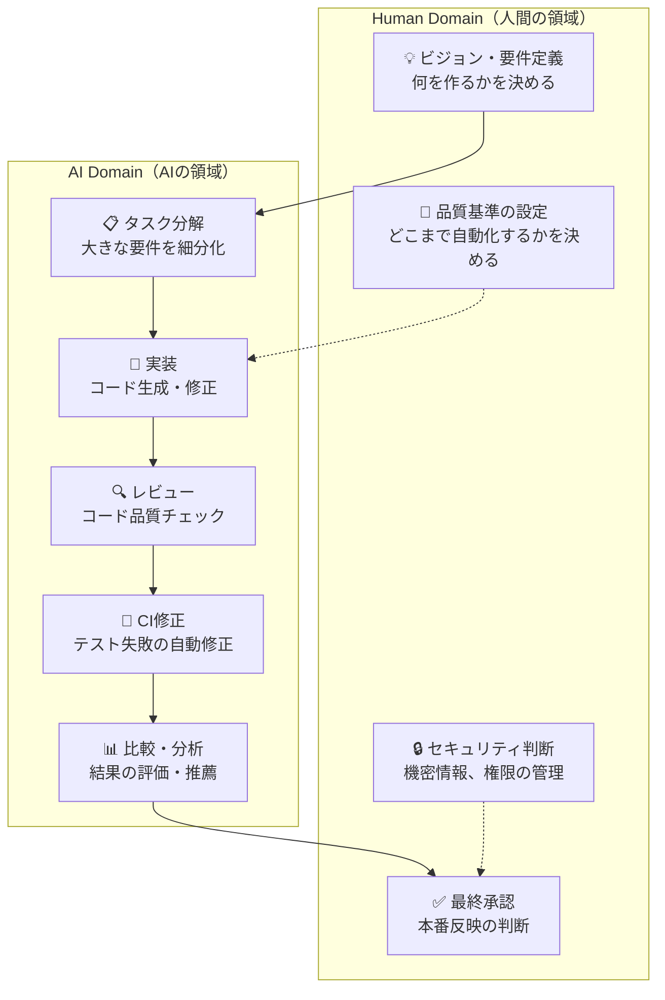
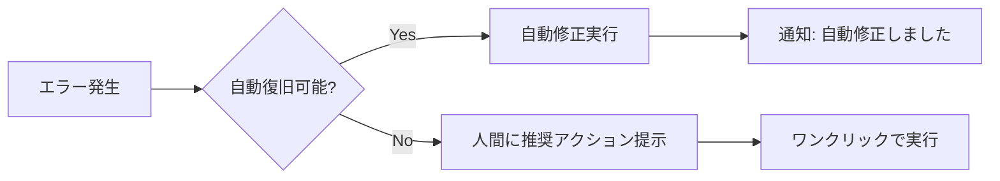
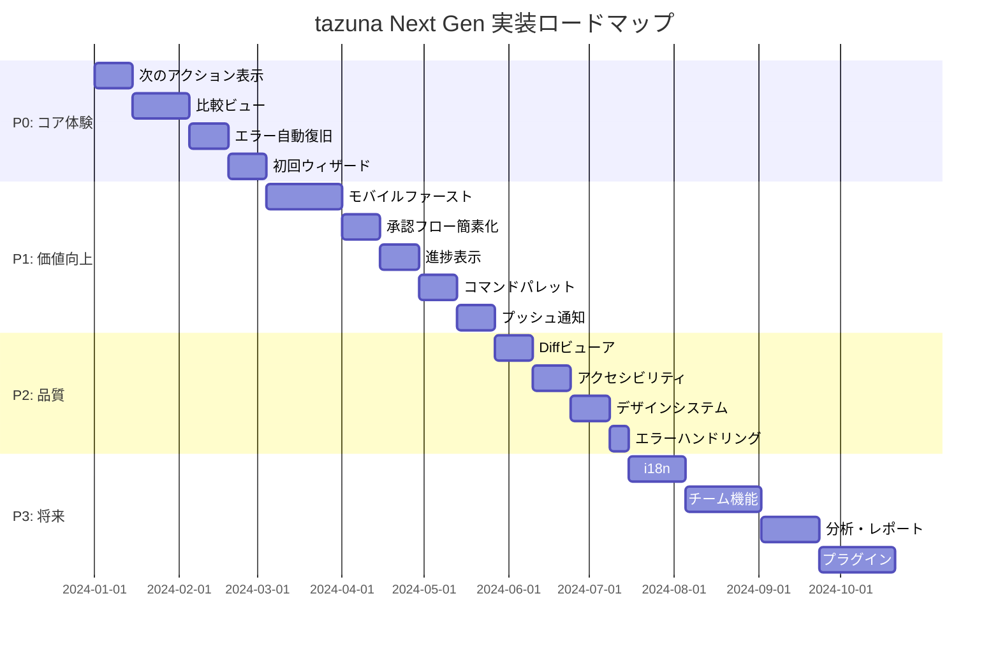

# tazuna Next Generation - 刷新計画

## コンセプト

```
"人間はAIにできないことだけをする"
```

### 5つの指針

1. **Human-only Tasks**: 人間はAIにできず人間しかできないことだけをする
2. **Minimal & Obvious**: 人間がやることを最小限、一目瞭然にする
3. **Best-in-class UX**: ソフトウェアエンジニアリングにおける最高のUI/UX
4. **Anywhere Development**: パソコン、スマホ、どこからでも最高の開発体験
5. **Focus on DX**: AIの進歩はAI coding toolに任せて開発体験、開発効率の向上に努める

---

## 現状とあるべき姿

### 1. 人間がやるべきことの明確化

| 領域 | 現状 | あるべき姿 | ギャップ |
|------|------|-----------|---------|
| **意思決定** | PR作成、マージを手動で選択 | 承認ポイントのみに集中 | 中間操作が多すぎる |
| **品質判断** | 各Runの結果を個別に確認 | AIが比較・推薦、人間は最終判断 | 比較UIが弱い |
| **設定** | GitHub App、API Key等の初期設定 | ガイド付きウィザード | 導線が不明確 |
| **フィードバック** | レビュー指摘の確認・修正指示 | AIが自動対応、異常時のみ人間介入 | 自動化レベルが低い |

### 2. UI/UX

| 領域 | 現状 | あるべき姿 | ギャップ |
|------|------|-----------|---------|
| **情報設計** | 機能中心の画面構成 | タスク中心、アクション中心 | 認知負荷が高い |
| **比較体験** | Runカードの羅列 | Side-by-side比較、差分ハイライト | 比較機能が未実装 |
| **進捗表示** | ステータスバッジのみ | フェーズ表示、ETA、ステップ可視化 | 透明性が低い |
| **エラー回復** | エラーメッセージ表示 | 推奨アクション提示、ワンクリック修正 | 次の手順が不明 |
| **キーボード操作** | 基本的なショートカット | コマンドパレット、完全キーボード操作 | パワーユーザー向け機能不足 |

### 3. モバイル体験

| 領域 | 現状 | あるべき姿 | ギャップ |
|------|------|-----------|---------|
| **レスポンシブ** | 最低限のモバイル対応 | モバイルファースト設計 | Diff、Kanban等が見づらい |
| **タッチ操作** | 基本的なタップ対応 | スワイプ、ジェスチャー対応 | 操作効率が低い |
| **通知** | ブラウザ内トースト | Push通知、モバイルアラート | 外出先での追跡が困難 |
| **オフライン** | 非対応 | 読み取り専用オフラインモード | 接続不安定時に使えない |

### 4. 開発効率

| 領域 | 現状 | あるべき姿 | ギャップ |
|------|------|-----------|---------|
| **自動化レベル** | Semi Auto/Full Autoモード実装済 | デフォルトで最大自動化 | 設定の推奨が弱い |
| **ブランチ管理** | 手動ブランチ選択 | 自動ブランチ作成・命名 | 認知負荷が高い |
| **テンプレート** | なし | タスクテンプレート、インストラクション例文 | 入力の敷居が高い |
| **バッチ操作** | 単一タスク操作 | 複数タスク一括操作 | 大規模プロジェクトで非効率 |

---

## 人間がやるべきこと（Human-only Tasks）

tazunaにおいて**人間だけができること**を明確に定義し、それ以外はAIに委譲する。

### 人間が担当すべき領域



### 人間のアクション一覧（理想状態）

| アクション | 頻度 | 所要時間 | 備考 |
|-----------|------|---------|------|
| 要件・指示の入力 | タスクごとに1回 | 1-5分 | 自然言語で記述 |
| 承認ボタン押下 | PRごとに1回 | 10秒 | Full Autoでは不要 |
| 品質基準の調整 | 月1回程度 | 5分 | 設定画面で調整 |
| 異常対応 | 稀 | 数分 | AIが解決できない問題 |

---

## 優先度付き改善ロードマップ

### 凡例

- **P0**: 最優先（コア体験を阻害している問題）
- **P1**: 高優先（価値を大きく向上させる機能）
- **P2**: 中優先（品質・一貫性の向上）
- **P3**: 将来投資（差別化・拡張性）

---

## P0: コア体験の改善（最優先）

### P0-1: "次に何をすべきか"を常に表示

**課題**: ユーザーが次のアクションを判断できない場面が多い

**改善内容**:

```
┌─────────────────────────────────────────────────────────────┐
│  📋 次のステップ                                             │
│  ─────────────────────────────────────────────────────────  │
│                                                             │
│  ✓ Claude Code の実行が完了しました                          │
│                                                             │
│  👉 推奨アクション:                                          │
│  ┌─────────────────────────────────────────────────────────┐│
│  │ [PR を作成する]  ← 最も一般的な次のステップ               ││
│  │                                                         ││
│  │ または:                                                  ││
│  │ • 別のモデルでも実行する                                 ││
│  │ • レビューを依頼する                                     ││
│  │ • 修正を依頼する                                         ││
│  └─────────────────────────────────────────────────────────┘│
└─────────────────────────────────────────────────────────────┘
```

**実装項目**:
- [ ] コンテキストに応じた推奨アクションの表示
- [ ] 設定不足時のガイダンス（GitHub App、API Key等）
- [ ] エラー発生時の復旧パス提示
- [ ] 空状態での導線表示

---

### P0-2: マルチモデル比較ビュー

**課題**: 並列実行の価値を活かせていない（カードの羅列のみ）

**改善内容**:

```
┌─────────────────────────────────────────────────────────────┐
│  📊 実行結果比較                              [比較モード ON]│
│  ─────────────────────────────────────────────────────────  │
│                                                             │
│  ┌───────────────┬───────────────┬───────────────┐         │
│  │ Claude Code   │ Codex         │ Gemini        │         │
│  ├───────────────┼───────────────┼───────────────┤         │
│  │ ✓ 成功        │ ✓ 成功       │ ⚠️ 警告        │         │
│  │ 5 files       │ 4 files       │ 6 files       │         │
│  │ +120 -45      │ +95 -30       │ +150 -60      │         │
│  │ ⭐ 推奨       │               │               │         │
│  └───────────────┴───────────────┴───────────────┘         │
│                                                             │
│  💡 AI推薦: Claude Code の結果が最もシンプルです             │
│                                                             │
│  [Claude Code で PR 作成]  [詳細を比較]                      │
└─────────────────────────────────────────────────────────────┘
```

**実装項目**:
- [ ] Side-by-side比較UI
- [ ] Diff比較（ファイルごと、行ごと）
- [ ] AI推薦機能（変更量、複雑度、リスク評価）
- [ ] 結果のピン留め・選択機能

---

### P0-3: エラーからの自動復旧

**課題**: エラー発生時に人間が対処方法を考える必要がある

**改善内容**:



**実装項目**:
- [ ] エラーパターンの分類と対処法マッピング
- [ ] 自動再試行（ネットワークエラー、レート制限）
- [ ] 推奨アクションのワンクリック実行
- [ ] エスカレーションルール設定

---

### P0-4: 初回設定ウィザード

**課題**: 初回アクセス時に何をすべきかわからない

**改善内容**:

```
┌─────────────────────────────────────────────────────────────┐
│  🎉 tazuna へようこそ！                                      │
│                                                             │
│  セットアップを完了して、最初のタスクを作成しましょう         │
│                                                             │
│  ┌─────────────────────────────────────────────────────────┐│
│  │ ✓ 1. GitHub App を接続        [完了]                    ││
│  │    リポジトリへのアクセス権限を設定                       ││
│  ├─────────────────────────────────────────────────────────┤│
│  │ → 2. 実行器を設定              [設定する]                ││
│  │    Claude Code、Codex、Geminiから選択                    ││
│  ├─────────────────────────────────────────────────────────┤│
│  │ ○ 3. 最初のタスクを作成                                  ││
│  │    バグ修正や機能追加を依頼してみましょう                 ││
│  └─────────────────────────────────────────────────────────┘│
│                                                             │
│  [スキップして後で設定]                                      │
└─────────────────────────────────────────────────────────────┘
```

**実装項目**:
- [ ] ステップバイステップのオンボーディングフロー
- [ ] 各ステップの完了状態の永続化
- [ ] 設定不足時のリマインダー
- [ ] スキップ可能なオプション設定

---

## P1: 価値向上（高優先）

### P1-1: モバイルファースト設計

**課題**: モバイルでの開発体験が著しく劣る

**改善内容**:

```
┌──────────────────┐    ┌──────────────────┐
│ 📱 Mobile View   │    │ 💻 Desktop View  │
├──────────────────┤    ├──────────────────┤
│                  │    │ ┌──────┬────────┐│
│  Task #42        │    │ │ Side │ Main   ││
│  ──────────────  │    │ │ bar  │ Content││
│                  │    │ │      │        ││
│  [Tab: Chat]     │    │ │      │        ││
│  [Tab: Results]  │    │ │      │        ││
│  [Tab: PR]       │    │ └──────┴────────┘│
│                  │    │                  │
│  ──────────────  │    │                  │
│  [📝] [🤖] [📊]  │    │                  │
└──────────────────┘    └──────────────────┘
```

**実装項目**:
- [ ] レスポンシブレイアウトの全面見直し
- [ ] モバイル専用ナビゲーション（ボトムタブ）
- [ ] タッチ最適化（スワイプ、ロングプレス）
- [ ] モバイル向けDiffビューア
- [ ] PWA対応（ホーム画面追加、オフライン対応）

---

### P1-2: 承認フローの簡素化

**課題**: 承認に必要なアクションが多すぎる

**現状のフロー**:
```
指示入力 → 実行器選択 → モデル選択 → 実行 → 結果確認
→ PR作成ボタン → タイトル入力 → 作成 → CI確認 → マージ
```

**あるべきフロー**:
```
指示入力 → 実行（自動選択）→ [承認] → 完了
```

**実装項目**:
- [ ] スマートデフォルト（過去の選択から学習）
- [ ] ワンクリックPR作成（タイトル・説明自動生成）
- [ ] 承認待ちダッシュボード
- [ ] バッチ承認機能

---

### P1-3: リアルタイム進捗表示

**課題**: 実行中に何が起きているかわからない

**改善内容**:

```
┌─────────────────────────────────────────────────────────────┐
│  🔄 Claude Code 実行中                         [キャンセル] │
│  ─────────────────────────────────────────────────────────  │
│                                                             │
│  ⏱️ 経過時間: 2:34 / 推定残り: 1:30                          │
│                                                             │
│  [████████████████░░░░░░░░] 65%                             │
│                                                             │
│  📋 ステップ:                                               │
│  ├── ✓ コードベース分析 (完了)                              │
│  ├── ✓ 変更箇所特定 (完了)                                  │
│  ├── 🔄 コード生成中...                                     │
│  │      └── src/components/Button.tsx を編集中              │
│  └── ○ テスト実行 (待機中)                                  │
│                                                             │
│  💬 最新ログ:                                               │
│  > Generating implementation for Button component...        │
│                                                             │
│  [ログを展開] [バックグラウンドで実行]                       │
└─────────────────────────────────────────────────────────────┘
```

**実装項目**:
- [ ] ステップベースの進捗表示
- [ ] 推定残り時間表示
- [ ] ライブログストリーミング
- [ ] バックグラウンド実行と通知

---

### P1-4: コマンドパレット

**課題**: パワーユーザーにとって操作が遅い

**改善内容**:

```
┌─────────────────────────────────────────────────────────────┐
│  🔍 コマンドを入力...                                 ⌘K    │
├─────────────────────────────────────────────────────────────┤
│                                                             │
│  📋 最近の操作                                              │
│  ├── 新規タスク作成                              ⌘N        │
│  ├── PR作成                                      ⌘P        │
│  └── 設定を開く                                  ⌘,        │
│                                                             │
│  🔧 アクション                                              │
│  ├── タスク検索...                               ⌘F        │
│  ├── リポジトリを変更...                                    │
│  ├── 実行をキャンセル                            Esc       │
│  └── ヘルプを表示                                ⌘?        │
│                                                             │
│  📁 最近のタスク                                            │
│  ├── #42: バグ修正 - ログイン画面                           │
│  ├── #41: 機能追加 - ダークモード                           │
│  └── #40: リファクタリング - API層                          │
│                                                             │
└─────────────────────────────────────────────────────────────┘
```

**実装項目**:
- [ ] ⌘K / Ctrl+K でコマンドパレット起動
- [ ] ファジー検索
- [ ] 最近の操作履歴
- [ ] タスク・リポジトリ・設定への高速アクセス

---

### P1-5: プッシュ通知

**課題**: ブラウザを離れると進捗がわからない

**実装項目**:
- [ ] Web Push Notification対応
- [ ] 通知設定のカスタマイズ
- [ ] モバイルアプリ（PWA）での通知
- [ ] Slack/Discord連携

---

## P2: 品質向上（中優先）

### P2-1: Diffビューアの改善

**実装項目**:
- [ ] ファイルツリー + Diff表示の2カラムレイアウト
- [ ] Unified / Split表示の切り替え
- [ ] シンタックスハイライト
- [ ] 行コメント機能
- [ ] コピー・ダウンロード機能

---

### P2-2: アクセシビリティ

**実装項目**:
- [ ] キーボードナビゲーションの完全対応
- [ ] スクリーンリーダー対応（aria-label、aria-live）
- [ ] フォーカス管理の改善
- [ ] 色覚多様性への配慮
- [ ] prefers-reduced-motion対応

---

### P2-3: デザインシステムの統一

**実装項目**:
- [ ] CSS変数によるテーマ管理
- [ ] コンポーネントの一貫性確保
- [ ] アイコン体系の統一（Heroicons統一）
- [ ] タイポグラフィのガイドライン
- [ ] スペーシング・レイアウトの標準化

---

### P2-4: エラーハンドリングの統一

**実装項目**:
- [ ] エラー分類体系の定義
- [ ] 統一されたエラー表示コンポーネント
- [ ] 自動リトライロジック
- [ ] エラー報告機能

---

## P3: 将来投資

### P3-1: 国際化（i18n）

**実装項目**:
- [ ] 文言の辞書化
- [ ] 日本語/英語切り替え
- [ ] 日付・数値フォーマットのローカライズ

---

### P3-2: チーム機能

**実装項目**:
- [ ] マルチユーザー対応
- [ ] 権限管理
- [ ] タスクの共有・アサイン
- [ ] チームダッシュボード

---

### P3-3: 分析・レポート

**実装項目**:
- [ ] 利用統計ダッシュボード
- [ ] コスト分析（API使用量）
- [ ] 生産性メトリクス
- [ ] エクスポート機能

---

### P3-4: プラグインシステム

**実装項目**:
- [ ] カスタム実行器の追加
- [ ] Webhook連携
- [ ] 外部ツール統合（Jira、Linear等）

---

## 実装フェーズ



---

## 成功指標（KPI）

| 指標 | 現状推定 | 目標 | 測定方法 |
|-----|---------|------|---------|
| **タスク完了率** | 70% | 95% | 開始したタスクのうち完了したもの |
| **初回PR作成時間** | 15分 | 5分 | 初見ユーザーがPRを作るまでの時間 |
| **人間操作回数/タスク** | 10回 | 3回 | 1タスク完了に必要なクリック/入力数 |
| **モバイル利用率** | 5% | 30% | モバイルデバイスからのアクセス割合 |
| **エラー自動復旧率** | 0% | 80% | 自動的に解決されたエラーの割合 |
| **ユーザー満足度** | - | 4.5/5 | フィードバック調査 |

---

## アーキテクチャの方向性

### フロントエンド

```
現状: Next.js + SWR + Tailwind
↓
目標: Next.js + React Server Components + Streaming + PWA
```

**変更点**:
- Server Componentsでの初期ロード高速化
- Streaming SSRでの段階的レンダリング
- Service Workerでのオフライン対応
- Edge Functionsでの低レイテンシ

### バックエンド

```
現状: FastAPI + SQLite + In-memory Queue
↓
目標: FastAPI + SQLite/PostgreSQL + Redis + WebSocket
```

**変更点**:
- WebSocketでのリアルタイム更新
- Redis Pub/Subでのイベント配信
- 将来的なPostgreSQL移行パス
- 分散タスクキュー（Celery）

### AI統合

```
現状: CLI実行器 + Patch Agent
↓
目標: 統一されたAgent Interface + Pluggable Executors
```

**変更点**:
- エージェントインターフェースの統一
- 実行器のプラグイン化
- 結果の構造化・比較可能化
- コスト・レイテンシのトラッキング

---

## 関連ドキュメント

- [UI/UX Improvement v2](./ui-ux-improvement-v2.md) - 詳細なUI改善計画
- [Coding Mode](./coding-mode.md) - 自動化レベルの設計
- [Architecture](./architecture.md) - システムアーキテクチャ
- [AI Role Refactoring](./refactoring-ai-role.md) - AIロール共通インターフェース

---

## 次のアクション

1. **P0項目の詳細設計**: 各P0項目のUI/APIデザイン文書作成
2. **モバイルUI調査**: 競合ツールのモバイル体験調査
3. **ユーザーインタビュー**: 現ユーザーへのヒアリング
4. **技術検証**: React Server Components、PWA、WebSocketの検証
