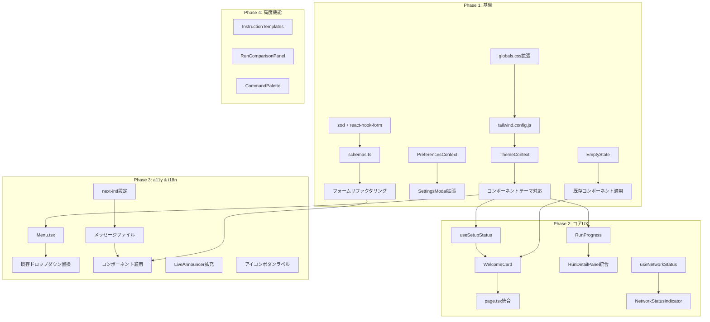

# UI/UX 改善 実装計画書

このドキュメントは、zloth の UI/UX 改善を実現するための詳細な実装計画です。コードベースの調査結果に基づき、各改善項目について具体的な実装方法、修正対象ファイル、依存関係を記載しています。

## 目次

1. [概要](#概要)
2. [Phase 1: 基盤整備](#phase-1-基盤整備)
3. [Phase 2: コアUX改善](#phase-2-コアux改善)
4. [Phase 3: アクセシビリティ & i18n](#phase-3-アクセシビリティ--i18n)
5. [Phase 4: 高度な機能](#phase-4-高度な機能)
6. [ファイル変更サマリー](#ファイル変更サマリー)
7. [依存関係グラフ](#依存関係グラフ)

---

## 概要

### 現状分析サマリー

| カテゴリ | 現状 | 課題 |
|---------|------|------|
| デザインシステム | Tailwind + CSS変数（40+） | ハードコードされた色、テーマ切替不可 |
| i18n | なし（日英混在） | 322個のハードコード文字列 |
| フォームバリデーション | 手動、送信時のみ | リアルタイムバリデーションなし |
| 空状態 | 部分的に実装 | 一貫性なし、CTAが不足 |
| アクセシビリティ | 基本的なARIA実装 | ドロップダウンのキーボード操作不可 |
| プリファレンス | バックエンドのみ | クライアント側キャッシュなし |

### 改善目標

```
オンボーディング:    2/5 → 4/5
情報設計:           3/5 → 4/5
タスク効率:         3/5 → 5/5
エラーハンドリング:  3/5 → 5/5
認知負荷:           3/5 → 4/5
比較体験:           2/5 → 5/5
```

---

## Phase 1: 基盤整備

**期間**: 2週間
**目標**: テーマシステム、プリファレンス管理、フォームバリデーションの基盤を整備

### 1.1 テーマシステムの構築

**目的**: ダーク/ライトモード切替、将来的なカスタマイズの基盤

#### 1.1.1 CSS変数の拡張

**修正ファイル**: `apps/web/src/app/globals.css`

```css
/* 現状: :root のみ */
/* 改善: テーマ別の変数定義 */

:root {
  /* 共通 */
  --radius-sm: 4px;
  --radius-md: 8px;
  --radius-lg: 12px;
  --radius-full: 9999px;
}

:root, [data-theme="dark"] {
  --color-bg-primary: #030712;
  --color-bg-secondary: #111827;
  --color-bg-tertiary: #1f2937;
  --color-bg-elevated: #374151;

  --color-text-primary: #f9fafb;
  --color-text-secondary: #d1d5db;
  --color-text-muted: #9ca3af;

  --color-border-default: #374151;
  --color-border-subtle: #1f2937;

  --color-interactive-primary: #2563eb;
  --color-interactive-primary-hover: #1d4ed8;
}

[data-theme="light"] {
  --color-bg-primary: #ffffff;
  --color-bg-secondary: #f9fafb;
  --color-bg-tertiary: #f3f4f6;
  --color-bg-elevated: #ffffff;

  --color-text-primary: #111827;
  --color-text-secondary: #374151;
  --color-text-muted: #6b7280;

  --color-border-default: #e5e7eb;
  --color-border-subtle: #f3f4f6;
}
```

#### 1.1.2 Tailwind設定の拡張

**修正ファイル**: `apps/web/tailwind.config.js`

```javascript
// 現状: 2つのCSS変数のみ
// 改善: 全セマンティックカラーをマッピング

module.exports = {
  theme: {
    extend: {
      colors: {
        bg: {
          primary: 'var(--color-bg-primary)',
          secondary: 'var(--color-bg-secondary)',
          tertiary: 'var(--color-bg-tertiary)',
          elevated: 'var(--color-bg-elevated)',
        },
        text: {
          primary: 'var(--color-text-primary)',
          secondary: 'var(--color-text-secondary)',
          muted: 'var(--color-text-muted)',
        },
        border: {
          DEFAULT: 'var(--color-border-default)',
          subtle: 'var(--color-border-subtle)',
        },
        interactive: {
          primary: 'var(--color-interactive-primary)',
          'primary-hover': 'var(--color-interactive-primary-hover)',
        },
      },
    },
  },
};
```

#### 1.1.3 テーマプロバイダーの作成

**新規ファイル**: `apps/web/src/context/ThemeContext.tsx`

```typescript
'use client';

import { createContext, useContext, useEffect, useState } from 'react';

type Theme = 'light' | 'dark' | 'system';

interface ThemeContextValue {
  theme: Theme;
  resolvedTheme: 'light' | 'dark';
  setTheme: (theme: Theme) => void;
}

const ThemeContext = createContext<ThemeContextValue | null>(null);

export function ThemeProvider({ children }: { children: React.ReactNode }) {
  const [theme, setTheme] = useState<Theme>('system');
  const [resolvedTheme, setResolvedTheme] = useState<'light' | 'dark'>('dark');

  useEffect(() => {
    const stored = localStorage.getItem('theme') as Theme | null;
    if (stored) setTheme(stored);
  }, []);

  useEffect(() => {
    const mediaQuery = window.matchMedia('(prefers-color-scheme: dark)');

    const updateTheme = () => {
      const resolved = theme === 'system'
        ? (mediaQuery.matches ? 'dark' : 'light')
        : theme;
      setResolvedTheme(resolved);
      document.documentElement.setAttribute('data-theme', resolved);
    };

    updateTheme();
    mediaQuery.addEventListener('change', updateTheme);
    return () => mediaQuery.removeEventListener('change', updateTheme);
  }, [theme]);

  const handleSetTheme = (newTheme: Theme) => {
    setTheme(newTheme);
    localStorage.setItem('theme', newTheme);
  };

  return (
    <ThemeContext.Provider value={{ theme, resolvedTheme, setTheme: handleSetTheme }}>
      {children}
    </ThemeContext.Provider>
  );
}

export const useTheme = () => {
  const context = useContext(ThemeContext);
  if (!context) throw new Error('useTheme must be used within ThemeProvider');
  return context;
};
```

#### 1.1.4 コンポーネントのテーマ対応

**修正ファイル** (優先度順):
1. `apps/web/src/components/ui/Button.tsx` - ハードコード色をCSS変数に置換
2. `apps/web/src/components/ui/Card.tsx` - 同上
3. `apps/web/src/components/ui/Input.tsx` - 同上
4. `apps/web/src/components/ui/Modal.tsx` - 同上
5. `apps/web/src/components/Sidebar.tsx` - 同上

**変更パターン**:
```typescript
// Before
className="bg-gray-900 border-gray-800 text-gray-100"

// After
className="bg-bg-primary border-border text-text-primary"
```

---

### 1.2 プリファレンス管理の改善

**目的**: クライアント側キャッシュ、即座の適用

#### 1.2.1 プリファレンスコンテキストの作成

**新規ファイル**: `apps/web/src/context/PreferencesContext.tsx`

```typescript
'use client';

import { createContext, useContext, useEffect, useState } from 'react';
import useSWR from 'swr';
import { preferencesApi } from '@/lib/api';
import type { UserPreferences } from '@/types';

interface PreferencesContextValue {
  preferences: UserPreferences | null;
  isLoading: boolean;
  updatePreference: <K extends keyof UserPreferences>(
    key: K,
    value: UserPreferences[K]
  ) => Promise<void>;
}

const PreferencesContext = createContext<PreferencesContextValue | null>(null);

export function PreferencesProvider({ children }: { children: React.ReactNode }) {
  const { data, mutate, isLoading } = useSWR('preferences', preferencesApi.get);
  const [localCache, setLocalCache] = useState<UserPreferences | null>(null);

  // localStorage から初期値を読み込み（高速表示）
  useEffect(() => {
    const cached = localStorage.getItem('preferences');
    if (cached) setLocalCache(JSON.parse(cached));
  }, []);

  // APIデータをlocalStorageに同期
  useEffect(() => {
    if (data) {
      localStorage.setItem('preferences', JSON.stringify(data));
      setLocalCache(data);
    }
  }, [data]);

  const updatePreference = async <K extends keyof UserPreferences>(
    key: K,
    value: UserPreferences[K]
  ) => {
    const updated = { ...localCache, [key]: value } as UserPreferences;
    setLocalCache(updated);
    localStorage.setItem('preferences', JSON.stringify(updated));

    await preferencesApi.save(updated);
    mutate(updated);
  };

  return (
    <PreferencesContext.Provider
      value={{
        preferences: localCache ?? data ?? null,
        isLoading,
        updatePreference
      }}
    >
      {children}
    </PreferencesContext.Provider>
  );
}

export const usePreferences = () => {
  const context = useContext(PreferencesContext);
  if (!context) throw new Error('usePreferences must be used within PreferencesProvider');
  return context;
};
```

#### 1.2.2 UI設定の追加

**修正ファイル**:
- `apps/api/src/zloth_api/storage/schema.sql` - カラム追加
- `apps/api/src/zloth_api/domain/models.py` - フィールド追加
- `apps/web/src/types.ts` - 型定義追加

**追加フィールド**:
```sql
ALTER TABLE user_preferences ADD COLUMN (
    theme TEXT DEFAULT 'system',           -- dark, light, system
    font_size TEXT DEFAULT 'medium',       -- small, medium, large
    reduced_motion INTEGER DEFAULT 0,      -- accessibility
    sidebar_collapsed INTEGER DEFAULT 0    -- UI state
);
```

#### 1.2.3 設定UIタブの追加

**修正ファイル**: `apps/web/src/components/SettingsModal.tsx`

```typescript
// 現状: 3タブ (models, github, defaults)
// 改善: 4タブ (+ appearance)

export type SettingsTabType = 'models' | 'github' | 'defaults' | 'appearance';

// AppearanceTab コンポーネントを追加
function AppearanceTab() {
  const { theme, setTheme } = useTheme();
  const { preferences, updatePreference } = usePreferences();

  return (
    <div className="space-y-6">
      {/* テーマ選択 */}
      <div>
        <label>テーマ</label>
        <select value={theme} onChange={(e) => setTheme(e.target.value)}>
          <option value="system">システム設定に従う</option>
          <option value="dark">ダーク</option>
          <option value="light">ライト</option>
        </select>
      </div>

      {/* フォントサイズ */}
      <div>
        <label>フォントサイズ</label>
        <select
          value={preferences?.font_size ?? 'medium'}
          onChange={(e) => updatePreference('font_size', e.target.value)}
        >
          <option value="small">小</option>
          <option value="medium">中</option>
          <option value="large">大</option>
        </select>
      </div>
    </div>
  );
}
```

---

### 1.3 フォームバリデーションの改善

**目的**: リアルタイムバリデーション、型安全なスキーマ

#### 1.3.1 依存パッケージの追加

**修正ファイル**: `apps/web/package.json`

```json
{
  "dependencies": {
    "zod": "^3.23.0",
    "react-hook-form": "^7.54.0",
    "@hookform/resolvers": "^3.9.0"
  }
}
```

#### 1.3.2 バリデーションスキーマの作成

**新規ファイル**: `apps/web/src/lib/schemas.ts`

```typescript
import { z } from 'zod';

// モデル追加フォーム
export const addModelSchema = z.object({
  provider: z.enum(['openai', 'anthropic', 'google']),
  modelName: z.string().min(1, 'モデル名は必須です'),
  displayName: z.string().optional(),
  apiKey: z.string()
    .min(1, 'APIキーは必須です')
    .refine(
      (val) => /^(sk-|Bearer |AIza)/.test(val),
      'APIキーの形式が正しくありません'
    ),
});

// GitHub App設定
export const githubAppSchema = z.object({
  appId: z.string().min(1, 'App IDは必須です').regex(/^\d+$/, '数字で入力してください'),
  privateKey: z.string().min(1, '秘密鍵は必須です'),
  installationId: z.string().min(1, 'Installation IDは必須です').regex(/^\d+$/, '数字で入力してください'),
});

// タスク作成フォーム
export const createTaskSchema = z.object({
  instruction: z.string().min(1, '指示を入力してください'),
  repoFullName: z.string().min(1, 'リポジトリを選択してください'),
  branch: z.string().min(1, 'ブランチを選択してください'),
  executors: z.array(z.string()).min(1, '実行器を1つ以上選択してください'),
  codingMode: z.enum(['interactive', 'semi_auto', 'full_auto']),
});

export type AddModelInput = z.infer<typeof addModelSchema>;
export type GitHubAppInput = z.infer<typeof githubAppSchema>;
export type CreateTaskInput = z.infer<typeof createTaskSchema>;
```

#### 1.3.3 フォームコンポーネントのリファクタリング

**修正ファイル**: `apps/web/src/components/SettingsModal.tsx` (AddModelForm部分)

```typescript
import { useForm } from 'react-hook-form';
import { zodResolver } from '@hookform/resolvers/zod';
import { addModelSchema, type AddModelInput } from '@/lib/schemas';

function AddModelForm({ onSuccess }: { onSuccess: () => void }) {
  const {
    register,
    handleSubmit,
    formState: { errors, isSubmitting },
    reset,
  } = useForm<AddModelInput>({
    resolver: zodResolver(addModelSchema),
    mode: 'onBlur', // フォーカスを外した時にバリデーション
  });

  const onSubmit = async (data: AddModelInput) => {
    await modelsApi.create(data);
    reset();
    onSuccess();
  };

  return (
    <form onSubmit={handleSubmit(onSubmit)}>
      <Input
        label="APIキー"
        {...register('apiKey')}
        error={errors.apiKey?.message}
      />
      {/* 他のフィールド */}
    </form>
  );
}
```

**修正ファイル**: `apps/web/src/app/page.tsx` (タスク作成フォーム)

```typescript
// 同様にreact-hook-form + zodで書き換え
// リアルタイムバリデーション + エラー表示の改善
```

---

### 1.4 空状態コンポーネントの統一

**目的**: 一貫性のある空状態表示、CTAの明確化

#### 1.4.1 汎用EmptyStateコンポーネントの作成

**新規ファイル**: `apps/web/src/components/ui/EmptyState.tsx`

```typescript
import { type ComponentType } from 'react';
import { Button } from './Button';

interface EmptyStateAction {
  label: string;
  onClick: () => void;
  variant?: 'primary' | 'secondary';
}

interface EmptyStateProps {
  icon: ComponentType<{ className?: string }>;
  title: string;
  description?: string;
  actions?: EmptyStateAction[];
  size?: 'sm' | 'md' | 'lg';
}

const sizeStyles = {
  sm: {
    container: 'py-6',
    icon: 'w-8 h-8',
    title: 'text-base',
    description: 'text-sm',
  },
  md: {
    container: 'py-12',
    icon: 'w-12 h-12',
    title: 'text-lg',
    description: 'text-sm',
  },
  lg: {
    container: 'py-16',
    icon: 'w-16 h-16',
    title: 'text-xl',
    description: 'text-base',
  },
};

export function EmptyState({
  icon: Icon,
  title,
  description,
  actions,
  size = 'md',
}: EmptyStateProps) {
  const styles = sizeStyles[size];

  return (
    <div className={`${styles.container} flex flex-col items-center justify-center text-center`}>
      <Icon className={`${styles.icon} text-text-muted mb-4`} />
      <h3 className={`${styles.title} font-medium text-text-primary mb-2`}>
        {title}
      </h3>
      {description && (
        <p className={`${styles.description} text-text-muted max-w-sm mb-4`}>
          {description}
        </p>
      )}
      {actions && actions.length > 0 && (
        <div className="flex gap-3">
          {actions.map((action, i) => (
            <Button
              key={i}
              variant={action.variant ?? (i === 0 ? 'primary' : 'secondary')}
              onClick={action.onClick}
            >
              {action.label}
            </Button>
          ))}
        </div>
      )}
    </div>
  );
}
```

#### 1.4.2 既存コンポーネントへの適用

**修正ファイル**:
- `apps/web/src/components/Sidebar.tsx` (タスク一覧の空状態)
- `apps/web/src/app/kanban/components/KanbanColumn.tsx` (カラムの空状態)
- `apps/web/src/components/RunsPanel.tsx` (実行一覧の空状態)
- `apps/web/src/components/SettingsModal.tsx` (モデル一覧の空状態)

---

## Phase 2: コアUX改善

**期間**: 3週間
**目標**: ユーザー体験の核となる部分の改善

### 2.1 オンボーディングウィザード

**目的**: 初回ユーザーの設定完了率向上

#### 2.1.1 セットアップ状態の検出

**新規ファイル**: `apps/web/src/hooks/useSetupStatus.ts`

```typescript
import useSWR from 'swr';
import { modelsApi, githubApi } from '@/lib/api';

interface SetupStatus {
  isComplete: boolean;
  steps: {
    github: { complete: boolean; label: string };
    models: { complete: boolean; label: string };
  };
  nextStep: 'github' | 'models' | null;
}

export function useSetupStatus(): SetupStatus {
  const { data: models } = useSWR('models', modelsApi.list);
  const { data: github } = useSWR('github-app', githubApi.status);

  const githubComplete = github?.configured ?? false;
  const modelsComplete = (models?.length ?? 0) > 0;

  return {
    isComplete: githubComplete && modelsComplete,
    steps: {
      github: { complete: githubComplete, label: 'GitHub App を接続' },
      models: { complete: modelsComplete, label: 'モデルを追加' },
    },
    nextStep: !githubComplete ? 'github' : !modelsComplete ? 'models' : null,
  };
}
```

#### 2.1.2 ウェルカムカードの作成

**新規ファイル**: `apps/web/src/components/WelcomeCard.tsx`

```typescript
import { CheckCircleIcon, ArrowRightIcon } from '@heroicons/react/24/outline';
import { useSetupStatus } from '@/hooks/useSetupStatus';
import { Card } from './ui/Card';
import { Button } from './ui/Button';

export function WelcomeCard({ onOpenSettings }: { onOpenSettings: (tab: string) => void }) {
  const { isComplete, steps, nextStep } = useSetupStatus();

  if (isComplete) return null;

  return (
    <Card className="mb-6 p-6 border-blue-800/50 bg-blue-950/20">
      <h2 className="text-lg font-semibold mb-4">
        zloth へようこそ！
      </h2>
      <p className="text-text-muted mb-4">
        セットアップを完了して、最初のタスクを作成しましょう
      </p>

      <div className="space-y-3">
        {Object.entries(steps).map(([key, step]) => (
          <div
            key={key}
            className={`flex items-center gap-3 p-3 rounded-lg ${
              step.complete ? 'bg-green-950/20' : 'bg-bg-secondary'
            }`}
          >
            {step.complete ? (
              <CheckCircleIcon className="w-5 h-5 text-green-500" />
            ) : (
              <div className="w-5 h-5 rounded-full border-2 border-text-muted" />
            )}
            <span className={step.complete ? 'text-text-muted line-through' : ''}>
              {step.label}
            </span>
            {!step.complete && key === nextStep && (
              <Button
                size="sm"
                variant="primary"
                onClick={() => onOpenSettings(key)}
                className="ml-auto"
              >
                設定する
                <ArrowRightIcon className="w-4 h-4 ml-1" />
              </Button>
            )}
          </div>
        ))}
      </div>
    </Card>
  );
}
```

#### 2.1.3 ホームページへの統合

**修正ファイル**: `apps/web/src/app/page.tsx`

```typescript
import { WelcomeCard } from '@/components/WelcomeCard';

export default function HomePage() {
  const [settingsOpen, setSettingsOpen] = useState(false);
  const [settingsTab, setSettingsTab] = useState<SettingsTabType>('models');

  const handleOpenSettings = (tab: string) => {
    setSettingsTab(tab as SettingsTabType);
    setSettingsOpen(true);
  };

  return (
    <div>
      <WelcomeCard onOpenSettings={handleOpenSettings} />
      {/* 既存のタスク作成フォーム */}
    </div>
  );
}
```

---

### 2.2 実行進捗の可視化

**目的**: 長時間実行時のユーザー不安軽減

#### 2.2.1 進捗表示コンポーネント

**新規ファイル**: `apps/web/src/components/RunProgress.tsx`

```typescript
import { useState, useEffect } from 'react';
import { ClockIcon, CheckCircleIcon } from '@heroicons/react/24/outline';

interface RunProgressProps {
  status: 'queued' | 'running' | 'succeeded' | 'failed' | 'cancelled';
  startedAt?: string;
  logs?: string[];
}

const STEPS = [
  { id: 'prepare', label: 'ワークスペース準備' },
  { id: 'analyze', label: 'コード分析' },
  { id: 'generate', label: '変更を生成中' },
  { id: 'patch', label: 'パッチ作成' },
];

export function RunProgress({ status, startedAt, logs }: RunProgressProps) {
  const [elapsed, setElapsed] = useState(0);
  const [currentStep, setCurrentStep] = useState(0);

  // 経過時間の計算
  useEffect(() => {
    if (status !== 'running' || !startedAt) return;

    const interval = setInterval(() => {
      const start = new Date(startedAt).getTime();
      setElapsed(Math.floor((Date.now() - start) / 1000));
    }, 1000);

    return () => clearInterval(interval);
  }, [status, startedAt]);

  // ログからステップを推定
  useEffect(() => {
    if (!logs) return;
    const lastLog = logs[logs.length - 1] ?? '';
    if (lastLog.includes('workspace')) setCurrentStep(0);
    else if (lastLog.includes('analyz')) setCurrentStep(1);
    else if (lastLog.includes('generat')) setCurrentStep(2);
    else if (lastLog.includes('patch')) setCurrentStep(3);
  }, [logs]);

  const formatTime = (seconds: number) => {
    const m = Math.floor(seconds / 60);
    const s = seconds % 60;
    return `${m}:${s.toString().padStart(2, '0')}`;
  };

  if (status !== 'running') return null;

  return (
    <div className="p-4 bg-bg-secondary rounded-lg">
      <div className="flex items-center justify-between mb-4">
        <div className="flex items-center gap-2">
          <div className="w-4 h-4 border-2 border-blue-500 border-t-transparent rounded-full animate-spin" />
          <span className="font-medium">実行中</span>
        </div>
        <div className="flex items-center gap-1 text-text-muted">
          <ClockIcon className="w-4 h-4" />
          <span>{formatTime(elapsed)}</span>
        </div>
      </div>

      <div className="space-y-2">
        {STEPS.map((step, i) => (
          <div key={step.id} className="flex items-center gap-2">
            {i < currentStep ? (
              <CheckCircleIcon className="w-4 h-4 text-green-500" />
            ) : i === currentStep ? (
              <div className="w-4 h-4 border-2 border-blue-500 border-t-transparent rounded-full animate-spin" />
            ) : (
              <div className="w-4 h-4 rounded-full border border-text-muted" />
            )}
            <span className={i <= currentStep ? 'text-text-primary' : 'text-text-muted'}>
              {step.label}
            </span>
          </div>
        ))}
      </div>

      {logs && logs.length > 0 && (
        <div className="mt-4 pt-4 border-t border-border-subtle">
          <p className="text-xs text-text-muted mb-1">最新のログ:</p>
          <code className="text-xs text-text-secondary">
            {logs[logs.length - 1]}
          </code>
        </div>
      )}
    </div>
  );
}
```

#### 2.2.2 RunDetailPanelへの統合

**修正ファイル**: `apps/web/src/components/RunDetailPanel.tsx`

```typescript
import { RunProgress } from './RunProgress';

// 既存のコードに追加
{run.status === 'running' && (
  <RunProgress
    status={run.status}
    startedAt={run.started_at}
    logs={run.logs}
  />
)}
```

---

### 2.3 ネットワーク状態表示

**目的**: 接続問題の早期発見

#### 2.3.1 ネットワーク状態フック

**新規ファイル**: `apps/web/src/hooks/useNetworkStatus.ts`

```typescript
import { useState, useEffect } from 'react';

interface NetworkStatus {
  isOnline: boolean;
  isApiReachable: boolean;
  latency: number | null;
}

export function useNetworkStatus(): NetworkStatus {
  const [status, setStatus] = useState<NetworkStatus>({
    isOnline: true,
    isApiReachable: true,
    latency: null,
  });

  useEffect(() => {
    const checkApi = async () => {
      const start = Date.now();
      try {
        await fetch('/api/health', { method: 'HEAD' });
        setStatus(prev => ({
          ...prev,
          isApiReachable: true,
          latency: Date.now() - start,
        }));
      } catch {
        setStatus(prev => ({ ...prev, isApiReachable: false, latency: null }));
      }
    };

    const handleOnline = () => setStatus(prev => ({ ...prev, isOnline: true }));
    const handleOffline = () => setStatus(prev => ({ ...prev, isOnline: false }));

    window.addEventListener('online', handleOnline);
    window.addEventListener('offline', handleOffline);

    const interval = setInterval(checkApi, 30000);
    checkApi();

    return () => {
      window.removeEventListener('online', handleOnline);
      window.removeEventListener('offline', handleOffline);
      clearInterval(interval);
    };
  }, []);

  return status;
}
```

#### 2.3.2 ステータスインジケーター

**新規ファイル**: `apps/web/src/components/NetworkStatusIndicator.tsx`

```typescript
import { WifiIcon, ExclamationTriangleIcon } from '@heroicons/react/24/outline';
import { useNetworkStatus } from '@/hooks/useNetworkStatus';

export function NetworkStatusIndicator() {
  const { isOnline, isApiReachable } = useNetworkStatus();

  if (isOnline && isApiReachable) return null;

  return (
    <div className="fixed bottom-4 right-4 z-50">
      <div className="flex items-center gap-2 px-4 py-2 bg-red-900/90 text-red-100 rounded-lg shadow-lg">
        {!isOnline ? (
          <>
            <WifiIcon className="w-5 h-5" />
            <span>オフライン</span>
          </>
        ) : (
          <>
            <ExclamationTriangleIcon className="w-5 h-5" />
            <span>サーバーに接続できません</span>
          </>
        )}
      </div>
    </div>
  );
}
```

---

### 2.4 Diffビューアの改善

**目的**: 大規模な差分の可読性向上

#### 2.4.1 ファイル一覧パネル

**修正ファイル**: `apps/web/src/components/DiffViewer.tsx`

```typescript
// 追加: ファイル一覧サイドバー
interface FileListProps {
  files: ParsedFile[];
  activeFile: string | null;
  onSelectFile: (path: string) => void;
}

function FileList({ files, activeFile, onSelectFile }: FileListProps) {
  return (
    <div className="w-64 border-r border-border overflow-y-auto">
      <div className="p-3 border-b border-border">
        <h3 className="font-medium text-sm">
          変更されたファイル ({files.length})
        </h3>
      </div>
      <div className="divide-y divide-border-subtle">
        {files.map((file) => (
          <button
            key={file.path}
            onClick={() => onSelectFile(file.path)}
            className={`w-full p-3 text-left hover:bg-bg-secondary transition-colors ${
              activeFile === file.path ? 'bg-bg-tertiary' : ''
            }`}
          >
            <div className="flex items-center justify-between">
              <span className="text-sm truncate">{file.path.split('/').pop()}</span>
              <span className="text-xs text-text-muted">
                <span className="text-green-500">+{file.additions}</span>
                {' / '}
                <span className="text-red-500">-{file.deletions}</span>
              </span>
            </div>
            <div className="text-xs text-text-muted truncate">
              {file.path}
            </div>
          </button>
        ))}
      </div>
    </div>
  );
}
```

#### 2.4.2 表示モード切替

```typescript
// 追加: Unified/Split表示切替
type DiffViewMode = 'unified' | 'split';

function DiffViewModeToggle({
  mode,
  onChange
}: {
  mode: DiffViewMode;
  onChange: (mode: DiffViewMode) => void
}) {
  return (
    <div className="flex rounded-lg border border-border overflow-hidden">
      <button
        onClick={() => onChange('unified')}
        className={`px-3 py-1 text-sm ${
          mode === 'unified' ? 'bg-interactive-primary text-white' : 'hover:bg-bg-secondary'
        }`}
      >
        Unified
      </button>
      <button
        onClick={() => onChange('split')}
        className={`px-3 py-1 text-sm ${
          mode === 'split' ? 'bg-interactive-primary text-white' : 'hover:bg-bg-secondary'
        }`}
      >
        Split
      </button>
    </div>
  );
}
```

---

## Phase 3: アクセシビリティ & i18n

**期間**: 4週間
**目標**: WCAG 2.1 AA準拠、英語UIの統一

### 3.1 キーボードナビゲーションの改善

**目的**: 全操作をキーボードで完結可能に

#### 3.1.1 アクセシブルなドロップダウン

**新規ファイル**: `apps/web/src/components/ui/Menu.tsx`

```typescript
import { useState, useRef, useEffect, useCallback, type ReactNode } from 'react';

interface MenuProps {
  trigger: ReactNode;
  children: ReactNode;
  align?: 'left' | 'right';
}

interface MenuItemProps {
  children: ReactNode;
  onClick?: () => void;
  disabled?: boolean;
}

export function Menu({ trigger, children, align = 'left' }: MenuProps) {
  const [isOpen, setIsOpen] = useState(false);
  const menuRef = useRef<HTMLDivElement>(null);
  const buttonRef = useRef<HTMLButtonElement>(null);
  const itemsRef = useRef<HTMLButtonElement[]>([]);
  const [focusedIndex, setFocusedIndex] = useState(-1);

  const handleKeyDown = useCallback((e: React.KeyboardEvent) => {
    const items = itemsRef.current.filter(Boolean);

    switch (e.key) {
      case 'ArrowDown':
        e.preventDefault();
        setFocusedIndex(prev => (prev + 1) % items.length);
        break;
      case 'ArrowUp':
        e.preventDefault();
        setFocusedIndex(prev => (prev - 1 + items.length) % items.length);
        break;
      case 'Home':
        e.preventDefault();
        setFocusedIndex(0);
        break;
      case 'End':
        e.preventDefault();
        setFocusedIndex(items.length - 1);
        break;
      case 'Escape':
        setIsOpen(false);
        buttonRef.current?.focus();
        break;
      case 'Tab':
        setIsOpen(false);
        break;
    }
  }, []);

  useEffect(() => {
    if (focusedIndex >= 0) {
      itemsRef.current[focusedIndex]?.focus();
    }
  }, [focusedIndex]);

  useEffect(() => {
    if (isOpen) {
      setFocusedIndex(0);
    }
  }, [isOpen]);

  return (
    <div className="relative" ref={menuRef}>
      <button
        ref={buttonRef}
        onClick={() => setIsOpen(!isOpen)}
        aria-expanded={isOpen}
        aria-haspopup="menu"
      >
        {trigger}
      </button>

      {isOpen && (
        <div
          role="menu"
          className={`absolute z-50 mt-1 py-1 bg-bg-elevated border border-border rounded-lg shadow-lg ${
            align === 'right' ? 'right-0' : 'left-0'
          }`}
          onKeyDown={handleKeyDown}
        >
          {children}
        </div>
      )}
    </div>
  );
}

export function MenuItem({ children, onClick, disabled }: MenuItemProps) {
  return (
    <button
      role="menuitem"
      onClick={onClick}
      disabled={disabled}
      className="w-full px-4 py-2 text-left text-sm hover:bg-bg-secondary focus:bg-bg-secondary focus:outline-none disabled:opacity-50"
      tabIndex={-1}
    >
      {children}
    </button>
  );
}
```

#### 3.1.2 既存ドロップダウンの置き換え

**修正ファイル**:
- `apps/web/src/components/Sidebar.tsx` (ソートメニュー)
- `apps/web/src/components/RunDetailPanel.tsx` (更新ドロップダウン)
- `apps/web/src/components/RunsPanel.tsx` (フィルターメニュー)

---

### 3.2 スクリーンリーダー対応の強化

**目的**: 状態変化の適切な通知

#### 3.2.1 LiveAnnouncerの拡充

**修正ファイル**: `apps/web/src/components/ui/LiveAnnouncer.tsx`

```typescript
// 追加: より多くのイベントタイプに対応
export type AnnouncementType =
  | 'run_started'
  | 'run_completed'
  | 'run_failed'
  | 'pr_created'
  | 'validation_error'
  | 'network_error';

const messages: Record<AnnouncementType, (detail?: string) => string> = {
  run_started: (model) => `${model} の実行を開始しました`,
  run_completed: (model) => `${model} の実行が完了しました`,
  run_failed: (model) => `${model} の実行が失敗しました`,
  pr_created: () => 'プルリクエストを作成しました',
  validation_error: (field) => `${field} の入力に問題があります`,
  network_error: () => 'ネットワーク接続に問題があります',
};
```

#### 3.2.2 アイコンボタンのラベル追加

**修正ファイル**: 複数のコンポーネント

```typescript
// 例: Sidebar.tsx の検索クリアボタン
<button
  onClick={() => setSearchQuery('')}
  aria-label="検索をクリア"
  className="..."
>
  <XMarkIcon className="w-4 h-4" />
</button>
```

**対象箇所**:
- `Sidebar.tsx`: 検索クリア、ソート切替
- `DiffViewer.tsx`: 折りたたみ、コピー
- `RunDetailPanel.tsx`: タブ切替、更新
- `ChatPanel.tsx`: 送信ボタン

---

### 3.3 色覚多様性対応

**目的**: 色だけに依存しない情報伝達

#### 3.3.1 Diffビューアの改善

**修正ファイル**: `apps/web/src/components/DiffViewer.tsx`

```typescript
// 行頭に+/-を追加（色に加えて）
function DiffLine({ type, content }: { type: 'add' | 'remove' | 'context'; content: string }) {
  const prefix = type === 'add' ? '+' : type === 'remove' ? '-' : ' ';

  return (
    <div className={`flex ${
      type === 'add' ? 'bg-green-950/30' :
      type === 'remove' ? 'bg-red-950/30' : ''
    }`}>
      <span className="w-6 text-center select-none text-text-muted" aria-hidden="true">
        {prefix}
      </span>
      <code className={`flex-1 ${
        type === 'add' ? 'text-green-400' :
        type === 'remove' ? 'text-red-400' : ''
      }`}>
        {content}
      </code>
    </div>
  );
}
```

---

### 3.4 i18n基盤の構築

**目的**: 多言語対応の基盤整備（英語統一から開始）

#### 3.4.1 依存パッケージの追加

**修正ファイル**: `apps/web/package.json`

```json
{
  "dependencies": {
    "next-intl": "^3.26.0"
  }
}
```

#### 3.4.2 メッセージファイルの作成

**新規ファイル**: `apps/web/messages/en.json`

```json
{
  "common": {
    "save": "Save",
    "cancel": "Cancel",
    "delete": "Delete",
    "edit": "Edit",
    "create": "Create",
    "loading": "Loading...",
    "retry": "Retry"
  },
  "navigation": {
    "newTask": "New Task",
    "kanban": "Kanban Board",
    "metrics": "Metrics",
    "backlog": "Backlog & Archived",
    "repositories": "Repositories",
    "settings": "Settings"
  },
  "task": {
    "instruction": "Instruction",
    "instructionPlaceholder": "Ask zloth to build, fix bugs, explore...",
    "repository": "Repository",
    "selectRepository": "Select repository",
    "branch": "Branch",
    "selectBranch": "Select branch",
    "executor": "Executor",
    "selectExecutor": "Select executor",
    "mode": "Coding Mode",
    "submit": "Create Task"
  },
  "run": {
    "status": {
      "queued": "Queued",
      "running": "Running",
      "succeeded": "Succeeded",
      "failed": "Failed",
      "cancelled": "Cancelled"
    },
    "tabs": {
      "summary": "Summary",
      "diff": "Diff",
      "logs": "Logs"
    }
  },
  "settings": {
    "tabs": {
      "models": "Models",
      "github": "GitHub App",
      "defaults": "Defaults",
      "appearance": "Appearance"
    },
    "models": {
      "addModel": "Add Model",
      "noModels": "No models configured",
      "provider": "Provider",
      "modelName": "Model Name",
      "apiKey": "API Key"
    }
  },
  "errors": {
    "network": {
      "title": "Connection Error",
      "message": "Could not connect to the server. Please check your internet connection."
    },
    "auth": {
      "title": "Authentication Error",
      "message": "Your API key is invalid or expired."
    },
    "rateLimit": {
      "title": "Rate Limit Exceeded",
      "message": "Please wait a moment before trying again."
    }
  },
  "empty": {
    "tasks": {
      "title": "No tasks yet",
      "description": "Create your first task to get started",
      "action": "New Task"
    },
    "runs": {
      "title": "No runs yet",
      "description": "Enter instructions to start a new run"
    }
  }
}
```

#### 3.4.3 i18n設定

**新規ファイル**: `apps/web/src/i18n.ts`

```typescript
import { getRequestConfig } from 'next-intl/server';

export default getRequestConfig(async () => {
  const locale = 'en'; // 現時点では英語固定

  return {
    locale,
    messages: (await import(`../messages/${locale}.json`)).default
  };
});
```

**修正ファイル**: `apps/web/next.config.js`

```javascript
const createNextIntlPlugin = require('next-intl/plugin');
const withNextIntl = createNextIntlPlugin();

module.exports = withNextIntl({
  // 既存の設定
});
```

#### 3.4.4 コンポーネントでの使用

```typescript
import { useTranslations } from 'next-intl';

function TaskForm() {
  const t = useTranslations('task');

  return (
    <Textarea
      label={t('instruction')}
      placeholder={t('instructionPlaceholder')}
    />
  );
}
```

---

## Phase 4: 高度な機能

**期間**: 3週間
**目標**: ユーザー体験の更なる向上

### 4.1 テンプレート機能

**目的**: よく使う指示の再利用

#### 4.1.1 テンプレート管理

**新規ファイル**: `apps/web/src/components/InstructionTemplates.tsx`

```typescript
interface Template {
  id: string;
  name: string;
  instruction: string;
}

const DEFAULT_TEMPLATES: Template[] = [
  { id: 'bug-fix', name: 'バグ修正', instruction: 'Fix the bug in...' },
  { id: 'add-test', name: 'テスト追加', instruction: 'Add unit tests for...' },
  { id: 'refactor', name: 'リファクタリング', instruction: 'Refactor...' },
];

export function InstructionTemplates({ onSelect }: { onSelect: (instruction: string) => void }) {
  const [templates, setTemplates] = useState<Template[]>([]);

  useEffect(() => {
    const stored = localStorage.getItem('instruction-templates');
    setTemplates(stored ? JSON.parse(stored) : DEFAULT_TEMPLATES);
  }, []);

  return (
    <div className="flex flex-wrap gap-2">
      {templates.map((template) => (
        <button
          key={template.id}
          onClick={() => onSelect(template.instruction)}
          className="px-3 py-1 text-sm bg-bg-secondary hover:bg-bg-tertiary rounded-full transition-colors"
        >
          {template.name}
        </button>
      ))}
    </div>
  );
}
```

---

### 4.2 マルチモデル比較ビュー

**目的**: 複数モデルの結果を効率的に比較

#### 4.2.1 比較パネル

**新規ファイル**: `apps/web/src/components/RunComparisonPanel.tsx`

```typescript
interface RunComparisonPanelProps {
  runs: Run[];
  onSelectRun: (runId: string) => void;
}

export function RunComparisonPanel({ runs, onSelectRun }: RunComparisonPanelProps) {
  const succeededRuns = runs.filter(r => r.status === 'succeeded');

  if (succeededRuns.length < 2) return null;

  return (
    <div className="border border-border rounded-lg overflow-hidden">
      <div className="p-3 bg-bg-secondary border-b border-border">
        <h3 className="font-medium flex items-center gap-2">
          <ChartBarIcon className="w-5 h-5" />
          結果比較
        </h3>
      </div>

      <div className="grid grid-cols-2 lg:grid-cols-4 divide-x divide-border">
        {succeededRuns.map((run) => (
          <div key={run.id} className="p-4">
            <div className="flex items-center justify-between mb-2">
              <span className="font-medium">{run.executor_type}</span>
              <StatusBadge status={run.status} />
            </div>
            <div className="text-sm text-text-muted">
              <div>ファイル: {run.files_changed?.length ?? 0}</div>
              <div>変更行: +{run.additions ?? 0} / -{run.deletions ?? 0}</div>
            </div>
            <Button
              size="sm"
              variant="secondary"
              className="mt-3 w-full"
              onClick={() => onSelectRun(run.id)}
            >
              詳細を見る
            </Button>
          </div>
        ))}
      </div>
    </div>
  );
}
```

---

### 4.3 コマンドパレット

**目的**: パワーユーザー向けの高速操作

#### 4.3.1 コマンドパレットコンポーネント

**新規ファイル**: `apps/web/src/components/CommandPalette.tsx`

```typescript
import { useState, useEffect, useCallback } from 'react';
import { useRouter } from 'next/navigation';

interface Command {
  id: string;
  name: string;
  shortcut?: string;
  action: () => void;
  category: 'navigation' | 'action' | 'settings';
}

export function CommandPalette() {
  const [isOpen, setIsOpen] = useState(false);
  const [query, setQuery] = useState('');
  const router = useRouter();

  const commands: Command[] = [
    { id: 'new-task', name: 'New Task', shortcut: 'N', action: () => router.push('/'), category: 'navigation' },
    { id: 'kanban', name: 'Kanban Board', shortcut: 'K', action: () => router.push('/kanban'), category: 'navigation' },
    { id: 'metrics', name: 'Metrics', shortcut: 'M', action: () => router.push('/metrics'), category: 'navigation' },
    { id: 'settings', name: 'Settings', shortcut: ',', action: () => {/* open settings */}, category: 'settings' },
  ];

  const filteredCommands = commands.filter(cmd =>
    cmd.name.toLowerCase().includes(query.toLowerCase())
  );

  // Cmd/Ctrl + K で開く
  useEffect(() => {
    const handleKeyDown = (e: KeyboardEvent) => {
      if ((e.metaKey || e.ctrlKey) && e.key === 'k') {
        e.preventDefault();
        setIsOpen(true);
      }
    };
    window.addEventListener('keydown', handleKeyDown);
    return () => window.removeEventListener('keydown', handleKeyDown);
  }, []);

  if (!isOpen) return null;

  return (
    <Modal isOpen={isOpen} onClose={() => setIsOpen(false)}>
      <div className="p-4">
        <input
          type="text"
          value={query}
          onChange={(e) => setQuery(e.target.value)}
          placeholder="Type a command..."
          className="w-full px-4 py-3 bg-bg-secondary border border-border rounded-lg"
          autoFocus
        />
        <div className="mt-4 max-h-80 overflow-y-auto">
          {filteredCommands.map((cmd) => (
            <button
              key={cmd.id}
              onClick={() => {
                cmd.action();
                setIsOpen(false);
              }}
              className="w-full px-4 py-3 flex items-center justify-between hover:bg-bg-secondary rounded-lg"
            >
              <span>{cmd.name}</span>
              {cmd.shortcut && (
                <kbd className="px-2 py-1 text-xs bg-bg-tertiary rounded">
                  ⌘{cmd.shortcut}
                </kbd>
              )}
            </button>
          ))}
        </div>
      </div>
    </Modal>
  );
}
```

---

## ファイル変更サマリー

### 新規作成ファイル (18ファイル)

| ファイル | Phase | 目的 |
|---------|-------|------|
| `src/context/ThemeContext.tsx` | 1 | テーマ管理 |
| `src/context/PreferencesContext.tsx` | 1 | プリファレンス管理 |
| `src/lib/schemas.ts` | 1 | Zodバリデーションスキーマ |
| `src/components/ui/EmptyState.tsx` | 1 | 汎用空状態コンポーネント |
| `src/hooks/useSetupStatus.ts` | 2 | セットアップ状態検出 |
| `src/components/WelcomeCard.tsx` | 2 | オンボーディングカード |
| `src/components/RunProgress.tsx` | 2 | 実行進捗表示 |
| `src/hooks/useNetworkStatus.ts` | 2 | ネットワーク状態監視 |
| `src/components/NetworkStatusIndicator.tsx` | 2 | ネットワーク状態表示 |
| `src/components/ui/Menu.tsx` | 3 | アクセシブルメニュー |
| `src/i18n.ts` | 3 | i18n設定 |
| `messages/en.json` | 3 | 英語メッセージ |
| `src/components/InstructionTemplates.tsx` | 4 | 指示テンプレート |
| `src/components/RunComparisonPanel.tsx` | 4 | 比較パネル |
| `src/components/CommandPalette.tsx` | 4 | コマンドパレット |

### 修正ファイル (主要)

| ファイル | Phase | 変更内容 |
|---------|-------|----------|
| `globals.css` | 1 | CSS変数の拡張 |
| `tailwind.config.js` | 1 | カラーマッピング |
| `package.json` | 1, 3 | 依存追加 (zod, react-hook-form, next-intl) |
| `layout.tsx` | 1 | プロバイダー追加 |
| `SettingsModal.tsx` | 1, 3 | タブ追加、フォーム改善 |
| `page.tsx` | 2 | ウェルカムカード統合 |
| `Button.tsx` | 1 | テーマ対応 |
| `Input.tsx` | 1 | テーマ対応、バリデーション |
| `Modal.tsx` | 1 | テーマ対応 |
| `Sidebar.tsx` | 1, 3 | テーマ対応、メニュー改善 |
| `DiffViewer.tsx` | 2, 3 | ファイル一覧、アクセシビリティ |
| `RunDetailPanel.tsx` | 2, 3 | 進捗表示、メニュー改善 |
| `RunsPanel.tsx` | 1, 3 | 空状態、メニュー改善 |
| `LiveAnnouncer.tsx` | 3 | イベント拡充 |

---

## 依存関係グラフ



---

## 工数見積もり

| Phase | 期間 | 工数 (人日) | 備考 |
|-------|------|-------------|------|
| Phase 1 | 2週間 | 10日 | 基盤整備、並行作業可 |
| Phase 2 | 3週間 | 12日 | コアUX、順次実装 |
| Phase 3 | 4週間 | 15日 | a11y監査含む |
| Phase 4 | 3週間 | 10日 | 機能追加 |
| **合計** | **12週間** | **47日** | |

---

## 関連ドキュメント

- [UI/UX Improvement Plan v2](./ui-ux-improvement-v2.md) - UX課題の詳細分析
- [UI/UX Improvement Plan v1](./ui-ux-improvement.md) - 基礎的な改善項目
- [Architecture](./architecture.md) - システムアーキテクチャ
- [Development](./development.md) - 開発ガイドライン
