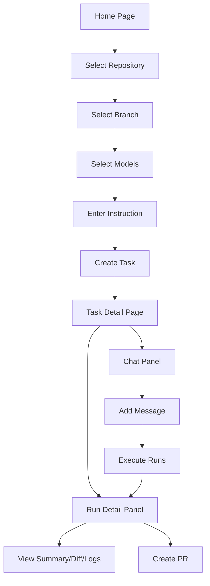

# UI/UX Improvement Plan for dursor

This document outlines the current state of dursor's UI/UX, identifies issues and opportunities for improvement, and provides actionable recommendations with implementation guidelines.

## Table of Contents

1. [Executive Summary](#executive-summary)
2. [Current State Analysis](#current-state-analysis)
3. [Identified Issues](#identified-issues)
4. [Improvement Roadmap](#improvement-roadmap)
5. [Design System Proposal](#design-system-proposal)
6. [Implementation Guidelines](#implementation-guidelines)
7. [Accessibility Considerations](#accessibility-considerations)
8. [Success Metrics](#success-metrics)

---

## Executive Summary

dursor is a self-hostable multi-model parallel coding agent with a Next.js 14 frontend. The current UI features a dark theme with a functional but inconsistent design. This document proposes improvements across responsiveness, consistency, accessibility, and user experience to create a more polished and professional interface.

### Key Focus Areas
- **Mobile Responsiveness**: Currently broken, needs complete overhaul
- **Component Consistency**: Button, form, and spacing patterns need standardization
- **Loading & Feedback States**: Missing skeleton loaders and toast notifications
- **Accessibility**: Color contrast and keyboard navigation improvements needed

---

## Current State Analysis

### Tech Stack
| Technology | Version | Purpose |
|------------|---------|---------|
| Next.js | 14.1.0 | React framework |
| React | 18.2.0 | UI library |
| Tailwind CSS | 3.4.1 | Utility-first styling |
| SWR | 2.2.4 | Data fetching |
| TypeScript | Strict | Type safety |

### Component Architecture

```
apps/web/src/
├── app/
│   ├── layout.tsx              # Root layout
│   ├── page.tsx                # Home (task creation)
│   ├── globals.css             # Global styles
│   └── tasks/[taskId]/
│       └── page.tsx            # Task detail (split view)
├── components/
│   ├── ChatPanel.tsx           # Chat interface
│   ├── RunsPanel.tsx           # Run history
│   ├── RunDetailPanel.tsx      # Run details & PR creation
│   ├── DiffViewer.tsx          # Diff visualization
│   ├── SettingsModal.tsx       # Settings interface
│   ├── RepoSelector.tsx        # Repository selection
│   ├── Sidebar.tsx             # Navigation
│   └── ClientLayout.tsx        # Layout wrapper
├── lib/
│   └── api.ts                  # API client
└── types.ts                    # TypeScript types
```

### Current Design Language
- **Theme**: Dark mode only (gray-900/gray-800 backgrounds)
- **Primary Color**: Blue (#2563eb - blue-600)
- **Status Colors**: Green (success), Red (error), Yellow (pending)
- **Typography**: System fonts, monospace for code

### User Flows



---

## Identified Issues

### Critical (P0) - Blocks Core Functionality

| Issue | Location | Impact |
|-------|----------|--------|
| **Mobile layout broken** | `tasks/[taskId]/page.tsx` | App unusable on mobile |
| **Fixed 50/50 split layout** | Task detail page | No responsive adaptation |
| **No loading states** | ChatPanel, RunsPanel | Users don't know data is loading |

#### Mobile Responsiveness Problem

Current implementation uses fixed widths:
```tsx
// tasks/[taskId]/page.tsx
<div className="w-1/2">  {/* Fixed 50% - breaks on mobile */}
  <ChatPanel />
</div>
<div className="w-1/2">  {/* Fixed 50% */}
  <RunDetailPanel />
</div>
```

### High (P1) - Degrades User Experience

| Issue | Location | Impact |
|-------|----------|--------|
| **Inconsistent button styles** | Multiple components | Visual inconsistency |
| **No toast notifications** | All forms | Users miss success/error feedback |
| **Missing confirmation dialogs** | Delete actions | Accidental deletions possible |
| **Inconsistent spacing** | All components | Unprofessional appearance |

#### Button Style Inconsistencies

```tsx
// ChatPanel.tsx - Style A
<button className="bg-blue-600 hover:bg-blue-700 px-4 py-2">

// RunDetailPanel.tsx - Style B
<button className="px-3 py-1.5 text-sm bg-green-600">

// SettingsModal.tsx - Style C
<button className="flex-1 py-2 rounded bg-blue-600">
```

### Medium (P2) - Affects Usability

| Issue | Location | Impact |
|-------|----------|--------|
| **Low color contrast** | Dark text on dark bg | Accessibility concern |
| **No keyboard navigation** | Modal dialogs | Keyboard users excluded |
| **Hardcoded text truncation** | RunsPanel (50 chars) | Arbitrary content cutoff |
| **OS-specific hints** | "Cmd+Enter" placeholder | Confusing on non-Mac |
| **Inconsistent tab styling** | Panels | Disorienting navigation |

### Low (P3) - Polish Items

| Issue | Location | Impact |
|-------|----------|--------|
| **Inline SVG icons** | All components | Maintenance burden |
| **No light mode** | Global | User preference ignored |
| **Unused dependencies** | `react-diff-viewer-continued` | Bundle size |
| **No skeleton loaders** | List components | Jarring load experience |

---

## Improvement Roadmap

### Phase 1: Foundation (Week 1-2)

**Goal**: Establish design system and fix critical issues

- [ ] Create design token system (colors, spacing, typography)
- [ ] Implement responsive breakpoints
- [ ] Add base component library (Button, Input, Card)
- [ ] Fix mobile layout in TaskPage

### Phase 2: Consistency (Week 3-4)

**Goal**: Standardize UI patterns across components

- [ ] Migrate all buttons to component library
- [ ] Standardize form inputs and validation
- [ ] Implement consistent modal pattern
- [ ] Add loading states (skeletons, spinners)

### Phase 3: Feedback & Polish (Week 5-6)

**Goal**: Enhance user feedback and interactions

- [ ] Implement toast notification system
- [ ] Add confirmation dialogs for destructive actions
- [ ] Improve error messaging UX
- [ ] Add micro-animations and transitions

### Phase 4: Accessibility (Week 7-8)

**Goal**: Achieve WCAG 2.1 AA compliance

- [ ] Audit and fix color contrast
- [ ] Implement keyboard navigation
- [ ] Add ARIA labels and roles
- [ ] Test with screen readers

---

## Design System Proposal

### Design Tokens

```typescript
// lib/design-tokens.ts

export const colors = {
  // Background
  bg: {
    primary: '#030712',    // gray-950
    secondary: '#111827',  // gray-900
    tertiary: '#1f2937',   // gray-800
    elevated: '#374151',   // gray-700
  },

  // Text
  text: {
    primary: '#f9fafb',    // gray-50
    secondary: '#9ca3af',  // gray-400
    muted: '#6b7280',      // gray-500
    inverse: '#030712',    // gray-950
  },

  // Brand
  brand: {
    primary: '#2563eb',    // blue-600
    primaryHover: '#1d4ed8', // blue-700
    secondary: '#7c3aed',  // violet-600
  },

  // Status
  status: {
    success: '#22c55e',    // green-500
    error: '#ef4444',      // red-500
    warning: '#f59e0b',    // amber-500
    info: '#3b82f6',       // blue-500
  },

  // Border
  border: {
    default: '#374151',    // gray-700
    subtle: '#1f2937',     // gray-800
  },
} as const;

export const spacing = {
  xs: '0.25rem',   // 4px
  sm: '0.5rem',    // 8px
  md: '0.75rem',   // 12px
  lg: '1rem',      // 16px
  xl: '1.5rem',    // 24px
  '2xl': '2rem',   // 32px
  '3xl': '3rem',   // 48px
} as const;

export const radii = {
  sm: '0.25rem',   // 4px
  md: '0.375rem',  // 6px
  lg: '0.5rem',    // 8px
  xl: '0.75rem',   // 12px
  full: '9999px',
} as const;

export const shadows = {
  sm: '0 1px 2px 0 rgb(0 0 0 / 0.05)',
  md: '0 4px 6px -1px rgb(0 0 0 / 0.1)',
  lg: '0 10px 15px -3px rgb(0 0 0 / 0.1)',
} as const;
```

### Component Library

#### Button Component

```tsx
// components/ui/Button.tsx

type ButtonVariant = 'primary' | 'secondary' | 'danger' | 'ghost';
type ButtonSize = 'sm' | 'md' | 'lg';

interface ButtonProps {
  variant?: ButtonVariant;
  size?: ButtonSize;
  isLoading?: boolean;
  disabled?: boolean;
  children: React.ReactNode;
  onClick?: () => void;
}

const variantStyles: Record<ButtonVariant, string> = {
  primary: 'bg-blue-600 hover:bg-blue-700 text-white',
  secondary: 'bg-gray-700 hover:bg-gray-600 text-gray-100',
  danger: 'bg-red-600 hover:bg-red-700 text-white',
  ghost: 'bg-transparent hover:bg-gray-800 text-gray-300',
};

const sizeStyles: Record<ButtonSize, string> = {
  sm: 'px-3 py-1.5 text-sm',
  md: 'px-4 py-2 text-sm',
  lg: 'px-6 py-3 text-base',
};

export function Button({
  variant = 'primary',
  size = 'md',
  isLoading = false,
  disabled = false,
  children,
  onClick,
}: ButtonProps) {
  return (
    <button
      className={cn(
        'rounded-md font-medium transition-colors',
        'focus:outline-none focus:ring-2 focus:ring-blue-500 focus:ring-offset-2 focus:ring-offset-gray-900',
        'disabled:opacity-50 disabled:cursor-not-allowed',
        variantStyles[variant],
        sizeStyles[size],
      )}
      disabled={disabled || isLoading}
      onClick={onClick}
    >
      {isLoading ? (
        <span className="flex items-center gap-2">
          <Spinner size="sm" />
          <span>Loading...</span>
        </span>
      ) : (
        children
      )}
    </button>
  );
}
```

#### Input Component

```tsx
// components/ui/Input.tsx

interface InputProps {
  label?: string;
  error?: string;
  hint?: string;
  // ...standard input props
}

export function Input({
  label,
  error,
  hint,
  ...props
}: InputProps & React.InputHTMLAttributes<HTMLInputElement>) {
  return (
    <div className="space-y-1">
      {label && (
        <label className="block text-sm font-medium text-gray-200">
          {label}
        </label>
      )}
      <input
        className={cn(
          'w-full px-3 py-2 rounded-md',
          'bg-gray-800 border text-gray-100',
          'placeholder:text-gray-500',
          'focus:outline-none focus:ring-2 focus:ring-blue-500',
          'transition-colors',
          error ? 'border-red-500' : 'border-gray-700',
        )}
        {...props}
      />
      {error && (
        <p className="text-sm text-red-400">{error}</p>
      )}
      {hint && !error && (
        <p className="text-sm text-gray-500">{hint}</p>
      )}
    </div>
  );
}
```

#### Card Component

```tsx
// components/ui/Card.tsx

interface CardProps {
  children: React.ReactNode;
  className?: string;
  padding?: 'sm' | 'md' | 'lg';
}

export function Card({ children, className, padding = 'md' }: CardProps) {
  const paddingStyles = {
    sm: 'p-3',
    md: 'p-4',
    lg: 'p-6',
  };

  return (
    <div
      className={cn(
        'bg-gray-900 border border-gray-800 rounded-lg',
        paddingStyles[padding],
        className,
      )}
    >
      {children}
    </div>
  );
}
```

### Toast Notification System

```tsx
// components/ui/Toast.tsx

import { createContext, useContext, useState } from 'react';

type ToastType = 'success' | 'error' | 'warning' | 'info';

interface Toast {
  id: string;
  type: ToastType;
  message: string;
  duration?: number;
}

interface ToastContextValue {
  toasts: Toast[];
  addToast: (toast: Omit<Toast, 'id'>) => void;
  removeToast: (id: string) => void;
}

const ToastContext = createContext<ToastContextValue | null>(null);

export function ToastProvider({ children }: { children: React.ReactNode }) {
  const [toasts, setToasts] = useState<Toast[]>([]);

  const addToast = (toast: Omit<Toast, 'id'>) => {
    const id = crypto.randomUUID();
    setToasts((prev) => [...prev, { ...toast, id }]);

    setTimeout(() => {
      removeToast(id);
    }, toast.duration || 5000);
  };

  const removeToast = (id: string) => {
    setToasts((prev) => prev.filter((t) => t.id !== id));
  };

  return (
    <ToastContext.Provider value={{ toasts, addToast, removeToast }}>
      {children}
      <ToastContainer toasts={toasts} onDismiss={removeToast} />
    </ToastContext.Provider>
  );
}

export function useToast() {
  const context = useContext(ToastContext);
  if (!context) throw new Error('useToast must be used within ToastProvider');
  return context;
}
```

---

## Implementation Guidelines

### Responsive Breakpoints

Use Tailwind's default breakpoints consistently:

```css
/* Mobile first approach */
sm: 640px   /* Tablet portrait */
md: 768px   /* Tablet landscape */
lg: 1024px  /* Desktop */
xl: 1280px  /* Large desktop */
2xl: 1536px /* Extra large desktop */
```

#### TaskPage Responsive Layout

```tsx
// Before (broken)
<div className="flex h-screen">
  <div className="w-1/2">...</div>
  <div className="w-1/2">...</div>
</div>

// After (responsive)
<div className="flex flex-col lg:flex-row h-screen">
  {/* Mobile: Full width, stacked */}
  {/* Desktop: Side by side */}
  <div className="w-full lg:w-1/2 h-1/2 lg:h-full overflow-hidden">
    <ChatPanel />
  </div>
  <div className="w-full lg:w-1/2 h-1/2 lg:h-full overflow-hidden">
    {selectedRun ? <RunDetailPanel /> : <RunsPanel />}
  </div>
</div>
```

### Loading States

#### Skeleton Components

```tsx
// components/ui/Skeleton.tsx

export function Skeleton({ className }: { className?: string }) {
  return (
    <div
      className={cn(
        'animate-pulse bg-gray-800 rounded',
        className
      )}
    />
  );
}

// Usage in ChatPanel
function MessageSkeleton() {
  return (
    <div className="space-y-3 p-4">
      <div className="flex items-start gap-3">
        <Skeleton className="w-8 h-8 rounded-full" />
        <div className="flex-1 space-y-2">
          <Skeleton className="h-4 w-24" />
          <Skeleton className="h-16 w-full" />
        </div>
      </div>
    </div>
  );
}
```

### Form Validation Pattern

```tsx
// Consistent validation UX
function CreateTaskForm() {
  const [errors, setErrors] = useState<Record<string, string>>({});

  const validate = () => {
    const newErrors: Record<string, string> = {};

    if (!repo) newErrors.repo = 'Repository is required';
    if (!instruction.trim()) newErrors.instruction = 'Instruction is required';
    if (models.length === 0) newErrors.models = 'Select at least one model';

    setErrors(newErrors);
    return Object.keys(newErrors).length === 0;
  };

  return (
    <form onSubmit={handleSubmit}>
      <Input
        label="Instruction"
        error={errors.instruction}
        // ...
      />
      {/* Real-time validation feedback */}
    </form>
  );
}
```

### Keyboard Shortcut Detection

```tsx
// lib/platform.ts
export function getPlatformModifier(): string {
  if (typeof navigator === 'undefined') return 'Ctrl';
  return navigator.platform.includes('Mac') ? 'Cmd' : 'Ctrl';
}

// Usage
<span className="text-gray-500 text-xs">
  {getPlatformModifier()}+Enter to submit
</span>
```

### Icon Library Integration

Recommend using **Heroicons** (by Tailwind Labs):

```bash
npm install @heroicons/react
```

```tsx
// Before (inline SVG)
<svg className="w-5 h-5" viewBox="0 0 24 24">
  <path d="M12 4v16m8-8H4" />
</svg>

// After (Heroicons)
import { PlusIcon } from '@heroicons/react/24/outline';

<PlusIcon className="w-5 h-5" />
```

---

## Accessibility Considerations

### Color Contrast Requirements

| Element | Current | Required (WCAG AA) | Recommendation |
|---------|---------|-------------------|----------------|
| Body text | gray-400 on gray-900 | 4.5:1 | Use gray-300 (#d1d5db) |
| Muted text | gray-500 on gray-900 | 4.5:1 | Use gray-400 (#9ca3af) |
| Large text | gray-500 on gray-900 | 3:1 | Acceptable for headings |

### Focus Management

```tsx
// Modal focus trap
import { useEffect, useRef } from 'react';

function Modal({ isOpen, onClose, children }) {
  const firstFocusableRef = useRef<HTMLElement>(null);

  useEffect(() => {
    if (isOpen) {
      firstFocusableRef.current?.focus();
    }
  }, [isOpen]);

  return (
    <div
      role="dialog"
      aria-modal="true"
      aria-labelledby="modal-title"
      onKeyDown={(e) => {
        if (e.key === 'Escape') onClose();
      }}
    >
      {children}
    </div>
  );
}
```

### ARIA Labels

```tsx
// Status indicators
<span
  className="w-2 h-2 rounded-full bg-green-500"
  role="status"
  aria-label="Run succeeded"
/>

// Icon buttons
<button aria-label="Close modal">
  <XMarkIcon className="w-5 h-5" />
</button>
```

### Screen Reader Announcements

```tsx
// Live region for dynamic updates
<div aria-live="polite" className="sr-only">
  {runStatus === 'completed' && 'Run completed successfully'}
  {runStatus === 'failed' && 'Run failed'}
</div>
```

---

## Success Metrics

### Quantitative Metrics

| Metric | Current | Target | Measurement |
|--------|---------|--------|-------------|
| Mobile usability | 0% | 100% | Lighthouse mobile score |
| Lighthouse Accessibility | ~70 | >90 | Lighthouse audit |
| First Contentful Paint | TBD | <1.5s | Web Vitals |
| Time to Interactive | TBD | <3s | Web Vitals |
| Cumulative Layout Shift | TBD | <0.1 | Web Vitals |

### Qualitative Metrics

- **User satisfaction**: Collect feedback on new UI patterns
- **Task completion rate**: Measure PR creation success
- **Error recovery**: Track how users handle error states
- **Learning curve**: Time for new users to complete first task

### Testing Approach

1. **Visual Regression**: Use tools like Percy or Chromatic
2. **Accessibility Testing**: axe-core integration in CI
3. **Cross-browser Testing**: Test on Chrome, Firefox, Safari
4. **Mobile Testing**: Test on iOS Safari, Android Chrome

---

## Appendix

### Files to Modify

| File | Changes |
|------|---------|
| `apps/web/src/app/tasks/[taskId]/page.tsx` | Responsive layout |
| `apps/web/src/components/ChatPanel.tsx` | Loading states, button consistency |
| `apps/web/src/components/RunsPanel.tsx` | Skeleton loaders |
| `apps/web/src/components/RunDetailPanel.tsx` | Tab consistency, PR form |
| `apps/web/src/components/SettingsModal.tsx` | Focus management, validation |
| `apps/web/src/components/Sidebar.tsx` | Responsive collapse |
| `apps/web/tailwind.config.js` | Design token integration |
| `apps/web/src/app/globals.css` | CSS variable updates |

### New Files to Create

| File | Purpose |
|------|---------|
| `apps/web/src/lib/design-tokens.ts` | Centralized design tokens |
| `apps/web/src/lib/platform.ts` | Platform detection utilities |
| `apps/web/src/components/ui/Button.tsx` | Button component |
| `apps/web/src/components/ui/Input.tsx` | Input component |
| `apps/web/src/components/ui/Card.tsx` | Card component |
| `apps/web/src/components/ui/Skeleton.tsx` | Skeleton component |
| `apps/web/src/components/ui/Toast.tsx` | Toast notification system |
| `apps/web/src/components/ui/Modal.tsx` | Accessible modal component |
| `apps/web/src/components/ui/ConfirmDialog.tsx` | Confirmation dialog |

### Dependencies to Add

```json
{
  "@heroicons/react": "^2.1.0",
  "clsx": "^2.1.0",
  "tailwind-merge": "^2.2.0"
}
```

### Dependencies to Remove

```json
{
  "react-diff-viewer-continued": "^3.4.0"  // Unused
}
```

---

## References

- [Tailwind CSS Documentation](https://tailwindcss.com/docs)
- [WCAG 2.1 Guidelines](https://www.w3.org/WAI/WCAG21/quickref/)
- [React Accessibility Guide](https://react.dev/reference/react-dom/components#form-components)
- [Heroicons](https://heroicons.com/)
- [Web Vitals](https://web.dev/vitals/)
