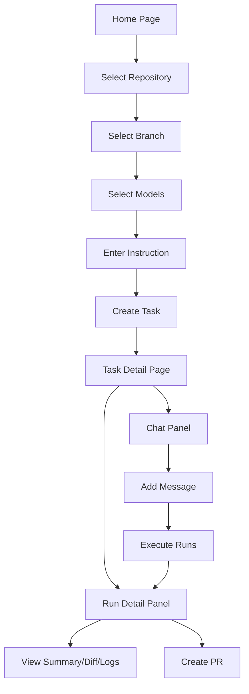

# UI/UX Improvement Plan for dursor

This document outlines the current state of dursor's UI/UX, identifies issues and opportunities for improvement, and provides actionable recommendations with implementation guidelines.

**Last Updated**: 2026-01-08

## Table of Contents

1. [Executive Summary](#executive-summary)
2. [Current State Analysis](#current-state-analysis)
3. [Identified Issues by Priority](#identified-issues-by-priority)
4. [Quick Wins](#quick-wins)
5. [Component-Specific Improvements](#component-specific-improvements)
6. [Improvement Roadmap](#improvement-roadmap)
7. [Design System Proposal](#design-system-proposal)
8. [Implementation Guidelines](#implementation-guidelines)
9. [Accessibility Considerations](#accessibility-considerations)
10. [Success Metrics](#success-metrics)

---

## Executive Summary

dursor is a self-hostable multi-model parallel coding agent with a Next.js 15 frontend. The current UI features a responsive dark theme with mobile-first design, reusable components, and consistent styling. This document proposes improvements across feedback mechanisms, error handling, accessibility, and user experience polish.

### Key Focus Areas
- **Error Handling & Stability**: Add error boundaries, improve error messaging
- **User Feedback**: Enhance loading states, validation feedback, and status updates
- **Accessibility**: Improve screen reader support, keyboard navigation, and color contrast
- **Performance**: Virtualize large lists and diffs for better performance
- **User Experience**: Reduce friction, add helpful features like retry and notifications

---

## Current State Analysis

### Tech Stack
| Technology | Version | Purpose |
|------------|---------|---------|
| Next.js | 15.x | React framework |
| React | 19.x | UI library |
| Tailwind CSS | 3.4.x | Utility-first styling |
| SWR | 2.x | Data fetching with caching |
| TypeScript | Strict | Type safety |

### Current Strengths
- Mobile-first responsive design with hamburger menu overlay
- Clean separation of concerns with reusable UI components (Button, Modal, Input, Toast, Card)
- Consistent dark theme (gray-950 to gray-100 palette)
- Keyboard shortcuts support (Cmd/Ctrl + Enter)
- Real-time repo/branch filtering with search
- Auto-resizing textarea for comfortable input
- Skeleton loaders for initial page load

### Component Architecture

```
apps/web/src/
├── app/
│   ├── layout.tsx              # Root layout
│   ├── page.tsx                # Home (task creation)
│   ├── globals.css             # Global styles
│   └── tasks/[taskId]/
│       └── page.tsx            # Task detail (split view)
├── components/
│   ├── ChatPanel.tsx           # Chat interface
│   ├── RunsPanel.tsx           # Run history
│   ├── RunDetailPanel.tsx      # Run details & PR creation
│   ├── DiffViewer.tsx          # Diff visualization
│   ├── SettingsModal.tsx       # Settings interface
│   ├── RepoSelector.tsx        # Repository selection
│   ├── Sidebar.tsx             # Navigation
│   └── ClientLayout.tsx        # Layout wrapper
├── lib/
│   └── api.ts                  # API client
└── types.ts                    # TypeScript types
```

### Current Design Language
- **Theme**: Dark mode only (gray-900/gray-800 backgrounds)
- **Primary Color**: Blue (#2563eb - blue-600)
- **Status Colors**: Green (success), Red (error), Yellow (pending)
- **Typography**: System fonts, monospace for code

### User Flows



---

## Identified Issues by Priority

### P0 - Critical (Stability & Core UX)

| Issue | Location | Impact | Effort |
|-------|----------|--------|--------|
| **No Error Boundaries** | All pages | Component crash breaks entire page | Medium |
| **No retry mechanism** | API calls | Users stuck on network failures | Medium |
| **Form validation only on submit** | `page.tsx` | Poor feedback, user confusion | Low |

### P1 - High (User Experience)

| Issue | Location | Impact | Effort |
|-------|----------|--------|--------|
| **No data refresh indicator** | Task page | Users don't know data is live | Low |
| **Truncated error messages** | `RunsPanel.tsx` | Can't see full error details | Low |
| **Failed runs can't be retried** | `RunsPanel.tsx` | Must create new message | Medium |
| **Tab state resets between runs** | `RunDetailPanel.tsx` | Loses user context | Low |
| **No run duration display** | `RunsPanel.tsx` | Can't gauge performance | Low |
| **Missing badge on Runs tab** | Task page | Unaware of new/updated runs | Low |

### P2 - Medium (Accessibility & Usability)

| Issue | Location | Impact | Effort |
|-------|----------|--------|--------|
| **Color-only status indicators** | Status icons | Accessibility issue | Low |
| **Missing ARIA labels** | Buttons, dropdowns | Screen reader issues | Medium |
| **No keyboard nav in dropdowns** | Model/repo/branch | Keyboard users excluded | Medium |
| **Large diffs not virtualized** | `DiffViewer.tsx` | Performance issues | High |
| **No shortcuts help modal** | Global | Users unaware of shortcuts | Medium |
| **Task list limited to 20** | `Sidebar.tsx` | Can't access older tasks | Medium |
| **No Markdown in chat** | `ChatPanel.tsx` | Poor code readability | Medium |
| **No copy button for diff** | `DiffViewer.tsx` | Friction for sharing | Low |

### P3 - Low (Polish & Nice-to-Have)

| Issue | Location | Impact | Effort |
|-------|----------|--------|--------|
| **No light mode** | Global | User preference ignored | High |
| **No desktop notifications** | Global | Misses run completion | Medium |
| **No task search/filter** | `Sidebar.tsx` | Hard to find old tasks | Medium |
| **No model comparison view** | Task page | Can't compare outputs | High |
| **No onboarding tour** | Global | First-time user confusion | High |
| **No task favorites/pinning** | `Sidebar.tsx` | No organization | Medium |

---

## Quick Wins

High-impact, low-effort improvements to implement first:

### 1. Add Error Boundary Component
```tsx
// components/ErrorBoundary.tsx
class ErrorBoundary extends React.Component {
  state = { hasError: false, error: null };

  static getDerivedStateFromError(error) {
    return { hasError: true, error };
  }

  render() {
    if (this.state.hasError) {
      return (
        <div className="p-4 text-center">
          <h2>Something went wrong</h2>
          <button onClick={() => this.setState({ hasError: false })}>
            Try again
          </button>
        </div>
      );
    }
    return this.props.children;
  }
}
```

### 2. Add "Last Updated" Indicator
```tsx
// In task page
<span className="text-gray-500 text-xs">
  Last updated: {formatDistanceToNow(lastUpdated)} ago
</span>
```

### 3. Add Status Text to Icons
```tsx
// Before: color only
<span className="w-2 h-2 rounded-full bg-green-500" />

// After: icon + text
<span className="flex items-center gap-1.5">
  <CheckCircleIcon className="w-4 h-4 text-green-500" />
  <span className="text-xs text-green-400">Succeeded</span>
</span>
```

### 4. Expandable Error Messages
```tsx
// In RunsPanel.tsx
const [expanded, setExpanded] = useState(false);
<div
  className={expanded ? '' : 'line-clamp-2'}
  onClick={() => setExpanded(!expanded)}
>
  {error}
</div>
```

### 5. Real-time Form Validation
```tsx
// In page.tsx
{selectedModels.length === 0 && instruction.length > 0 && (
  <span className="text-amber-400 text-sm">
    Select at least one model
  </span>
)}
```

---

## Component-Specific Improvements

### Home Page (`app/page.tsx`)

| Improvement | Priority | Description |
|------------|----------|-------------|
| Real-time validation | P0 | Show validation state as user fills form |
| Progress steps | P1 | Show "Cloning repo → Creating task → Starting runs" |
| Empty state CTA | P1 | Link to Settings when no models configured |
| Loading overlay | P2 | Show detailed progress during task creation |

### Task Detail Page (`app/tasks/[taskId]/page.tsx`)

| Improvement | Priority | Description |
|------------|----------|-------------|
| Refresh indicator | P1 | Show "Updated X seconds ago" |
| Tab badges | P1 | Show count of new/updated runs |
| Error boundary | P0 | Wrap in ErrorBoundary component |
| Mobile tab persistence | P2 | Remember last viewed tab |

### ChatPanel (`components/ChatPanel.tsx`)

| Improvement | Priority | Description |
|------------|----------|-------------|
| Markdown rendering | P2 | Use react-markdown for messages |
| Role badges | P2 | Add "User" / "Assistant" labels with icons |
| Original request header | P2 | Sticky or collapsible section showing first message |
| Model selection ARIA | P2 | Add aria-label with selection count |

### RunsPanel (`components/RunsPanel.tsx`)

| Improvement | Priority | Description |
|------------|----------|-------------|
| Expandable errors | P1 | Click to expand truncated error messages |
| Run duration | P1 | Show "Completed in X seconds" |
| Retry button | P1 | Add retry for failed runs |
| Selection highlight | P2 | More prominent selected run indicator |
| Status change animation | P2 | Highlight when status changes |

### RunDetailPanel (`components/RunDetailPanel.tsx`)

| Improvement | Priority | Description |
|------------|----------|-------------|
| Tab persistence | P1 | Remember last viewed tab per run |
| Copy buttons | P2 | Copy diff, copy logs buttons |
| Log syntax highlighting | P2 | Color-code log levels |
| Large diff handling | P2 | Collapse/expand hunks |

### DiffViewer (`components/DiffViewer.tsx`)

| Improvement | Priority | Description |
|------------|----------|-------------|
| Virtualization | P2 | Use react-window for large diffs |
| File navigation | P2 | Add file index sidebar |
| Line numbers | P3 | Optional line number display |
| Stats header | P2 | Show "X files, +Y/-Z lines" |
| Horizontal scroll hint | P2 | Mobile scroll indicator |

### SettingsModal (`components/SettingsModal.tsx`)

| Improvement | Priority | Description |
|------------|----------|-------------|
| Help tooltips | P2 | Explain each field with tooltips |
| Setup link | P2 | Link to GitHub App documentation |
| Env model explanation | P2 | Explain why env models can't be deleted |
| Save loading state | P2 | Show loading during save operation |

### Sidebar (`components/Sidebar.tsx`)

| Improvement | Priority | Description |
|------------|----------|-------------|
| Task status badges | P3 | Show running/completed/failed status |
| Search/filter | P2 | Add task search functionality |
| Infinite scroll | P2 | Load more than 20 tasks |
| Favorites | P3 | Pin important tasks |

---

## Improvement Roadmap

### Phase 1: Stability & Core Feedback

**Goal**: Ensure app stability and basic user feedback

- [ ] Add ErrorBoundary component and wrap all pages/panels
- [ ] Add real-time form validation on home page
- [ ] Add "Last updated X seconds ago" on task page
- [ ] Make error messages expandable in RunsPanel
- [ ] Add status text labels alongside status colors

### Phase 2: Enhanced User Experience

**Goal**: Reduce friction and improve interactions

- [ ] Add retry button for failed runs
- [ ] Show run duration/elapsed time
- [ ] Add badge on Runs tab for new/updated runs
- [ ] Remember tab state per run in RunDetailPanel
- [ ] Add copy buttons for diff and logs
- [ ] Add keyboard shortcuts help modal (`?` key)

### Phase 3: Accessibility

**Goal**: Achieve WCAG 2.1 AA compliance

- [ ] Add ARIA labels to all interactive elements
- [ ] Implement keyboard navigation for dropdowns
- [ ] Add focus management in modals
- [ ] Ensure all states have non-color indicators
- [ ] Test with screen readers

### Phase 4: Performance & Polish

**Goal**: Optimize performance and add polish features

- [ ] Virtualize DiffViewer for large diffs
- [ ] Add infinite scroll for task history
- [ ] Implement Markdown rendering in chat
- [ ] Add task search/filter functionality
- [ ] Add desktop notifications (optional)
- [ ] Consider light mode theme

---

## Design System Proposal

### Design Tokens

```typescript
// lib/design-tokens.ts

export const colors = {
  // Background
  bg: {
    primary: '#030712',    // gray-950
    secondary: '#111827',  // gray-900
    tertiary: '#1f2937',   // gray-800
    elevated: '#374151',   // gray-700
  },

  // Text
  text: {
    primary: '#f9fafb',    // gray-50
    secondary: '#9ca3af',  // gray-400
    muted: '#6b7280',      // gray-500
    inverse: '#030712',    // gray-950
  },

  // Brand
  brand: {
    primary: '#2563eb',    // blue-600
    primaryHover: '#1d4ed8', // blue-700
    secondary: '#7c3aed',  // violet-600
  },

  // Status
  status: {
    success: '#22c55e',    // green-500
    error: '#ef4444',      // red-500
    warning: '#f59e0b',    // amber-500
    info: '#3b82f6',       // blue-500
  },

  // Border
  border: {
    default: '#374151',    // gray-700
    subtle: '#1f2937',     // gray-800
  },
} as const;

export const spacing = {
  xs: '0.25rem',   // 4px
  sm: '0.5rem',    // 8px
  md: '0.75rem',   // 12px
  lg: '1rem',      // 16px
  xl: '1.5rem',    // 24px
  '2xl': '2rem',   // 32px
  '3xl': '3rem',   // 48px
} as const;

export const radii = {
  sm: '0.25rem',   // 4px
  md: '0.375rem',  // 6px
  lg: '0.5rem',    // 8px
  xl: '0.75rem',   // 12px
  full: '9999px',
} as const;

export const shadows = {
  sm: '0 1px 2px 0 rgb(0 0 0 / 0.05)',
  md: '0 4px 6px -1px rgb(0 0 0 / 0.1)',
  lg: '0 10px 15px -3px rgb(0 0 0 / 0.1)',
} as const;
```

### Component Library

#### Button Component

```tsx
// components/ui/Button.tsx

type ButtonVariant = 'primary' | 'secondary' | 'danger' | 'ghost';
type ButtonSize = 'sm' | 'md' | 'lg';

interface ButtonProps {
  variant?: ButtonVariant;
  size?: ButtonSize;
  isLoading?: boolean;
  disabled?: boolean;
  children: React.ReactNode;
  onClick?: () => void;
}

const variantStyles: Record<ButtonVariant, string> = {
  primary: 'bg-blue-600 hover:bg-blue-700 text-white',
  secondary: 'bg-gray-700 hover:bg-gray-600 text-gray-100',
  danger: 'bg-red-600 hover:bg-red-700 text-white',
  ghost: 'bg-transparent hover:bg-gray-800 text-gray-300',
};

const sizeStyles: Record<ButtonSize, string> = {
  sm: 'px-3 py-1.5 text-sm',
  md: 'px-4 py-2 text-sm',
  lg: 'px-6 py-3 text-base',
};

export function Button({
  variant = 'primary',
  size = 'md',
  isLoading = false,
  disabled = false,
  children,
  onClick,
}: ButtonProps) {
  return (
    <button
      className={cn(
        'rounded-md font-medium transition-colors',
        'focus:outline-none focus:ring-2 focus:ring-blue-500 focus:ring-offset-2 focus:ring-offset-gray-900',
        'disabled:opacity-50 disabled:cursor-not-allowed',
        variantStyles[variant],
        sizeStyles[size],
      )}
      disabled={disabled || isLoading}
      onClick={onClick}
    >
      {isLoading ? (
        <span className="flex items-center gap-2">
          <Spinner size="sm" />
          <span>Loading...</span>
        </span>
      ) : (
        children
      )}
    </button>
  );
}
```

#### Input Component

```tsx
// components/ui/Input.tsx

interface InputProps {
  label?: string;
  error?: string;
  hint?: string;
  // ...standard input props
}

export function Input({
  label,
  error,
  hint,
  ...props
}: InputProps & React.InputHTMLAttributes<HTMLInputElement>) {
  return (
    <div className="space-y-1">
      {label && (
        <label className="block text-sm font-medium text-gray-200">
          {label}
        </label>
      )}
      <input
        className={cn(
          'w-full px-3 py-2 rounded-md',
          'bg-gray-800 border text-gray-100',
          'placeholder:text-gray-500',
          'focus:outline-none focus:ring-2 focus:ring-blue-500',
          'transition-colors',
          error ? 'border-red-500' : 'border-gray-700',
        )}
        {...props}
      />
      {error && (
        <p className="text-sm text-red-400">{error}</p>
      )}
      {hint && !error && (
        <p className="text-sm text-gray-500">{hint}</p>
      )}
    </div>
  );
}
```

#### Card Component

```tsx
// components/ui/Card.tsx

interface CardProps {
  children: React.ReactNode;
  className?: string;
  padding?: 'sm' | 'md' | 'lg';
}

export function Card({ children, className, padding = 'md' }: CardProps) {
  const paddingStyles = {
    sm: 'p-3',
    md: 'p-4',
    lg: 'p-6',
  };

  return (
    <div
      className={cn(
        'bg-gray-900 border border-gray-800 rounded-lg',
        paddingStyles[padding],
        className,
      )}
    >
      {children}
    </div>
  );
}
```

### Toast Notification System

```tsx
// components/ui/Toast.tsx

import { createContext, useContext, useState } from 'react';

type ToastType = 'success' | 'error' | 'warning' | 'info';

interface Toast {
  id: string;
  type: ToastType;
  message: string;
  duration?: number;
}

interface ToastContextValue {
  toasts: Toast[];
  addToast: (toast: Omit<Toast, 'id'>) => void;
  removeToast: (id: string) => void;
}

const ToastContext = createContext<ToastContextValue | null>(null);

export function ToastProvider({ children }: { children: React.ReactNode }) {
  const [toasts, setToasts] = useState<Toast[]>([]);

  const addToast = (toast: Omit<Toast, 'id'>) => {
    const id = crypto.randomUUID();
    setToasts((prev) => [...prev, { ...toast, id }]);

    setTimeout(() => {
      removeToast(id);
    }, toast.duration || 5000);
  };

  const removeToast = (id: string) => {
    setToasts((prev) => prev.filter((t) => t.id !== id));
  };

  return (
    <ToastContext.Provider value={{ toasts, addToast, removeToast }}>
      {children}
      <ToastContainer toasts={toasts} onDismiss={removeToast} />
    </ToastContext.Provider>
  );
}

export function useToast() {
  const context = useContext(ToastContext);
  if (!context) throw new Error('useToast must be used within ToastProvider');
  return context;
}
```

---

## Implementation Guidelines

### Responsive Design (Already Implemented)

The app already uses Tailwind's responsive breakpoints with mobile-first design:
- Hamburger menu overlay on mobile
- Tab-based switching for mobile view on task page
- Desktop shows side-by-side panels

### Loading States

#### Skeleton Components

```tsx
// components/ui/Skeleton.tsx

export function Skeleton({ className }: { className?: string }) {
  return (
    <div
      className={cn(
        'animate-pulse bg-gray-800 rounded',
        className
      )}
    />
  );
}

// Usage in ChatPanel
function MessageSkeleton() {
  return (
    <div className="space-y-3 p-4">
      <div className="flex items-start gap-3">
        <Skeleton className="w-8 h-8 rounded-full" />
        <div className="flex-1 space-y-2">
          <Skeleton className="h-4 w-24" />
          <Skeleton className="h-16 w-full" />
        </div>
      </div>
    </div>
  );
}
```

### Form Validation Pattern

```tsx
// Consistent validation UX
function CreateTaskForm() {
  const [errors, setErrors] = useState<Record<string, string>>({});

  const validate = () => {
    const newErrors: Record<string, string> = {};

    if (!repo) newErrors.repo = 'Repository is required';
    if (!instruction.trim()) newErrors.instruction = 'Instruction is required';
    if (models.length === 0) newErrors.models = 'Select at least one model';

    setErrors(newErrors);
    return Object.keys(newErrors).length === 0;
  };

  return (
    <form onSubmit={handleSubmit}>
      <Input
        label="Instruction"
        error={errors.instruction}
        // ...
      />
      {/* Real-time validation feedback */}
    </form>
  );
}
```

### Keyboard Shortcut Detection

```tsx
// lib/platform.ts
export function getPlatformModifier(): string {
  if (typeof navigator === 'undefined') return 'Ctrl';
  return navigator.platform.includes('Mac') ? 'Cmd' : 'Ctrl';
}

// Usage
<span className="text-gray-500 text-xs">
  {getPlatformModifier()}+Enter to submit
</span>
```

### Icon Library Integration

Recommend using **Heroicons** (by Tailwind Labs):

```bash
npm install @heroicons/react
```

```tsx
// Before (inline SVG)
<svg className="w-5 h-5" viewBox="0 0 24 24">
  <path d="M12 4v16m8-8H4" />
</svg>

// After (Heroicons)
import { PlusIcon } from '@heroicons/react/24/outline';

<PlusIcon className="w-5 h-5" />
```

---

## Accessibility Considerations

### Color Contrast Requirements

| Element | Current | Required (WCAG AA) | Recommendation |
|---------|---------|-------------------|----------------|
| Body text | gray-400 on gray-900 | 4.5:1 | Use gray-300 (#d1d5db) |
| Muted text | gray-500 on gray-900 | 4.5:1 | Use gray-400 (#9ca3af) |
| Large text | gray-500 on gray-900 | 3:1 | Acceptable for headings |

### Focus Management

```tsx
// Modal focus trap
import { useEffect, useRef } from 'react';

function Modal({ isOpen, onClose, children }) {
  const firstFocusableRef = useRef<HTMLElement>(null);

  useEffect(() => {
    if (isOpen) {
      firstFocusableRef.current?.focus();
    }
  }, [isOpen]);

  return (
    <div
      role="dialog"
      aria-modal="true"
      aria-labelledby="modal-title"
      onKeyDown={(e) => {
        if (e.key === 'Escape') onClose();
      }}
    >
      {children}
    </div>
  );
}
```

### ARIA Labels

```tsx
// Status indicators
<span
  className="w-2 h-2 rounded-full bg-green-500"
  role="status"
  aria-label="Run succeeded"
/>

// Icon buttons
<button aria-label="Close modal">
  <XMarkIcon className="w-5 h-5" />
</button>
```

### Screen Reader Announcements

```tsx
// Live region for dynamic updates
<div aria-live="polite" className="sr-only">
  {runStatus === 'completed' && 'Run completed successfully'}
  {runStatus === 'failed' && 'Run failed'}
</div>
```

---

## Success Metrics

### Quantitative Metrics

| Metric | Current | Target | Measurement |
|--------|---------|--------|-------------|
| Mobile usability | 0% | 100% | Lighthouse mobile score |
| Lighthouse Accessibility | ~70 | >90 | Lighthouse audit |
| First Contentful Paint | TBD | <1.5s | Web Vitals |
| Time to Interactive | TBD | <3s | Web Vitals |
| Cumulative Layout Shift | TBD | <0.1 | Web Vitals |

### Qualitative Metrics

- **User satisfaction**: Collect feedback on new UI patterns
- **Task completion rate**: Measure PR creation success
- **Error recovery**: Track how users handle error states
- **Learning curve**: Time for new users to complete first task

### Testing Approach

1. **Visual Regression**: Use tools like Percy or Chromatic
2. **Accessibility Testing**: axe-core integration in CI
3. **Cross-browser Testing**: Test on Chrome, Firefox, Safari
4. **Mobile Testing**: Test on iOS Safari, Android Chrome

---

## Appendix

### Files to Modify

| File | Changes |
|------|---------|
| `apps/web/src/app/tasks/[taskId]/page.tsx` | Responsive layout |
| `apps/web/src/components/ChatPanel.tsx` | Loading states, button consistency |
| `apps/web/src/components/RunsPanel.tsx` | Skeleton loaders |
| `apps/web/src/components/RunDetailPanel.tsx` | Tab consistency, PR form |
| `apps/web/src/components/SettingsModal.tsx` | Focus management, validation |
| `apps/web/src/components/Sidebar.tsx` | Responsive collapse |
| `apps/web/tailwind.config.js` | Design token integration |
| `apps/web/src/app/globals.css` | CSS variable updates |

### New Files to Create

| File | Purpose |
|------|---------|
| `apps/web/src/lib/design-tokens.ts` | Centralized design tokens |
| `apps/web/src/lib/platform.ts` | Platform detection utilities |
| `apps/web/src/components/ui/Button.tsx` | Button component |
| `apps/web/src/components/ui/Input.tsx` | Input component |
| `apps/web/src/components/ui/Card.tsx` | Card component |
| `apps/web/src/components/ui/Skeleton.tsx` | Skeleton component |
| `apps/web/src/components/ui/Toast.tsx` | Toast notification system |
| `apps/web/src/components/ui/Modal.tsx` | Accessible modal component |
| `apps/web/src/components/ui/ConfirmDialog.tsx` | Confirmation dialog |

### Dependencies to Add

```json
{
  "@heroicons/react": "^2.1.0",
  "clsx": "^2.1.0",
  "tailwind-merge": "^2.2.0"
}
```

### Dependencies to Consider Adding

```json
{
  "react-window": "^1.x.x",        // For virtualizing large lists/diffs
  "react-markdown": "^9.x.x",      // For Markdown in chat messages
  "date-fns": "^3.x.x"             // For "X seconds ago" formatting (if not already)
}
```

---

## Summary Table

| Priority | Category | Count | Example Items |
|----------|----------|-------|---------------|
| P0 | Critical | 3 | Error boundaries, retry mechanism, form validation |
| P1 | High | 6 | Refresh indicator, expandable errors, retry button |
| P2 | Medium | 8 | ARIA labels, virtualization, shortcuts help |
| P3 | Low | 6 | Light mode, notifications, model comparison |

**Recommended Implementation Order:**
1. Error boundaries (immediate stability)
2. Real-time validation and "last updated" indicator
3. Expandable errors and retry button
4. Accessibility improvements
5. Performance optimizations
6. Nice-to-have features

---

## References

- [Tailwind CSS Documentation](https://tailwindcss.com/docs)
- [WCAG 2.1 Guidelines](https://www.w3.org/WAI/WCAG21/quickref/)
- [React Error Boundaries](https://react.dev/reference/react/Component#catching-rendering-errors-with-an-error-boundary)
- [react-window](https://github.com/bvaughn/react-window)
- [Heroicons](https://heroicons.com/)
- [Web Vitals](https://web.dev/vitals/)
