# dursor を使った開発ワークフロー ユースケース

このドキュメントでは、dursor を活用したヒアリングベースの開発ワークフローについて説明します。

## 概要

dursor は、ヒアリングで得た要件をAIによるタスク分解から実装・レビュー・マージまでを一貫して管理できるプラットフォームです。人間が要件定義とレビューに集中し、AIがコード実装を担当する協働開発ワークフローを実現します。

## ワークフロー全体図

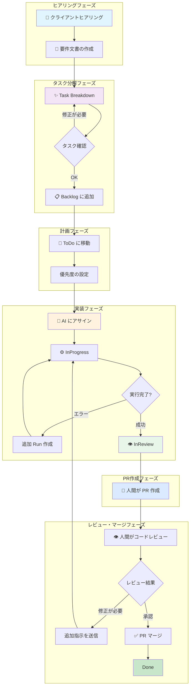

## 各フェーズの詳細

### 1. ヒアリングフェーズ

クライアントや関係者から要件をヒアリングし、文書化するフェーズです。

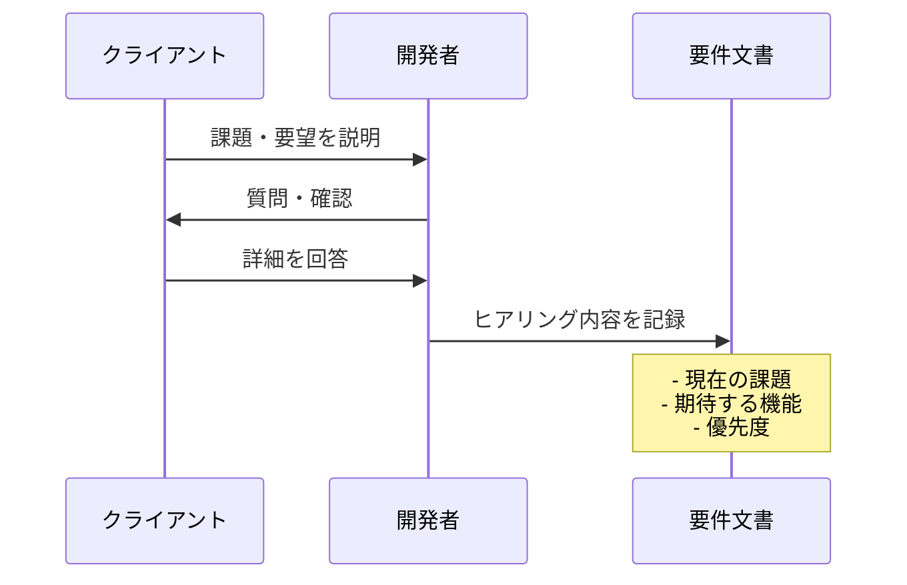

**アウトプット例:**
```
・ログイン画面でパスワードを間違えるとエラーメッセージが表示されない
・ユーザー一覧に検索機能が欲しい
・管理者のみアクセスできるページを作りたい
```

---

### 2. タスク分解フェーズ（Task Breakdown）

ヒアリング内容を dursor の Breakdown 機能でタスクに分解します。

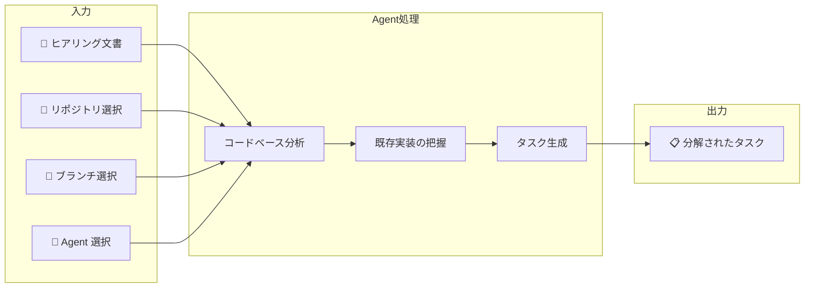

**使用する機能:**
- **Breakdown Modal** (`/backlog` ページの「Breakdown」ボタン)
- **対応 Agent**: Claude Code / Codex CLI / Gemini CLI

**Agent が行う処理:**
1. リポジトリのコードベースを分析
2. 既存のアーキテクチャ・パターンを把握
3. ヒアリング内容を具体的なタスクに分解
4. 各タスクに対象ファイル・実装ヒントを付与

**分解結果の例:**

| タスク | タイプ | サイズ | 対象ファイル |
|--------|--------|--------|--------------|
| ログインエラーメッセージ表示修正 | bug_fix | small | `src/components/LoginForm.tsx` |
| ユーザー一覧検索機能追加 | feature | medium | `src/pages/users/index.tsx`, `src/lib/api.ts` |
| 管理者専用ページ実装 | feature | large | `src/middleware.ts`, `src/lib/auth.ts` |

---

### 3. バックログ管理フェーズ（Backlog）

分解されたタスクをバックログで管理し、実装順序を決定します。

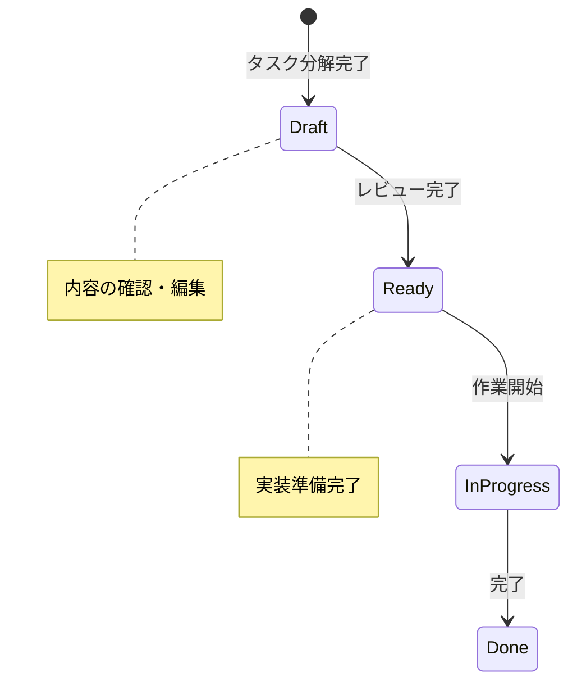

**Backlog ページの機能:**
- タスク一覧の表示・フィルタリング
- ステータス管理（Draft → Ready → In Progress → Done）
- タスク詳細の編集

**操作フロー:**
1. Breakdown 結果を確認
2. 必要に応じてタスク内容を編集
3. Ready ステータスに変更してバックログに追加

---

### 4. ToDo 管理フェーズ（Kanban: Backlog → ToDo）

やるべきタスクを Kanban ボードの ToDo カラムに移動します。

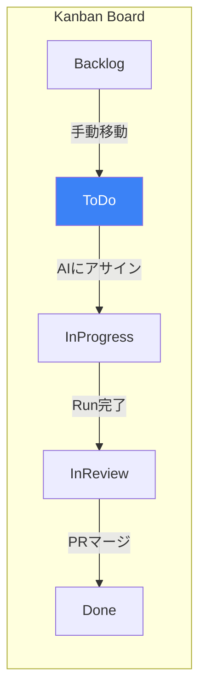

**操作:**
- Kanban ボード (`/kanban`) でタスクカードをドラッグ＆ドロップ
- または「→ ToDo」ボタンをクリック

**ToDo に移動する基準:**
- 優先度が高い
- 依存関係が解決済み
- 実装の準備が整っている

---

### 5. AI 実装フェーズ（Kanban: ToDo → InProgress）

優先度の高いタスクを AI にアサインして実装を依頼します。

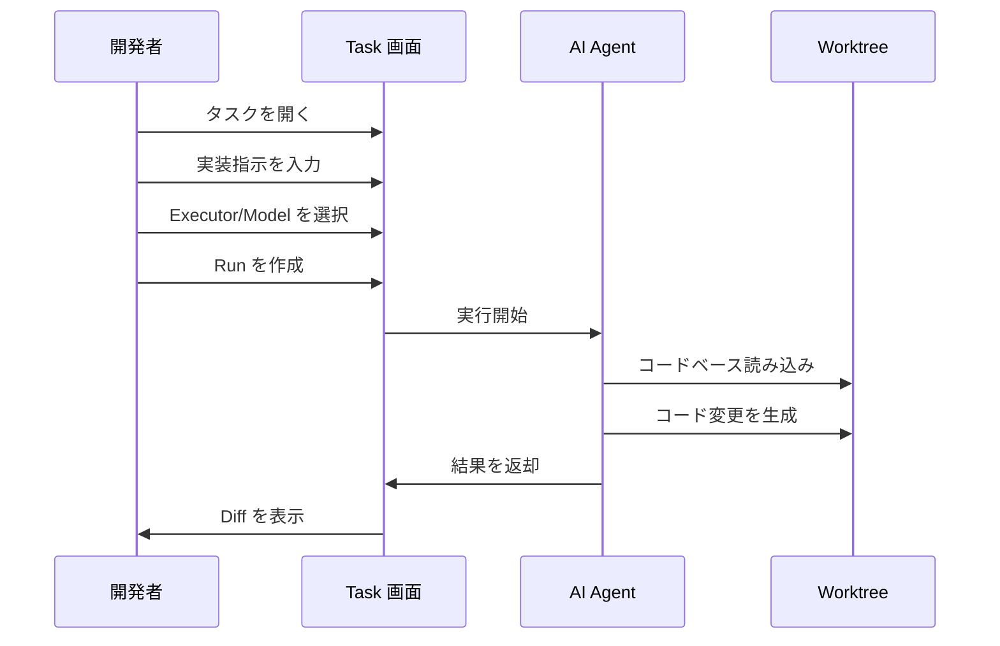

**使用する機能:**
- **Task 詳細画面** (`/tasks/[taskId]`)
- **ChatCodeView** コンポーネント

**選択可能な Executor:**

| タイプ | 説明 | 用途 |
|--------|------|------|
| `patch_agent` | LLM API 直接呼び出し | シンプルな変更 |
| `claude_code` | Claude Code CLI | 複雑な実装 |
| `codex_cli` | Codex CLI | OpenAI ベースの実装 |
| `gemini_cli` | Gemini CLI | Google AI ベースの実装 |

**並列実行の活用:**
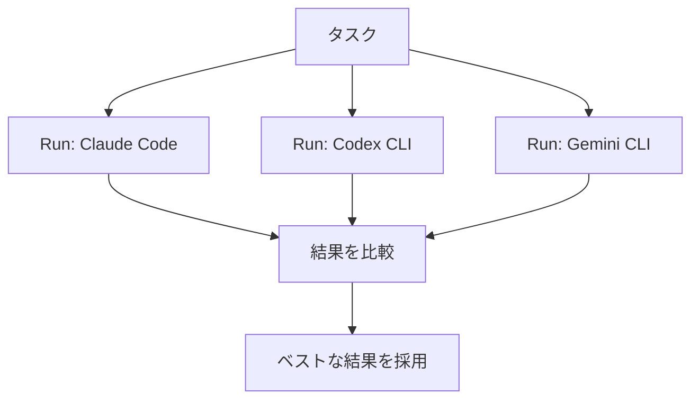

---

### 6. PR 作成フェーズ（Kanban: InProgress → InReview）

AI の実装が完了したら、人間が PR を作成します。

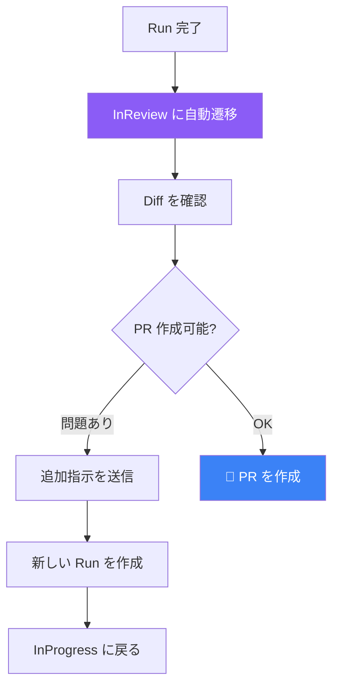

**PR 作成前の確認:**
- Diff の内容が要件を満たしているか
- 明らかなバグやエラーがないか
- PR を作成する準備が整っているか

**PR 作成機能:**
- Task 詳細画面の「Create PR」ボタン
- タイトル・説明文の自動生成
- テンプレートに基づく PR 説明

---

### 7. レビュー・マージフェーズ（GitHub PR レビュー → Done）

PR 作成後、GitHub 上でコードレビューを行い、マージします。

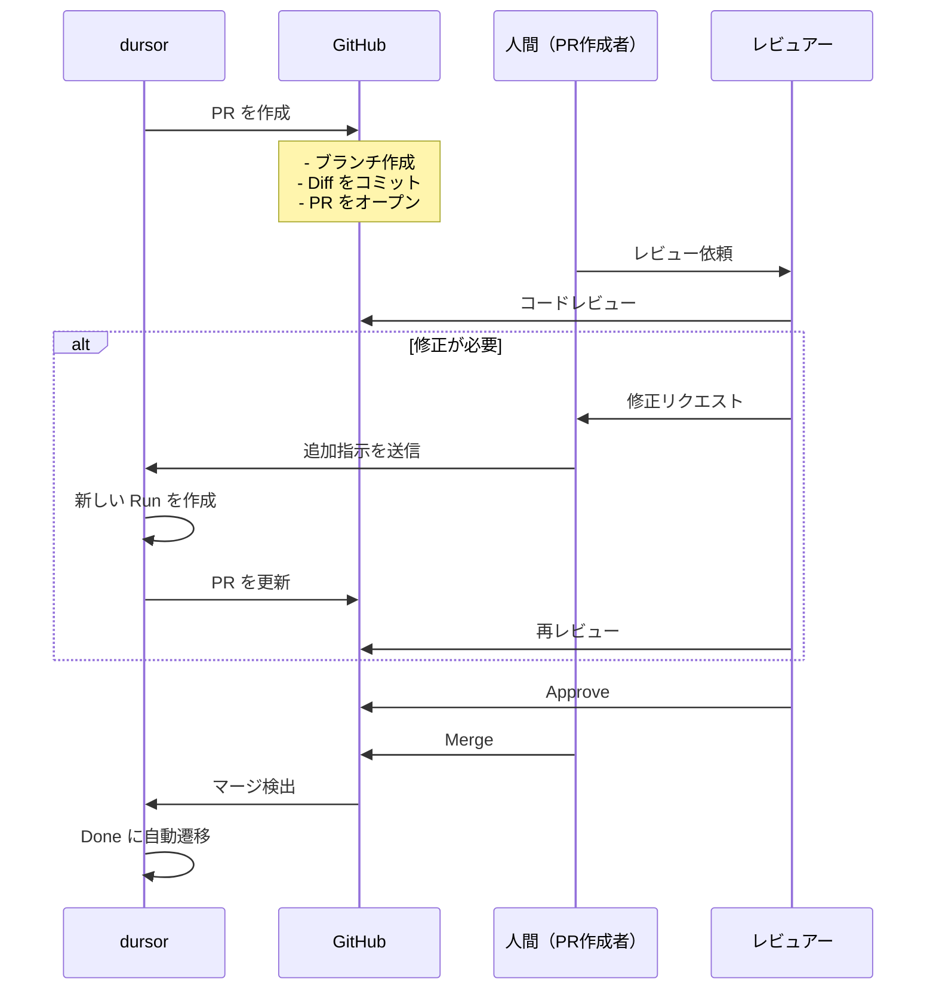

**レビュー観点:**
- コードの品質・可読性
- 要件との整合性
- セキュリティ上の問題
- テストの有無

**フィードバックの送信（修正が必要な場合）:**
```
修正してください:
- エラーハンドリングを追加
- 入力バリデーションを強化
- コメントを追加
```

**Done への遷移:**
- GitHub で PR がマージされると自動的に Done に遷移
- Kanban ボードの「Sync」ボタンで手動同期も可能

---

## ステータス遷移まとめ

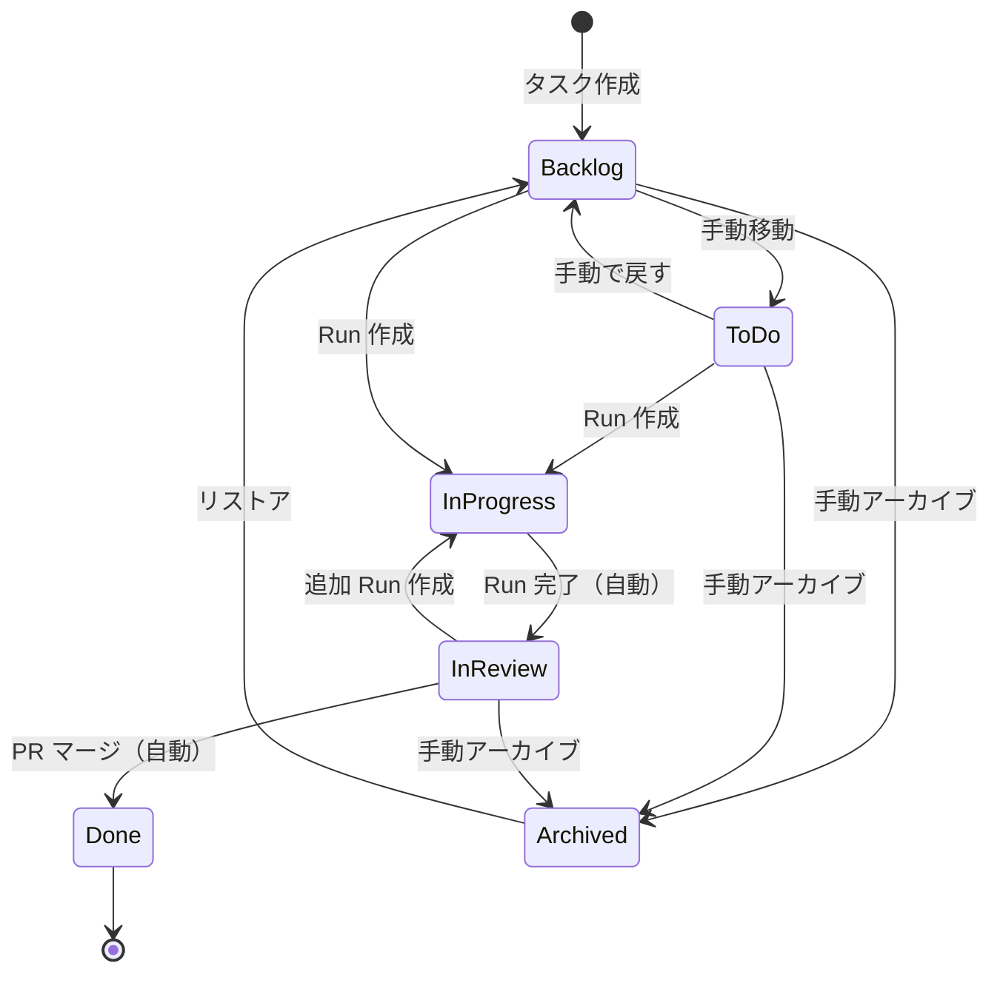

| 遷移 | 方法 | トリガー |
|------|------|----------|
| → Backlog | 手動 | 初期状態 / リストア |
| Backlog → ToDo | 手動 | ドラッグ＆ドロップ / ボタン |
| ToDo → InProgress | 自動 | Run が running になった時 |
| InProgress → InReview | 自動 | すべての Run が完了した時 |
| InReview → Done | 自動 | PR がマージされた時 |
| → Archived | 手動 | アーカイブボタン |

---

## 典型的なワークフロー例

### シナリオ: ログイン機能のバグ修正

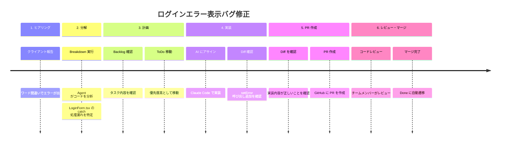

---

## ベストプラクティス

### 1. ヒアリング時
- 具体的な再現手順を記録する
- 期待する動作を明確にする
- 優先度・緊急度を確認する

### 2. タスク分解時
- 適切な Agent を選択する（複雑な変更は CLI Agent を推奨）
- 分解結果を必ずレビューする
- 大きすぎるタスクは手動で分割する

### 3. 実装時
- 複数モデルで並列実行して結果を比較する
- 追加指示は具体的に記述する
- テストの追加も指示に含める

### 4. PR 作成時
- Diff を丁寧に確認してから PR を作成する
- PR テンプレートを活用する
- テスト手順を明記する
- 関連 Issue をリンクする

### 5. レビュー時
- コードの品質・可読性を確認する
- セキュリティ上の問題がないか確認する
- 不明点は追加質問する

---

## 関連ドキュメント

- [Kanban 機能設計](./kanban.md)
- [タスク分解機能設計](./task-split.md)
- [API 設計](./api.md)
- [アーキテクチャ](./architecture.md)
