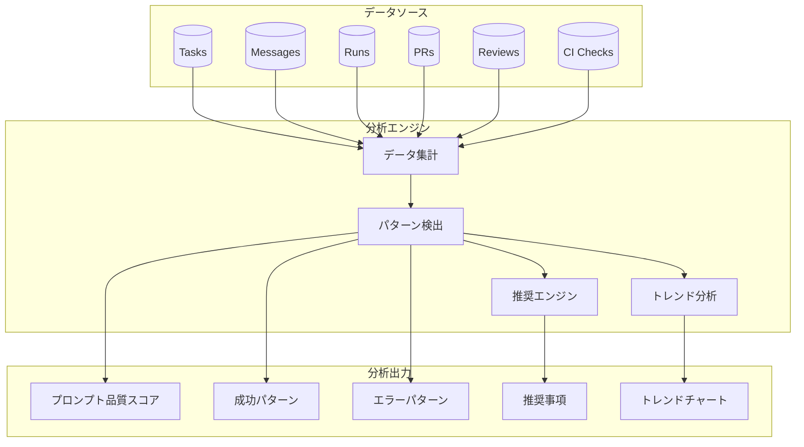

# ユーザープロンプト分析機能

## 概要

Analysis機能は、ユーザーの過去のタスク実行データに基づいてインサイトと推奨事項を提供します。過去のタスクからプロンプト、結果、パターンを分析することで、ユーザーがワークフローを改善し、AIコーディングエージェントからより良い結果を得るための実用的なアドバイスを提供します。

## データソース

分析はzlothシステムの以下のデータを活用します：

| データソース | 主要フィールド | 分析目的 |
|-------------|--------------|---------|
| **Tasks** | title, coding_mode, kanban_status, created_at, updated_at | タスク進行パターン |
| **Messages** | role, content, created_at | プロンプト品質と会話パターン |
| **Runs** | status, executor_type, instruction, summary, patch, logs, warnings, error | 成功/失敗パターン |
| **PRs** | status, merge time | アウトカム追跡 |
| **Reviews** | severity, category, feedbacks | コード品質パターン |
| **CI Checks** | status, failed_jobs | インテグレーション問題 |

## 分析カテゴリ

### 1. プロンプト品質分析

ユーザープロンプトの品質と効果を分析し、改善提案を提供します。

**メトリクス：**
- 平均プロンプト長
- 技術用語の使用状況
- コンテキスト/制約の有無
- 明確性・具体性スコア

**推奨事項：**
- プロンプトが曖昧な場合はコンテキストを追加
- 具体的なファイルパスや関数名を含める
- 受け入れ基準や期待される動作を提供
- 複雑なリクエストを小さなタスクに分割

**インサイト例：**
```
「15語程度のプロンプトは、50語以上のプロンプトと比較して
成功率が40%低い傾向があります。期待される動作や
影響するファイルについてより多くのコンテキストを追加することを
検討してください。」
```

### 2. 成功パターン分析

タスク完了の成功と相関するパターンを特定します。

**メトリクス：**
- プロンプトタイプ別成功率（機能追加、バグ修正、リファクタリング）
- エグゼキュータータイプ別成功率
- 時間帯/曜日別成功率
- タスク複雑度別成功率

**推奨事項：**
- タスクタイプに基づく最適なエグゼキューター選択
- 成功タスクからのベストプラクティス
- よく失敗するパターンの警告サイン

**インサイト例：**
```
「'認証'関連のタスクは、Claude Codeエグゼキューターで85%の成功率
ですが、Patch Agentでは60%です。セキュリティ関連のタスクには
Claude Codeの使用を検討してください。」
```

### 3. イテレーション効率分析

タスク完了に必要なイテレーション数を分析します。

**メトリクス：**
- 成功タスクあたりの平均メッセージ数
- 再実行頻度
- CI修正イテレーション数
- レビューイテレーション数

**推奨事項：**
- より明確な初期指示で往復を削減
- テスト要件を事前に含める
- 最初のメッセージでコーディング規約を指定

**インサイト例：**
```
「初期プロンプトにテスト要件を含むタスクは、平均で2.3回少ない
イテレーションで済みます。プロンプトに'ユニットテストを含める'
を追加してみてください。」
```

### 4. エラーパターン分析

一般的な失敗パターンとその原因を特定します。

**メトリクス：**
- 最も一般的なエラータイプ
- ファイルタイプ/モジュール別失敗率
- CI失敗パターン
- レビューフィードバックパターン

**推奨事項：**
- 既知の問題パターンを回避
- よく失敗する領域にセーフガードを追加
- 代替アプローチを提案

**インサイト例：**
```
「失敗の30%がデータベースマイグレーションに関連しています。
これらを小さなステップに分割することを検討してください：
1) マイグレーション作成、2) ローカルテスト、3) ステージング適用」
```

### 5. 完了時間分析

タスク完了時間を分析し、ボトルネックを特定します。

**メトリクス：**
- タスク作成からPRマージまでの平均時間
- 各カンバンステージでの滞在時間
- キュー待機時間
- CIチェック所要時間

**推奨事項：**
- より速い完了のための最適なタスクサイズ
- タスク送信に最適な時間帯
- 並列化の機会

**インサイト例：**
```
「午前9-11時に作成されたタスクは、完了時間が25%短くなります。
平均タスクは'gating'ステータスで45%の時間を費やしています -
低リスクの変更には自動マージを有効にすることを検討してください。」
```

### 6. コード品質トレンド分析

時間の経過に伴うコード品質の改善または低下を追跡します。

**メトリクス：**
- レビュースコアのトレンド
- 時間経過による問題深刻度の分布
- 最も一般的なレビューカテゴリ
- テストカバレッジのトレンド（利用可能な場合）

**推奨事項：**
- 繰り返し発生する問題に基づくフォーカスエリア
- 品質向上のためのプロンプトテンプレート
- 高スコアタスクからのベストプラクティス

**インサイト例：**
```
「セキュリティ関連のレビュー問題が今月40%増加しています。
セキュリティに敏感なプロンプトに'適切な入力バリデーションと
エラーハンドリングを確保する'を追加することを検討してください。」
```

### 7. モデル/エグゼキューター比較

異なるAIモデルとエグゼキューター間のパフォーマンスを比較します。

**メトリクス：**
- モデル別成功率
- モデル別速度
- コスト効率（追跡されている場合）
- タスクタイプ適合性

**推奨事項：**
- タスクタイプに最適なモデル選択
- コスト/品質のトレードオフ
- マルチモデル戦略の提案

**インサイト例：**
```
「リファクタリングタスクでは、Claude Codeが92%の成功率を示し、
Codex CLIは78%です。ただし、Codex CLIは単純なファイル変更では
3倍高速です。クイックフィックスにはCodexの使用を検討してください。」
```

### 8. リポジトリ固有のインサイト

各リポジトリに固有のインサイトを提供します。

**メトリクス：**
- リポジトリ別成功率
- コードベース内の一般的な失敗領域
- 最も変更されるファイル/モジュール
- 技術スタック固有のパターン

**推奨事項：**
- リポジトリ固有のプロンプトテンプレート
- 注意すべき高リスク領域
- ドキュメントのギャップ

**インサイト例：**
```
「'api'リポジトリでは、'src/auth/'を変更するタスクの失敗率が
35%高くなっています。このモジュールは複雑な依存関係があります -
関連プロンプトに'authモジュールの依存関係を確認'を追加することを
検討してください。」
```

## UI/UXデザイン

### 分析ダッシュボードレイアウト

```
+------------------------------------------+
|  Analysis                                 |
+------------------------------------------+
|                                          |
|  [期間選択: 7d | 30d | 90d | All]         |
|  [リポジトリフィルター: All | repo1 | ...] |
|                                          |
+------------------------------------------+
|  サマリーカード                           |
|  +--------+ +--------+ +--------+        |
|  |プロンプト| | 成功率 | | 平均   |        |
|  | スコア  | |        | |イテレ  |        |
|  |  72%   | |  85%   | |  3.2   |        |
|  +--------+ +--------+ +--------+        |
+------------------------------------------+
|  トップ推奨事項                           |
|  +--------------------------------------+|
|  | 1. プロンプトにテスト要件を追加       ||
|  |    影響: -2.3イテレーション           ||
|  +--------------------------------------+|
|  | 2. 認証タスクにはClaude Codeを使用    ||
|  |    影響: +25%成功率                   ||
|  +--------------------------------------+|
|  | 3. 大規模マイグレーションを分割       ||
|  |    影響: -40%失敗率                   ||
|  +--------------------------------------+|
+------------------------------------------+
|  詳細分析セクション                       |
|  [各カテゴリの展開可能なセクション]        |
+------------------------------------------+
```

### 主要UIコンポーネント

1. **サマリースコアカード**: 主要メトリクスの概要
2. **推奨事項リスト**: 優先度付きの実用的な提案
3. **トレンドチャート**: 時間経過によるメトリクスの視覚的表現
4. **比較テーブル**: モデル/エグゼキューターのパフォーマンス比較
5. **ドリルダウンビュー**: 特定パターンの詳細分析

## 実装フェーズ

### フェーズ1: 基本メトリクス収集
- タスク/実行/PR統計の集計
- 基本的な成功/失敗率
- 単純なプロンプト長分析

### フェーズ2: パターン認識
- プロンプト分類（機能追加、バグ修正、リファクタリング）
- エラーパターンのクラスタリング
- 時間ベースの分析

### フェーズ3: AI駆動インサイト
- LLMベースのプロンプト品質スコアリング
- 自動推奨事項生成
- 予測的成功分析

### フェーズ4: パーソナライズされた最適化
- ユーザー固有の学習パターン
- 適応的な推奨事項
- カスタムプロンプトテンプレート

## APIデザイン

### エンドポイント

```
GET  /v1/analysis
     - 全体の分析サマリーを返す

GET  /v1/analysis/prompts
     - プロンプト品質分析を返す

GET  /v1/analysis/success-patterns
     - 成功パターン分析を返す

GET  /v1/analysis/errors
     - エラーパターン分析を返す

GET  /v1/analysis/recommendations
     - 優先度付き推奨事項を返す

GET  /v1/analysis/trends
     - 指定されたメトリクスのトレンドデータを返す
```

### レスポンス例

```json
{
  "summary": {
    "period": "30d",
    "prompt_quality_score": 72,
    "overall_success_rate": 0.85,
    "avg_iterations": 3.2,
    "total_tasks_analyzed": 156
  },
  "recommendations": [
    {
      "id": "rec_001",
      "priority": "high",
      "category": "prompt_quality",
      "title": "プロンプトにテスト要件を追加",
      "description": "初期プロンプトにテスト要件を含めると、平均で2.3イテレーション削減できます。",
      "impact": {
        "metric": "avg_iterations",
        "improvement": -2.3
      },
      "evidence": {
        "with_tests": { "avg_iterations": 2.1, "sample_size": 45 },
        "without_tests": { "avg_iterations": 4.4, "sample_size": 111 }
      }
    }
  ],
  "prompt_analysis": {
    "avg_length": 45,
    "specificity_score": 0.68,
    "context_score": 0.72,
    "common_missing_elements": ["acceptance_criteria", "affected_files"]
  }
}
```

## プライバシーに関する考慮事項

- すべての分析はユーザーのzlothインスタンス内でローカルに実行
- 分析のためにプロンプト内容が外部サービスに送信されることはない
- ユーザーは分析データ収集をオプトアウト可能
- 履歴データの保持期間は設定可能

## 関連機能

- **メトリクスダッシュボード**: 定量的なメトリクスを提供（既存）
- **ブレイクダウン分析**: 要件を分析しサブタスクに分割（既存）
- **レビューシステム**: コード品質フィードバックを提供（既存）

## ダイアグラム



## 成功指標

Analysis機能自体は以下で測定されるべきです：

1. **採用率**: Analysisページを閲覧するユーザーの割合
2. **推奨事項のフォロースルー**: 実行された推奨事項の割合
3. **改善相関**: 分析使用と成功率改善の相関
4. **ユーザー満足度**: 推奨事項の有用性に関するフィードバック
