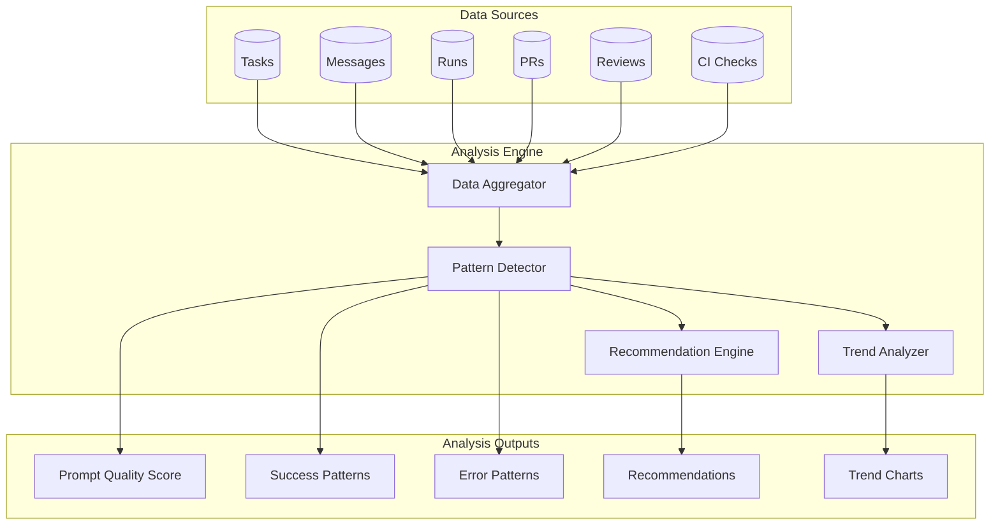

# User Prompt Analysis Feature

## Overview

The Analysis feature provides insights and recommendations based on the user's historical task execution data. By analyzing prompts, results, and patterns from past tasks, the system offers actionable advice to help users improve their workflow and get better results from AI coding agents.

## Data Sources

The analysis leverages the following data from the zloth system:

| Data Source | Key Fields | Analysis Purpose |
|-------------|------------|------------------|
| **Tasks** | title, coding_mode, kanban_status, created_at, updated_at | Task progression patterns |
| **Messages** | role, content, created_at | Prompt quality and conversation patterns |
| **Runs** | status, executor_type, instruction, summary, patch, logs, warnings, error | Success/failure patterns |
| **PRs** | status, merge time | Outcome tracking |
| **Reviews** | severity, category, feedbacks | Code quality patterns |
| **CI Checks** | status, failed_jobs | Integration issues |

## Analysis Categories

### 1. Prompt Quality Analysis

Analyzes the quality and effectiveness of user prompts to provide improvement suggestions.

**Metrics:**
- Average prompt length
- Use of specific technical terms
- Presence of context/constraints
- Clarity and specificity scores

**Recommendations:**
- Add more context when prompts are too vague
- Include specific file paths or function names
- Provide acceptance criteria or expected behavior
- Break down complex requests into smaller tasks

**Example Insights:**
```
"Your prompts averaging 15 words tend to have 40% lower success rates
than prompts with 50+ words. Consider adding more context about the
expected behavior and affected files."
```

### 2. Success Pattern Analysis

Identifies patterns that correlate with successful task completions.

**Metrics:**
- Success rate by prompt type (feature, bugfix, refactoring)
- Success rate by executor type
- Success rate by time of day/week
- Success rate by task complexity

**Recommendations:**
- Optimal executor selection based on task type
- Best practices from successful tasks
- Warning signs from commonly failed patterns

**Example Insights:**
```
"Tasks related to 'authentication' have 85% success rate when using
Claude Code executor, but only 60% with Patch Agent. Consider using
Claude Code for security-related tasks."
```

### 3. Iteration Efficiency Analysis

Analyzes how many iterations are needed to complete tasks.

**Metrics:**
- Average messages per successful task
- Re-run frequency
- CI fix iterations
- Review iteration counts

**Recommendations:**
- Reduce back-and-forth by providing clearer initial instructions
- Include test requirements upfront
- Specify coding standards in the first message

**Example Insights:**
```
"Tasks that include test requirements in the initial prompt require
2.3 fewer iterations on average. Try adding 'Include unit tests' to
your prompts."
```

### 4. Error Pattern Analysis

Identifies common failure patterns and their causes.

**Metrics:**
- Most common error types
- Failure rate by file type/module
- CI failure patterns
- Review feedback patterns

**Recommendations:**
- Avoid known problematic patterns
- Add safeguards for commonly failed areas
- Suggest alternative approaches

**Example Insights:**
```
"30% of your failures involve database migrations. Consider breaking
these into smaller steps: 1) Create migration, 2) Test locally,
3) Apply to staging."
```

### 5. Time-to-Completion Analysis

Analyzes task completion times and identifies bottlenecks.

**Metrics:**
- Average time from task creation to PR merge
- Time spent in each kanban stage
- Queue wait times
- CI check durations

**Recommendations:**
- Optimal task sizing for faster completion
- Best times to submit tasks
- Parallelization opportunities

**Example Insights:**
```
"Tasks created between 9-11 AM have 25% faster completion times.
Your average task spends 45% of time in 'gating' status - consider
enabling auto-merge for low-risk changes."
```

### 6. Code Quality Trend Analysis

Tracks code quality improvements or degradations over time.

**Metrics:**
- Review score trends
- Issue severity distribution over time
- Most common review categories
- Test coverage trends (if available)

**Recommendations:**
- Focus areas based on recurring issues
- Prompt templates for quality improvement
- Best practices from high-scoring tasks

**Example Insights:**
```
"Security-related review issues have increased 40% this month.
Consider adding 'Ensure proper input validation and error handling'
to your security-sensitive prompts."
```

### 7. Model/Executor Comparison

Compares performance across different AI models and executors.

**Metrics:**
- Success rate by model
- Speed by model
- Cost efficiency (if tracked)
- Task type suitability

**Recommendations:**
- Optimal model selection for task types
- Cost/quality trade-offs
- Multi-model strategy suggestions

**Example Insights:**
```
"For refactoring tasks, Claude Code shows 92% success rate vs 78%
for Codex CLI. However, Codex CLI is 3x faster for simple file
modifications. Consider using Codex for quick fixes."
```

### 8. Repository-Specific Insights

Provides insights specific to each repository.

**Metrics:**
- Success rate by repository
- Common failure areas in codebase
- Most modified files/modules
- Tech stack specific patterns

**Recommendations:**
- Repository-specific prompt templates
- High-risk areas to watch
- Documentation gaps

**Example Insights:**
```
"In the 'api' repository, tasks modifying 'src/auth/' have 35% higher
failure rates. This module has complex dependencies - consider adding
'Check auth module dependencies' to related prompts."
```

## UI/UX Design

### Analysis Dashboard Layout

```
+------------------------------------------+
|  Analysis                                 |
+------------------------------------------+
|                                          |
|  [Period Selector: 7d | 30d | 90d | All] |
|  [Repository Filter: All | repo1 | ...]  |
|                                          |
+------------------------------------------+
|  Summary Cards                           |
|  +--------+ +--------+ +--------+        |
|  | Prompt | | Success| | Avg    |        |
|  | Score  | | Rate   | | Iters  |        |
|  |  72%   | |  85%   | |  3.2   |        |
|  +--------+ +--------+ +--------+        |
+------------------------------------------+
|  Top Recommendations                      |
|  +--------------------------------------+|
|  | 1. Add test requirements to prompts  ||
|  |    Impact: -2.3 iterations           ||
|  +--------------------------------------+|
|  | 2. Use Claude Code for auth tasks    ||
|  |    Impact: +25% success rate         ||
|  +--------------------------------------+|
|  | 3. Break down large migrations       ||
|  |    Impact: -40% failure rate         ||
|  +--------------------------------------+|
+------------------------------------------+
|  Detailed Analysis Sections              |
|  [Expandable sections for each category] |
+------------------------------------------+
```

### Key UI Components

1. **Summary Score Cards**: Quick overview of key metrics
2. **Recommendation List**: Prioritized, actionable suggestions
3. **Trend Charts**: Visual representation of metrics over time
4. **Comparison Tables**: Model/executor performance comparison
5. **Drill-down Views**: Detailed analysis for specific patterns

## Implementation Phases

### Phase 1: Basic Metrics Collection
- Aggregate task/run/PR statistics
- Basic success/failure rates
- Simple prompt length analysis

### Phase 2: Pattern Recognition
- Prompt categorization (feature, bugfix, refactoring)
- Error pattern clustering
- Time-based analysis

### Phase 3: AI-Powered Insights
- LLM-based prompt quality scoring
- Automatic recommendation generation
- Predictive success analysis

### Phase 4: Personalized Optimization
- User-specific learning patterns
- Adaptive recommendations
- Custom prompt templates

## API Design

### Endpoints

```
GET  /v1/analysis
     - Returns overall analysis summary

GET  /v1/analysis/prompts
     - Returns prompt quality analysis

GET  /v1/analysis/success-patterns
     - Returns success pattern analysis

GET  /v1/analysis/errors
     - Returns error pattern analysis

GET  /v1/analysis/recommendations
     - Returns prioritized recommendations

GET  /v1/analysis/trends
     - Returns trend data for specified metrics
```

### Response Example

```json
{
  "summary": {
    "period": "30d",
    "prompt_quality_score": 72,
    "overall_success_rate": 0.85,
    "avg_iterations": 3.2,
    "total_tasks_analyzed": 156
  },
  "recommendations": [
    {
      "id": "rec_001",
      "priority": "high",
      "category": "prompt_quality",
      "title": "Add test requirements to prompts",
      "description": "Including test requirements in your initial prompt reduces iterations by 2.3 on average.",
      "impact": {
        "metric": "avg_iterations",
        "improvement": -2.3
      },
      "evidence": {
        "with_tests": { "avg_iterations": 2.1, "sample_size": 45 },
        "without_tests": { "avg_iterations": 4.4, "sample_size": 111 }
      }
    }
  ],
  "prompt_analysis": {
    "avg_length": 45,
    "specificity_score": 0.68,
    "context_score": 0.72,
    "common_missing_elements": ["acceptance_criteria", "affected_files"]
  }
}
```

## Privacy Considerations

- All analysis is performed locally within the user's zloth instance
- No prompt content is sent to external services for analysis
- Users can opt-out of analysis data collection
- Historical data retention is configurable

## Related Features

- **Metrics Dashboard**: Provides quantitative metrics (existing)
- **Breakdown Analysis**: Analyzes requirements and breaks into subtasks (existing)
- **Review System**: Provides code quality feedback (existing)

## Diagram



## Success Metrics

The Analysis feature itself should be measured by:

1. **Adoption Rate**: % of users who view the Analysis page
2. **Recommendation Follow-through**: % of recommendations acted upon
3. **Improvement Correlation**: Correlation between analysis usage and success rate improvement
4. **User Satisfaction**: Feedback on recommendation usefulness
