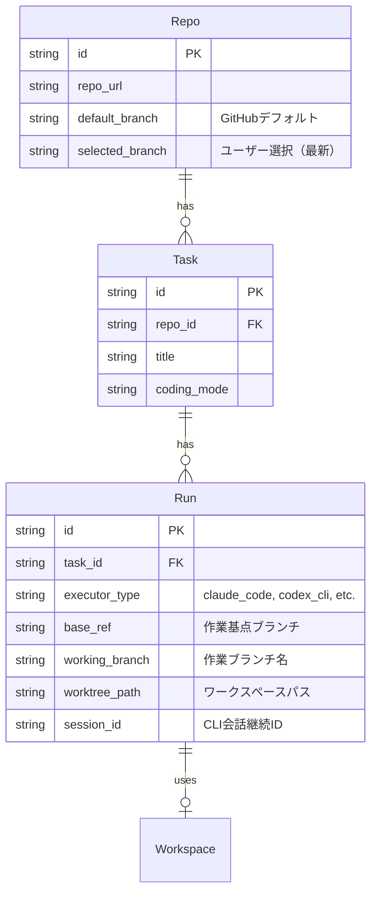
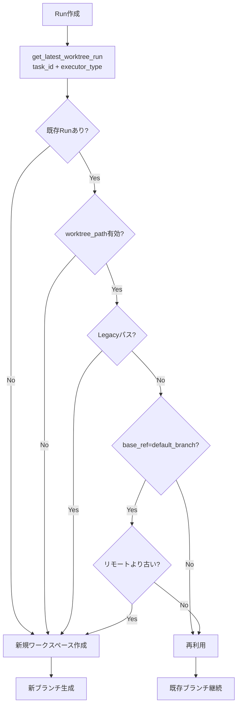
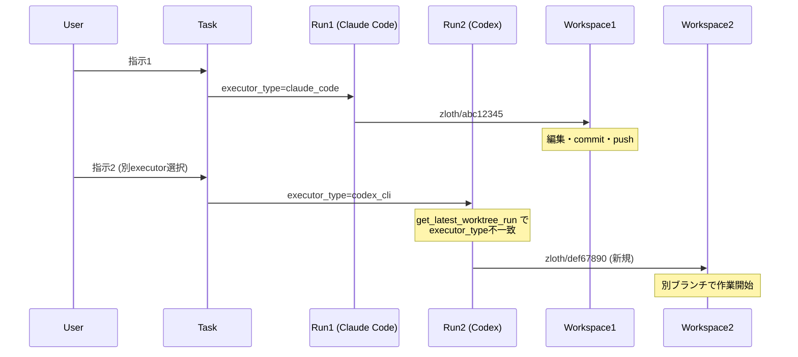
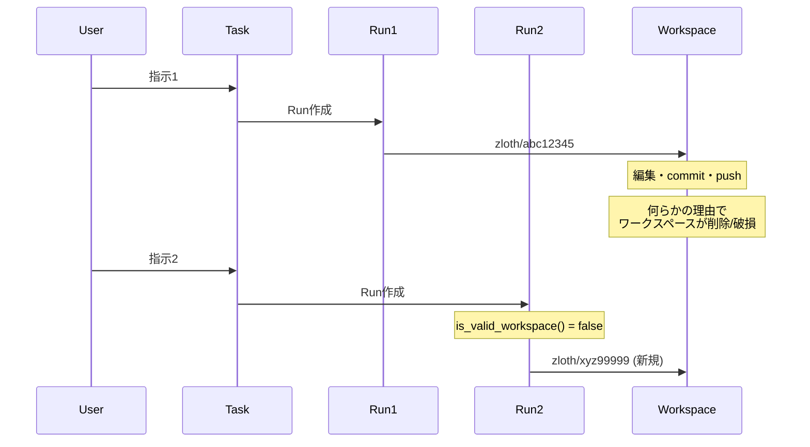
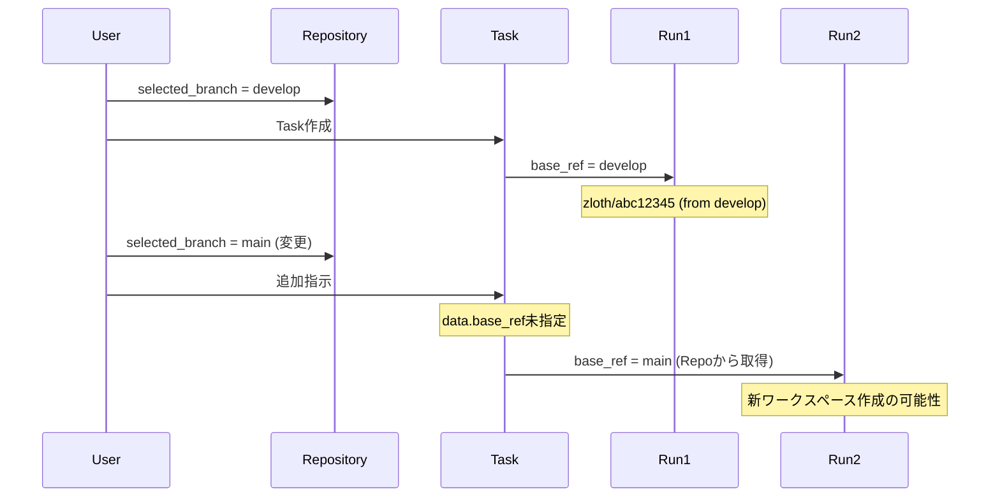
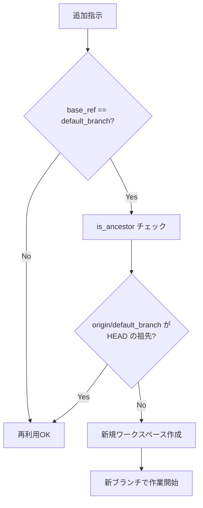
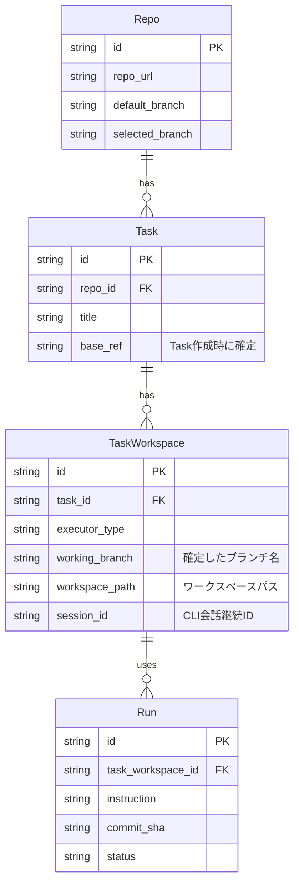
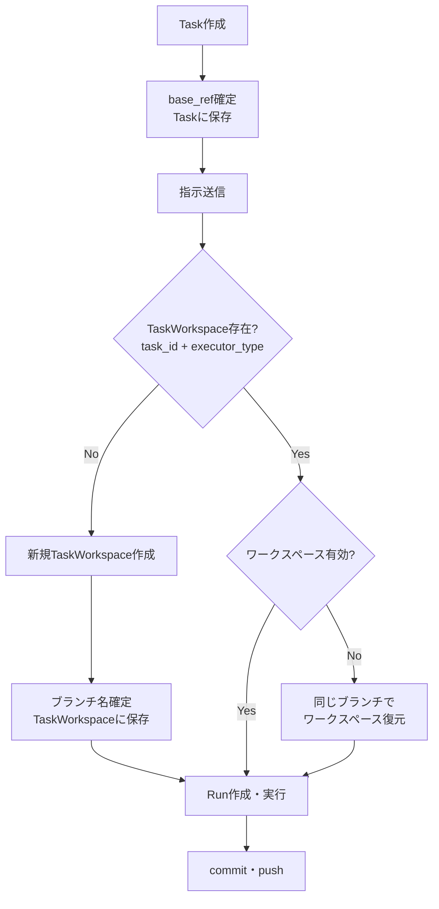

# Task内でのワークスペース・ブランチ一貫性の問題分析と改善計画

## 概要

同一のTask内でAIとやりとりをしていると、意図せずブランチが変わってしまう問題が報告されています。本ドキュメントでは、この問題の原因を分析し、あるべき姿と改善計画をまとめます。

## 現状のアーキテクチャ

### エンティティ関係



### 現在のワークスペース再利用ロジック



**参照コード:**
- `apps/api/src/zloth_api/services/run_workspace_manager.py`
- `apps/api/src/zloth_api/services/run_service.py`
- `apps/api/src/zloth_api/storage/dao.py` (RunDAO.get_latest_worktree_run)

## 問題が発生するシナリオ

### シナリオ1: executor_typeの変更



**原因:** `get_latest_worktree_run()`は`task_id`と`executor_type`の両方でフィルタリングするため、executor_typeが変わると既存ワークスペースが見つからない。

### シナリオ2: ワークスペースの無効化



**原因:** 
- ディスク容量不足やクリーンアップによるワークスペース削除
- 手動でのディレクトリ操作
- サーバー再起動後のストレージマウント問題

### シナリオ3: base_refの変更



**原因:**
- `Repo.selected_branch`は最新の選択で上書きされる
- 明示的な`base_ref`指定がない場合、Runは`repo.selected_branch`を参照
- 同一Task内でも異なるbase_refでRunが作成される可能性

### シナリオ4: デフォルトブランチとの比較による無効化



**原因:**
- `get_reusable_workspace()`でデフォルトブランチ更新時に既存ワークスペースを無効化
- これは意図的な設計だが、ユーザーの期待と異なる場合がある

## あるべき姿

### 原則

1. **同一Task内でのブランチ一貫性**
   - 同一Taskでは、同一executor_typeなら同じブランチを使い続ける
   - ブランチの変更は明示的なユーザーアクションによってのみ発生すべき

2. **ワークスペースの堅牢性**
   - ワークスペースが無効になった場合も、可能な限り同じブランチを復元する
   - 復元不可能な場合は、ユーザーに通知する

3. **予測可能な動作**
   - どのような条件でブランチが変わるかが明確
   - ユーザーが意図しないブランチ変更は発生しない

### 理想のエンティティ構造



### 理想のワークフロー



## 改善計画

### Phase 1: 短期対策（現行アーキテクチャ内での改善）

#### 1.1 Taskにbase_refを保存

**変更内容:**
- `tasks`テーブルに`base_ref`カラムを追加
- Task作成時または最初のRun作成時に`base_ref`を確定・保存
- 以降のRunは明示的な指定がない限り`Task.base_ref`を使用

```sql
-- マイグレーション
ALTER TABLE tasks ADD COLUMN base_ref TEXT;
```

**影響ファイル:**
- `apps/api/src/zloth_api/storage/schema.sql`
- `apps/api/src/zloth_api/domain/models.py`
- `apps/api/src/zloth_api/storage/dao.py` (TaskDAO)
- `apps/api/src/zloth_api/services/run_service.py`

#### 1.2 ワークスペース復元ロジックの追加

**変更内容:**
- ワークスペースが無効な場合、既存Runから`working_branch`を取得
- 同じブランチ名で新規ワークスペースを作成（リモートからfetch）
- ブランチが存在しない場合のみ新規ブランチを作成

```python
async def get_or_restore_workspace(
    self,
    existing_run: Run | None,
    repo: Repo,
    base_ref: str,
) -> ExecutionWorkspaceInfo:
    """既存ワークスペースを取得、または復元する"""
    
    # 1. 既存ワークスペースが有効ならそのまま使用
    workspace_info = await self.get_reusable_workspace(existing_run, repo, base_ref)
    if workspace_info:
        return workspace_info
    
    # 2. 既存Runにブランチ名があれば、そのブランチで復元を試みる
    if existing_run and existing_run.working_branch:
        try:
            return await self._restore_workspace_from_branch(
                repo=repo,
                branch_name=existing_run.working_branch,
                base_ref=base_ref,
                run_id=existing_run.id,
            )
        except Exception as e:
            logger.warning(f"Failed to restore workspace: {e}")
    
    # 3. 完全新規作成
    return await self.create_workspace(...)
```

**影響ファイル:**
- `apps/api/src/zloth_api/services/run_workspace_manager.py`
- `apps/api/src/zloth_api/services/workspace_service.py`

#### 1.3 executor_type間でのブランチ共有オプション

**変更内容:**
- 設定で「executor_type間でブランチを共有する」オプションを追加
- 有効時、同一Task内のすべてのexecutor_typeで同じブランチを使用

```python
# config.py
share_workspace_across_executors: bool = Field(
    default=False,
    description="Share workspace/branch across different executor types within the same task",
)
```

**影響ファイル:**
- `apps/api/src/zloth_api/config.py`
- `apps/api/src/zloth_api/services/run_service.py`
- `apps/api/src/zloth_api/storage/dao.py` (RunDAO.get_latest_worktree_run)

### Phase 2: 中期対策（アーキテクチャ改善）

#### 2.1 TaskWorkspaceエンティティの導入

**変更内容:**
- TaskとRunの間に`TaskWorkspace`エンティティを追加
- ワークスペース・ブランチ情報をTaskWorkspaceで一元管理
- RunはTaskWorkspaceを参照する形に変更

```sql
CREATE TABLE task_workspaces (
    id TEXT PRIMARY KEY,
    task_id TEXT NOT NULL REFERENCES tasks(id),
    executor_type TEXT NOT NULL,
    working_branch TEXT NOT NULL,
    workspace_path TEXT,
    session_id TEXT,
    base_ref TEXT NOT NULL,
    created_at TEXT NOT NULL DEFAULT (datetime('now')),
    updated_at TEXT NOT NULL DEFAULT (datetime('now')),
    UNIQUE(task_id, executor_type)
);

-- runs テーブルの変更
ALTER TABLE runs ADD COLUMN task_workspace_id TEXT REFERENCES task_workspaces(id);
```

#### 2.2 ワークスペースライフサイクル管理

**変更内容:**
- TaskWorkspace作成時にブランチを確定（変更不可）
- ワークスペースパスは再作成可能（ブランチ名は維持）
- Task削除時にTaskWorkspaceとワークスペースをクリーンアップ

### Phase 3: 長期対策（UX改善）

#### 3.1 ブランチ変更の明示的UI

**変更内容:**
- ブランチ変更が必要な場合、UIで確認ダイアログを表示
- 「新しいブランチで作業を開始」vs「既存ブランチで継続」の選択肢

#### 3.2 ワークスペース状態の可視化

**変更内容:**
- タスク詳細画面でワークスペース状態を表示
- ブランチ名、最終コミット、同期状態を表示
- ワークスペースに問題がある場合は警告を表示

## 実装優先順位

| 優先度 | 対策 | 工数目安 | 効果 |
|--------|------|----------|------|
| 高 | 1.1 Taskにbase_ref保存 | 小 | base_ref変更による意図しないブランチ変更を防止 |
| 高 | 1.2 ワークスペース復元ロジック | 中 | ワークスペース無効化時のブランチ維持 |
| 中 | 1.3 executor_type間共有オプション | 小 | executor変更時のブランチ維持（オプション） |
| 中 | 2.1 TaskWorkspaceエンティティ | 大 | 長期的な保守性向上 |
| 低 | 3.1/3.2 UX改善 | 中 | ユーザー体験向上 |

## まとめ

### 問題の根本原因

1. **Taskレベルでのブランチ管理がない**
   - ブランチ情報がRunレベルでのみ管理されている
   - Task内でRunを跨いだ一貫性が保証されていない

2. **ワークスペース再利用条件が複雑**
   - executor_type、base_ref、有効性、リモート比較など多くの条件
   - どの条件で新規作成になるかが予測しにくい

3. **回復メカニズムの不足**
   - ワークスペースが無効になった場合、同じブランチでの復元ができない
   - 新規ブランチが作成され、作業が分断される

### 推奨アクション

1. **即時対応**: Phase 1.1（Taskにbase_ref保存）を実装
2. **短期対応**: Phase 1.2（ワークスペース復元ロジック）を実装
3. **中期対応**: Phase 2（TaskWorkspaceエンティティ）を検討

これらの改善により、同一Task内でのブランチ一貫性が保証され、ユーザーの期待する動作が実現できます。
