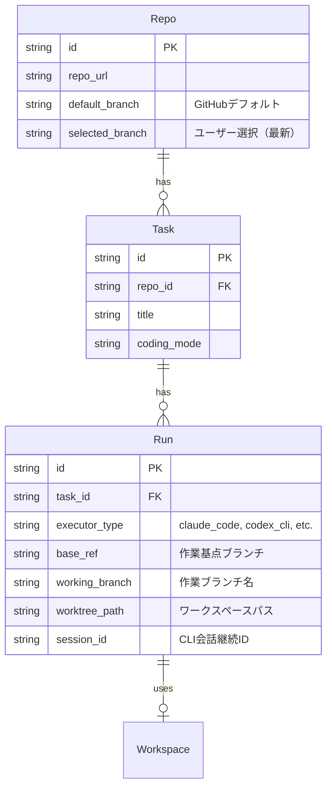
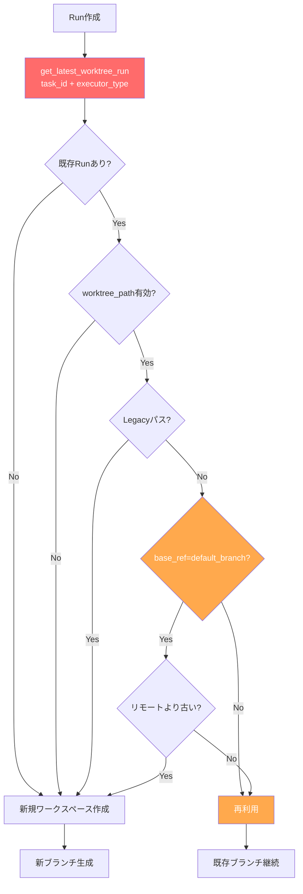
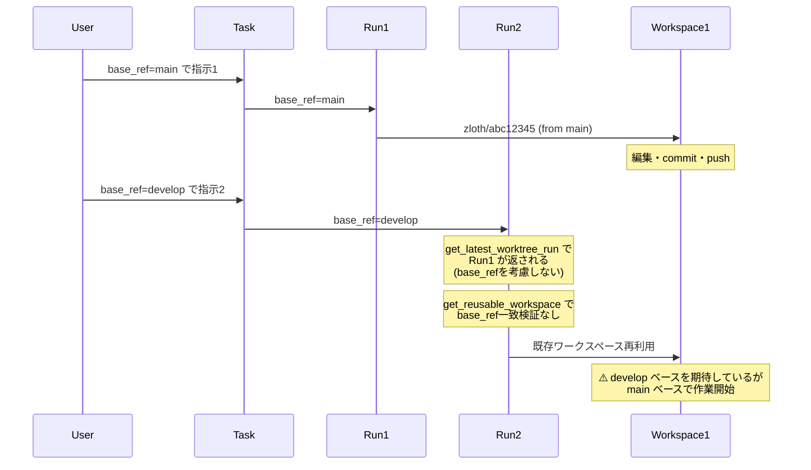
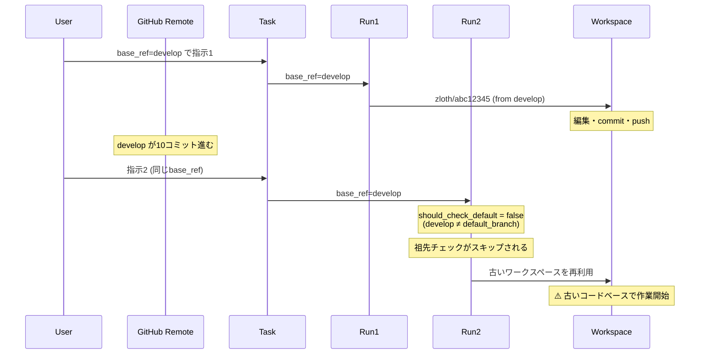
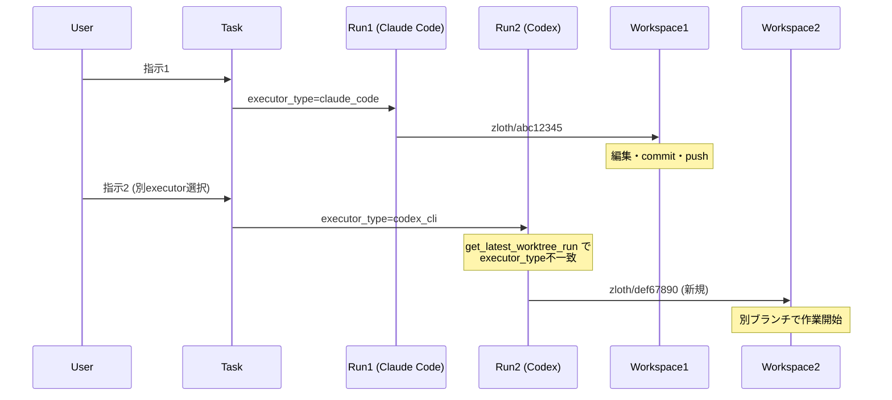
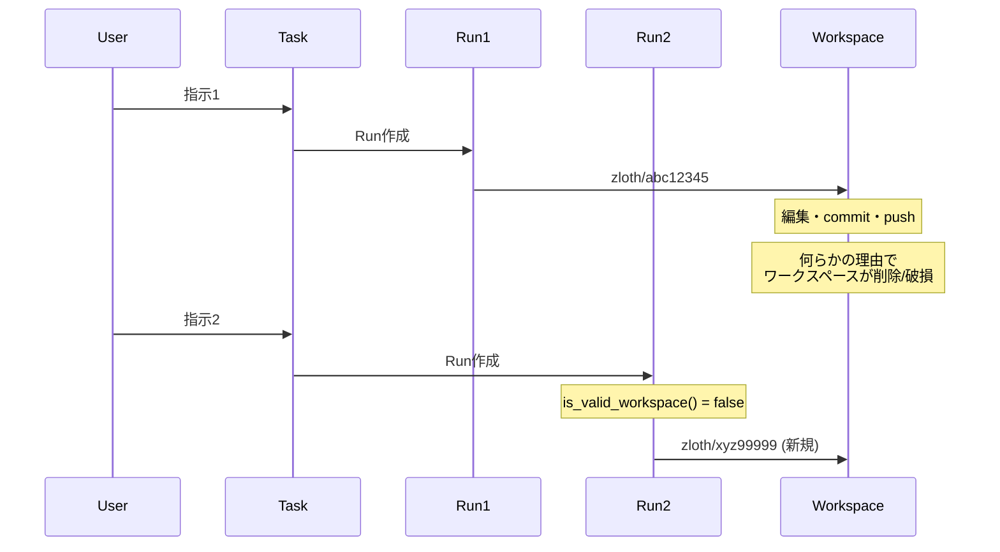
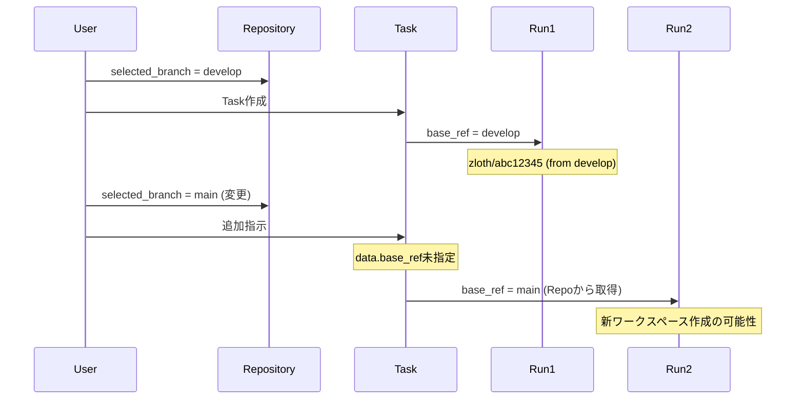
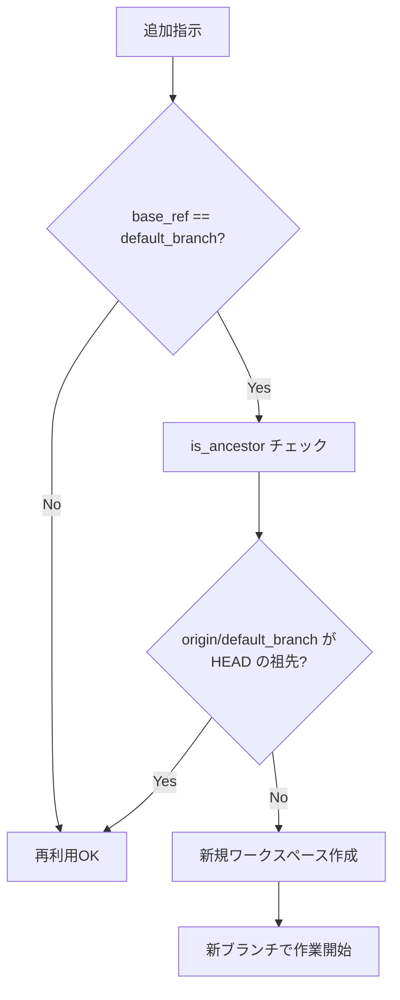
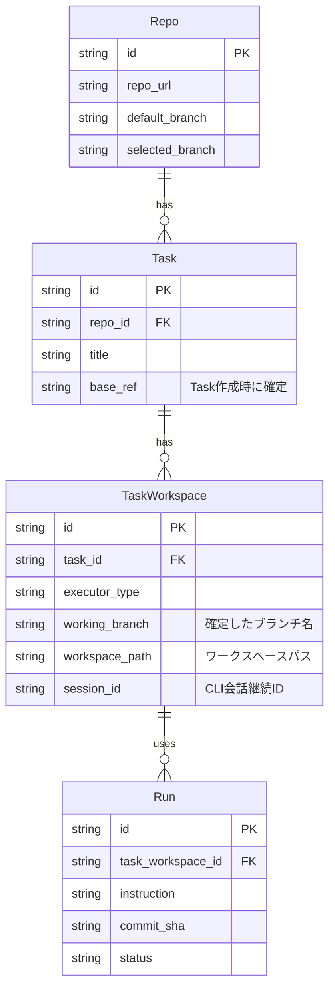
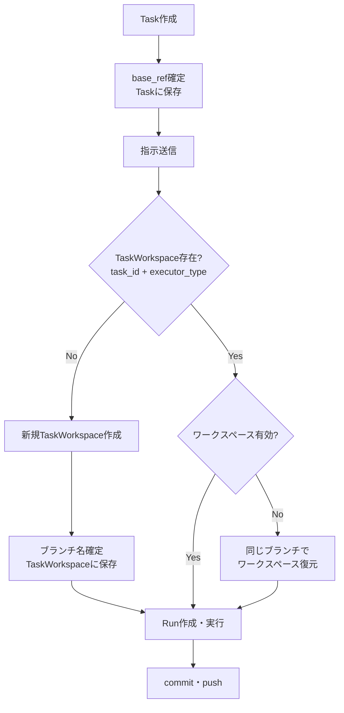

# Task内でのワークスペース・ブランチ一貫性の問題分析と改善計画

## 概要

同一のTask内でAIとやりとりをしていると、意図せずブランチが変わってしまう問題が報告されています。本ドキュメントでは、この問題の原因を分析し、あるべき姿と改善計画をまとめます。

## ⚠️ 発見された根本原因（重大）

以下の3つの根本原因により、タスク内でワークスペース・ブランチが意図せず切り替わる問題が発生しています。

### 根本原因1: `get_latest_worktree_run()` が `base_ref` を考慮していない

**ファイル**: `apps/api/src/zloth_api/storage/dao.py:713-762`

```python
async def get_latest_worktree_run(
    self,
    task_id: str,
    executor_type: ExecutorType | None = None,
    ignore_executor_type: bool = False,
) -> Run | None:
    # task_id と executor_type でのみフィルタリング
    # base_ref は一切考慮していない！
```

**問題**: 同じタスク内で異なる `base_ref` を持つRunが存在する場合、最新のRunが返され、**異なるベースブランチのワークスペース**が再利用される。

### 根本原因2: `get_reusable_workspace()` の `base_ref` 検証不足

**ファイル**: `apps/api/src/zloth_api/services/run_workspace_manager.py:40-88`

#### 問題点A: `base_ref` の一致検証がない
```python
# Line 81-88
workspace_info = ExecutionWorkspaceInfo(
    path=workspace_path,
    branch_name=existing_run.working_branch or "",
    base_branch=existing_run.base_ref or base_ref,  # ← 危険！
    created_at=existing_run.created_at or datetime.utcnow(),
)
```
- `existing_run.base_ref` と新しい `base_ref` が一致するかを**全く検証していない**
- `existing_run.base_ref` が NULL の場合、新しい `base_ref` にフォールバックするが、実際のワークスペースは別のベースから作成されている可能性

#### 問題点B: 非デフォルトブランチでは祖先チェックをスキップ
```python
# Line 66-79
should_check_default = (base_ref == repo.default_branch) and bool(repo.default_branch)
if should_check_default:
    # デフォルトブランチの場合のみチェック
    ...
# else: 非デフォルトブランチはチェックなしで再利用！
```
- `develop`, `release/*` などのブランチでは**一切検証せず古いワークスペースを再利用**

### 根本原因3: Run作成時の既存Run検索ロジック

**ファイル**: `apps/api/src/zloth_api/services/run_service.py:411-416`

```python
share_across = settings.share_workspace_across_executors
existing_run = await self.run_dao.get_latest_worktree_run(
    task_id=task_id,
    executor_type=executor_type,
    ignore_executor_type=share_across,  # base_ref は無視
)
```

**問題**: `base_ref` でフィルタリングせずに既存Runを検索するため、異なる `base_ref` のRunが返される可能性がある。

## 現状のアーキテクチャ

### エンティティ関係



### 現在のワークスペース再利用ロジック（問題箇所を含む）



**問題箇所の凡例:**
- 🔴 赤色: `base_ref` でフィルタリングしていない（根本原因1）
- 🟠 橙色: 非デフォルトブランチではチェックをスキップ（根本原因2）

**参照コード:**
- `apps/api/src/zloth_api/services/run_workspace_manager.py`
- `apps/api/src/zloth_api/services/run_service.py`
- `apps/api/src/zloth_api/storage/dao.py` (RunDAO.get_latest_worktree_run)

## 問題が発生するシナリオ

### シナリオ0: base_ref不一致による誤ったワークスペース再利用（最重要）



**原因:**
- `get_latest_worktree_run()` は `base_ref` でフィルタリングしない
- `get_reusable_workspace()` は `existing_run.base_ref` と新しい `base_ref` の一致を検証しない

### シナリオ0.5: 非デフォルトブランチの陳腐化



**原因:**
- `get_reusable_workspace()` は `base_ref == default_branch` の場合のみ祖先チェックを実行
- `develop`, `release/*` 等の非デフォルトブランチでは一切チェックしない

### シナリオ1: executor_typeの変更



**原因:** `get_latest_worktree_run()`は`task_id`と`executor_type`の両方でフィルタリングするため、executor_typeが変わると既存ワークスペースが見つからない。

### シナリオ2: ワークスペースの無効化



**原因:** 
- ディスク容量不足やクリーンアップによるワークスペース削除
- 手動でのディレクトリ操作
- サーバー再起動後のストレージマウント問題

### シナリオ3: base_refの変更



**原因:**
- `Repo.selected_branch`は最新の選択で上書きされる
- 明示的な`base_ref`指定がない場合、Runは`repo.selected_branch`を参照
- 同一Task内でも異なるbase_refでRunが作成される可能性

### シナリオ4: デフォルトブランチとの比較による無効化



**原因:**
- `get_reusable_workspace()`でデフォルトブランチ更新時に既存ワークスペースを無効化
- これは意図的な設計だが、ユーザーの期待と異なる場合がある

## あるべき姿

### 原則

1. **同一Task内でのブランチ一貫性**
   - 同一Taskでは、同一executor_typeなら同じブランチを使い続ける
   - ブランチの変更は明示的なユーザーアクションによってのみ発生すべき

2. **ワークスペースの堅牢性**
   - ワークスペースが無効になった場合も、可能な限り同じブランチを復元する
   - 復元不可能な場合は、ユーザーに通知する

3. **予測可能な動作**
   - どのような条件でブランチが変わるかが明確
   - ユーザーが意図しないブランチ変更は発生しない

### 理想のエンティティ構造



### 理想のワークフロー



## 改善計画

### Phase 0: 即時対策（根本原因の修正）

#### 0.1 `get_reusable_workspace()` に `base_ref` 一致検証を追加

**変更内容:**
- 既存Runの `base_ref` と新しい `base_ref` の一致を検証
- 不一致の場合は新規ワークスペースを作成

```python
# run_workspace_manager.py の get_reusable_workspace() を修正

async def get_reusable_workspace(
    self,
    existing_run: Run | None,
    repo: Repo,
    base_ref: str,
) -> ExecutionWorkspaceInfo | None:
    if not existing_run or not existing_run.worktree_path:
        return None

    # ⭐ 新規追加: base_ref の一致を検証
    if existing_run.base_ref and existing_run.base_ref != base_ref:
        logger.info(
            f"base_ref mismatch: existing={existing_run.base_ref}, "
            f"requested={base_ref}. Creating new workspace."
        )
        return None

    # ... 以降は既存ロジック
```

**影響ファイル:**
- `apps/api/src/zloth_api/services/run_workspace_manager.py`

#### 0.2 非デフォルトブランチでも祖先チェックを実行

**変更内容:**
- 全てのブランチタイプで祖先チェックを実行
- デフォルトブランチの特別扱いを廃止

```python
# run_workspace_manager.py の get_reusable_workspace() を修正

# 変更前（デフォルトブランチのみチェック）
should_check_default = (base_ref == repo.default_branch) and bool(repo.default_branch)
if should_check_default:
    # チェック実行
    ...

# 変更後（全ブランチでチェック）
# ⭐ すべてのブランチで祖先チェックを実行
remote_ref = f"origin/{base_ref}"
try:
    up_to_date = await self.git_service.is_ancestor(
        repo_path=workspace_path,
        ancestor=remote_ref,
        descendant="HEAD",
    )
    if not up_to_date:
        logger.info(f"Workspace is behind remote {base_ref}, creating new workspace")
        return None
except Exception as e:
    logger.warning(f"Ancestor check failed: {e}")
    # チェック失敗時は新規作成
    return None
```

**影響ファイル:**
- `apps/api/src/zloth_api/services/run_workspace_manager.py`

#### 0.3 `get_latest_worktree_run()` に `base_ref` パラメータを追加

**変更内容:**
- `base_ref` でのフィルタリングをオプションで追加
- 呼び出し元で `base_ref` を指定可能に

```python
# dao.py の get_latest_worktree_run() を修正

async def get_latest_worktree_run(
    self,
    task_id: str,
    executor_type: ExecutorType | None = None,
    ignore_executor_type: bool = False,
    base_ref: str | None = None,  # ⭐ 新規追加
) -> Run | None:
    query = """
        SELECT * FROM runs
        WHERE task_id = ?
          AND worktree_path IS NOT NULL
          AND working_branch IS NOT NULL
    """
    params: list[Any] = [task_id]

    # ⭐ base_ref でフィルタリング
    if base_ref:
        query += " AND base_ref = ?"
        params.append(base_ref)

    # ... 以降は既存ロジック
```

**影響ファイル:**
- `apps/api/src/zloth_api/storage/dao.py`
- `apps/api/src/zloth_api/services/run_service.py`

### Phase 1: 短期対策（現行アーキテクチャ内での改善）

#### 1.1 Taskにbase_refを保存

**変更内容:**
- `tasks`テーブルに`base_ref`カラムを追加
- Task作成時または最初のRun作成時に`base_ref`を確定・保存
- 以降のRunは明示的な指定がない限り`Task.base_ref`を使用

```sql
-- マイグレーション
ALTER TABLE tasks ADD COLUMN base_ref TEXT;
```

**影響ファイル:**
- `apps/api/src/zloth_api/storage/schema.sql`
- `apps/api/src/zloth_api/domain/models.py`
- `apps/api/src/zloth_api/storage/dao.py` (TaskDAO)
- `apps/api/src/zloth_api/services/run_service.py`

#### 1.2 ワークスペース復元ロジックの追加

**変更内容:**
- ワークスペースが無効な場合、既存Runから`working_branch`を取得
- 同じブランチ名で新規ワークスペースを作成（リモートからfetch）
- ブランチが存在しない場合のみ新規ブランチを作成

```python
async def get_or_restore_workspace(
    self,
    existing_run: Run | None,
    repo: Repo,
    base_ref: str,
) -> ExecutionWorkspaceInfo:
    """既存ワークスペースを取得、または復元する"""
    
    # 1. 既存ワークスペースが有効ならそのまま使用
    workspace_info = await self.get_reusable_workspace(existing_run, repo, base_ref)
    if workspace_info:
        return workspace_info
    
    # 2. 既存Runにブランチ名があれば、そのブランチで復元を試みる
    if existing_run and existing_run.working_branch:
        try:
            return await self._restore_workspace_from_branch(
                repo=repo,
                branch_name=existing_run.working_branch,
                base_ref=base_ref,
                run_id=existing_run.id,
            )
        except Exception as e:
            logger.warning(f"Failed to restore workspace: {e}")
    
    # 3. 完全新規作成
    return await self.create_workspace(...)
```

**影響ファイル:**
- `apps/api/src/zloth_api/services/run_workspace_manager.py`
- `apps/api/src/zloth_api/services/workspace_service.py`

#### 1.3 executor_type間でのブランチ共有オプション

**変更内容:**
- 設定で「executor_type間でブランチを共有する」オプションを追加
- 有効時、同一Task内のすべてのexecutor_typeで同じブランチを使用

```python
# config.py
share_workspace_across_executors: bool = Field(
    default=False,
    description="Share workspace/branch across different executor types within the same task",
)
```

**影響ファイル:**
- `apps/api/src/zloth_api/config.py`
- `apps/api/src/zloth_api/services/run_service.py`
- `apps/api/src/zloth_api/storage/dao.py` (RunDAO.get_latest_worktree_run)

### Phase 2: 中期対策（アーキテクチャ改善）

#### 2.1 TaskWorkspaceエンティティの導入

**変更内容:**
- TaskとRunの間に`TaskWorkspace`エンティティを追加
- ワークスペース・ブランチ情報をTaskWorkspaceで一元管理
- RunはTaskWorkspaceを参照する形に変更

```sql
CREATE TABLE task_workspaces (
    id TEXT PRIMARY KEY,
    task_id TEXT NOT NULL REFERENCES tasks(id),
    executor_type TEXT NOT NULL,
    working_branch TEXT NOT NULL,
    workspace_path TEXT,
    session_id TEXT,
    base_ref TEXT NOT NULL,
    created_at TEXT NOT NULL DEFAULT (datetime('now')),
    updated_at TEXT NOT NULL DEFAULT (datetime('now')),
    UNIQUE(task_id, executor_type)
);

-- runs テーブルの変更
ALTER TABLE runs ADD COLUMN task_workspace_id TEXT REFERENCES task_workspaces(id);
```

#### 2.2 ワークスペースライフサイクル管理

**変更内容:**
- TaskWorkspace作成時にブランチを確定（変更不可）
- ワークスペースパスは再作成可能（ブランチ名は維持）
- Task削除時にTaskWorkspaceとワークスペースをクリーンアップ

### Phase 3: 長期対策（UX改善）

#### 3.1 ブランチ変更の明示的UI

**変更内容:**
- ブランチ変更が必要な場合、UIで確認ダイアログを表示
- 「新しいブランチで作業を開始」vs「既存ブランチで継続」の選択肢

#### 3.2 ワークスペース状態の可視化

**変更内容:**
- タスク詳細画面でワークスペース状態を表示
- ブランチ名、最終コミット、同期状態を表示
- ワークスペースに問題がある場合は警告を表示

## 実装優先順位

| 優先度 | 対策 | 工数目安 | 効果 |
|--------|------|----------|------|
| 🔴 最高 | 0.1 `base_ref` 一致検証追加 | 小 | **根本原因の修正**: 異なるbase_refのワークスペース再利用を防止 |
| 🔴 最高 | 0.2 非デフォルトブランチの祖先チェック | 小 | **根本原因の修正**: 全ブランチで陳腐化チェック |
| 🟠 高 | 0.3 `get_latest_worktree_run` に `base_ref` 追加 | 小 | DAOレベルでのフィルタリング強化 |
| 高 | 1.1 Taskにbase_ref保存 | 小 | base_ref変更による意図しないブランチ変更を防止（実装済み） |
| 高 | 1.2 ワークスペース復元ロジック | 中 | ワークスペース無効化時のブランチ維持（実装済み） |
| 中 | 1.3 executor_type間共有オプション | 小 | executor変更時のブランチ維持（実装済み） |
| 中 | 2.1 TaskWorkspaceエンティティ | 大 | 長期的な保守性向上 |
| 低 | 3.1/3.2 UX改善 | 中 | ユーザー体験向上 |

## まとめ

### 問題の根本原因

#### 🔴 最重要（未修正）

1. **`get_latest_worktree_run()` が `base_ref` を考慮していない**
   - `task_id` と `executor_type` でのみフィルタリング
   - 異なる `base_ref` のRunが返される可能性
   - **ファイル**: `apps/api/src/zloth_api/storage/dao.py:713-762`

2. **`get_reusable_workspace()` で `base_ref` の一致検証がない**
   - `existing_run.base_ref` と新しい `base_ref` の一致を検証していない
   - 異なるベースブランチのワークスペースが再利用される
   - **ファイル**: `apps/api/src/zloth_api/services/run_workspace_manager.py:40-88`

3. **非デフォルトブランチでは祖先チェックがスキップされる**
   - `develop`, `release/*` 等では陳腐化チェックが行われない
   - リモートが更新されても古いワークスペースが再利用される
   - **ファイル**: `apps/api/src/zloth_api/services/run_workspace_manager.py:66-79`

#### 🟢 改善済み

1. **Taskレベルでのブランチ管理**
   - `Task.base_ref` で最初のRunの `base_ref` がロックされる
   - 以降のRunは明示的な指定がない限り `Task.base_ref` を使用

2. **ワークスペース復元メカニズム**
   - ワークスペースが無効でもリモートブランチから復元可能
   - `get_or_restore_workspace()` で実装済み

3. **executor_type間共有オプション**
   - `share_workspace_across_executors` 設定で有効化可能

### 推奨アクション

1. **🔴 即時対応**: Phase 0.1（`base_ref` 一致検証追加）を実装
2. **🔴 即時対応**: Phase 0.2（非デフォルトブランチの祖先チェック）を実装
3. **🟠 短期対応**: Phase 0.3（`get_latest_worktree_run` に `base_ref` 追加）を実装
4. **中期対応**: Phase 2（TaskWorkspaceエンティティ）を検討

これらの改善により、「タスク内では一度開始したワークスペース・ブランチで作業し続ける」という期待される動作が実現できます。

---

**最終更新**: 2026-01-28
**調査担当**: Claude Code
