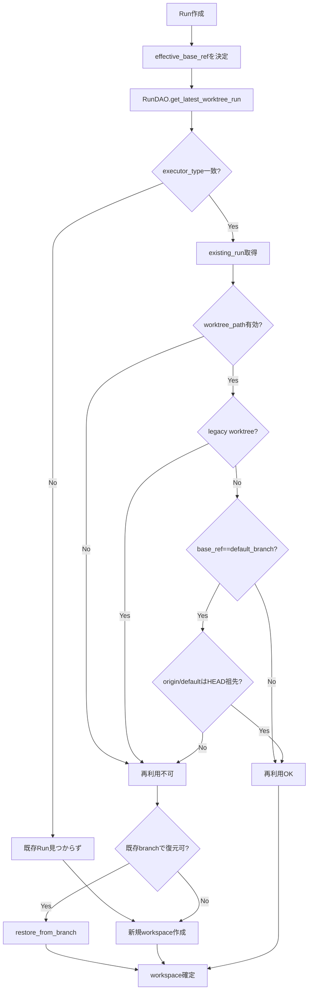
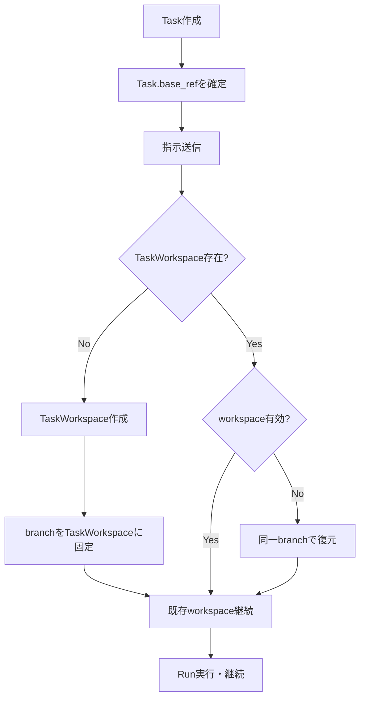

# Task 内でワークスペース/ブランチが切り替わる原因調査（v2）

## 調査対象と結論（要約）

**結論:** Task 内でワークスペース/ブランチが切り替わる主要因は、
1) **executor_type 切り替え時のワークスペース共有がデフォルトで無効**であること、
2) **ワークスペース再利用条件が厳格**（無効判定・デフォルトブランチ最新性チェック）であること、
3) **Run 作成時の base_ref が Task 基準と異なる場合に新規作成される**こと、
4) **旧 worktree パスが「レガシー扱い」され再利用されない**こと、
の複合要因です。以下にコードベースでの原因箇所と挙動を整理します。

---

## 1. 再利用ロジックの全体像（現行）

### 1.0 現状フロー（mermaid）

### 1.1 Run 作成時の既存ワークスペース探索

Run 作成時に `RunDAO.get_latest_worktree_run` が呼ばれ、**最新の「worktree_path がある Run」**を探します。検索条件は **executor_type 一致**が前提で、`share_workspace_across_executors` が有効な場合のみ executor_type を無視します。【F:apps/api/src/zloth_api/services/run_service.py†L401-L418】【F:apps/api/src/zloth_api/storage/dao.py†L713-L753】

- `share_workspace_across_executors` のデフォルトは **false** です。【F:apps/api/src/zloth_api/config.py†L215-L222】
- つまり **executor_type を変更すると別ワークスペースが作られる**のがデフォルト挙動です。【F:apps/api/src/zloth_api/services/run_service.py†L401-L418】

### 1.2 再利用可否の判定（RunWorkspaceManager）

取得した既存 Run に対して、`RunWorkspaceManager.get_reusable_workspace` が再利用可否を判定します。【F:apps/api/src/zloth_api/services/run_workspace_manager.py†L39-L90】

再利用を拒否する主な条件は以下です：

1. **worktree_path が無い/無効**（ディレクトリ消失・破損・非 git）【F:apps/api/src/zloth_api/services/run_workspace_manager.py†L45-L63】
2. **旧 worktree ルート配下のパス** → 「レガシー扱い」で強制的に再利用不可【F:apps/api/src/zloth_api/services/run_workspace_manager.py†L51-L57】
3. **base_ref が default_branch の場合に限り**、`origin/default` が `HEAD` の祖先でなければ「古い」と判断して再利用不可【F:apps/api/src/zloth_api/services/run_workspace_manager.py†L66-L79】

この結果、**既存の Task 内 Run があっても新規ワークスペースが作られる**ケースが発生します。

---

## 2. 主要原因の詳細分析

### 原因 A: executor_type 切り替え時のワークスペース共有が無効

`RunService._create_cli_run` は `share_workspace_across_executors` が **false** の場合、`get_latest_worktree_run` を **executor_type で絞り込む**ため、別 CLI への切り替え時に既存ワークスペースが見つかりません。【F:apps/api/src/zloth_api/services/run_service.py†L401-L418】【F:apps/api/src/zloth_api/storage/dao.py†L713-L753】

結果として、**Task の途中で executor_type を変えると別ブランチ/ワークスペースが生成される**のがデフォルト挙動です。【F:apps/api/src/zloth_api/config.py†L215-L222】

> 例: Claude Code → Codex CLI の切り替えで新規ブランチ生成

---

### 原因 B: デフォルトブランチ更新判定による再利用拒否

`RunWorkspaceManager.get_reusable_workspace` は `base_ref == repo.default_branch` の場合に限って、
**`origin/default_branch` が `HEAD` の祖先かどうか**を `git merge-base --is-ancestor` で判定します。【F:apps/api/src/zloth_api/services/run_workspace_manager.py†L66-L79】【F:apps/api/src/zloth_api/services/git_service.py†L251-L289】

この判定が **False** になると「古いワークスペース」として再利用を拒否し、新規ブランチが作成されます。【F:apps/api/src/zloth_api/services/run_workspace_manager.py†L66-L79】

特に以下の条件で発生しやすいです：
- default_branch に新しい commit が入った（Task 継続中）
- ローカルワークスペースが remote と乖離している

---

### 原因 C: 旧 worktree パスが「レガシー」として再利用不可

`RunWorkspaceManager.get_reusable_workspace` は、`git_service.worktrees_dir` 配下のパスを
**「レガシー worktree」として再利用拒否**します。【F:apps/api/src/zloth_api/services/run_workspace_manager.py†L51-L57】

過去に worktree ベースの workspace を使っていた Task の継続時は、
**意図せず新しい clone-based workspace が作成**され、別ブランチになります。

---

### 原因 D: base_ref が Task の固定値と異なる Run が作成される

`RunService.create_runs` は Run 作成時の base_ref を次の順で決定します：
1) リクエストの `data.base_ref`
2) Task にロックされた `task.base_ref`
3) `repo.selected_branch` / `repo.default_branch`
【F:apps/api/src/zloth_api/services/run_service.py†L275-L286】

そのため **API リクエストで base_ref が明示的に指定される**と、
Task 固定の base_ref と異なる Run が生成されます。【F:apps/api/src/zloth_api/services/run_service.py†L275-L286】

この場合、再利用判定が「別ブランチ起点」となるため、新規 workspace 生成に繋がります。

---

### 原因 E: ワークスペースが無効化された場合の新規作成

`get_reusable_workspace` では、`workspace_adapter.is_valid` が False になると
問答無用で新規 workspace を作ります。【F:apps/api/src/zloth_api/services/run_workspace_manager.py†L59-L63】

ワークスペース無効化の原因例：
- ディスククリーンアップで削除
- 手動削除/破損
- Git リポジトリとして壊れた

この場合、`get_or_restore_workspace` が **同じブランチでの復元を試みる**ものの、
リモートにブランチが存在しない場合は新規作成にフォールバックします。【F:apps/api/src/zloth_api/services/run_workspace_manager.py†L94-L152】【F:apps/api/src/zloth_api/services/workspace_service.py†L744-L828】

---

## 3. 追加観測ポイント（調査時に確認すべきログ/DB）

### 3.1 ログ出力での判定

以下のログが出る場合に **「意図せぬ切り替え」**が発生します：

- `Skipping reuse of legacy worktree path` → 旧 worktree パスのため再利用不可【F:apps/api/src/zloth_api/services/run_workspace_manager.py†L51-L57】
- `Workspace invalid or broken, will create new` → 無効判定で新規作成【F:apps/api/src/zloth_api/services/run_workspace_manager.py†L59-L63】
- `Existing workspace is behind latest default; creating new` → default_branch 更新判定【F:apps/api/src/zloth_api/services/run_workspace_manager.py†L72-L79】

### 3.2 DB で確認すべきカラム

- `runs.worktree_path` / `runs.working_branch`
- `runs.executor_type`
- `runs.base_ref`
- `tasks.base_ref`

これらを時系列で追うことで、切り替えのトリガーを追跡できます。
（`runs` は `created_at DESC` で最新が取得されます）【F:apps/api/src/zloth_api/storage/dao.py†L575-L584】

---

## 4. 問題の本質的構造

### 4.0 あるべきフロー（mermaid）

### 4.1 Task 単位での「固定 workspace」概念が弱い

- Task → Run の関係しかなく、**Task 単位で workspace/branch を固定する構造がない**。
- そのため executor_type の変化や base_ref 変更で別 workspace になる余地がある。

### 4.2 再利用ロジックが「安全側」に倒れている

- default_branch の更新判定
- legacy worktree の排除
- workspace 無効判定

いずれも安全側の設計であり、**同一 Task 内のブランチ一貫性とはトレードオフ**になっています。

---

## 5. まとめ（原因一覧）

| 原因 | 直接のトリガー | 根拠コード |
| --- | --- | --- |
| executor_type 切替時の再利用不可 | share_workspace_across_executors が false | RunService / RunDAO / config【F:apps/api/src/zloth_api/services/run_service.py†L401-L418】【F:apps/api/src/zloth_api/storage/dao.py†L713-L753】【F:apps/api/src/zloth_api/config.py†L215-L222】 |
| default_branch 更新判定 | origin/default が HEAD 祖先でない | RunWorkspaceManager + GitService【F:apps/api/src/zloth_api/services/run_workspace_manager.py†L66-L79】【F:apps/api/src/zloth_api/services/git_service.py†L251-L289】 |
| legacy worktree 再利用拒否 | worktrees_dir 配下のパス | RunWorkspaceManager【F:apps/api/src/zloth_api/services/run_workspace_manager.py†L51-L57】 |
| base_ref の明示指定 | data.base_ref が Task と異なる | RunService.create_runs【F:apps/api/src/zloth_api/services/run_service.py†L275-L286】 |
| workspace 無効化 | 破損/削除 | RunWorkspaceManager + WorkspaceService【F:apps/api/src/zloth_api/services/run_workspace_manager.py†L59-L63】【F:apps/api/src/zloth_api/services/workspace_service.py†L744-L828】 |

---

## 6. 次のアクション（参考）

本ドキュメントは調査結果をまとめたものであり、解決策の詳細は前回ドキュメント（`docs/workspace_branch.md`）の Phase 1/2/3 を再確認するのが望ましいです。特に以下は有効な対策候補です：

- **executor_type 跨ぎの workspace 共有を有効化/再設計**（Task レベル固定の Workspace 導入）
- **default_branch 更新判定の動作を UI/設定で明示化**
- **Task 単位で base_ref/branch を固定し、明示的な変更操作のみ許可**

（※ 実装方針の詳細は `docs/workspace_branch.md` を参照）
