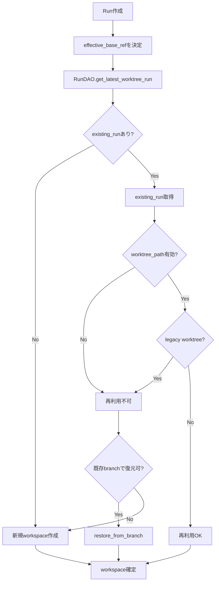
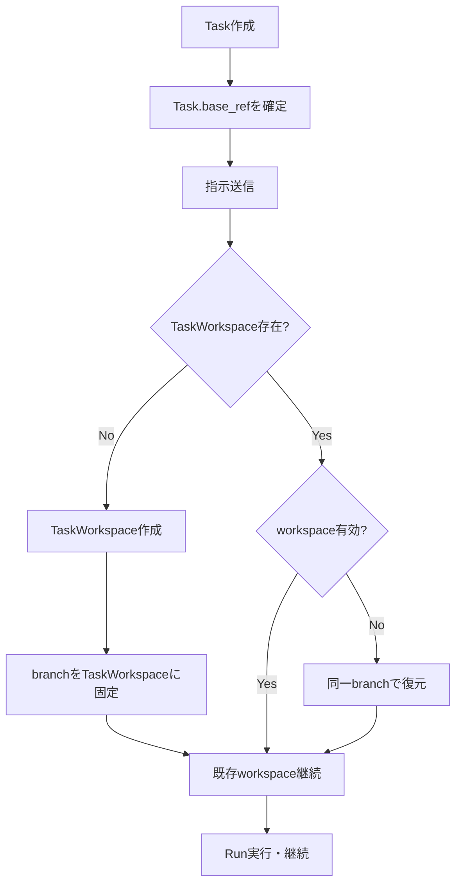
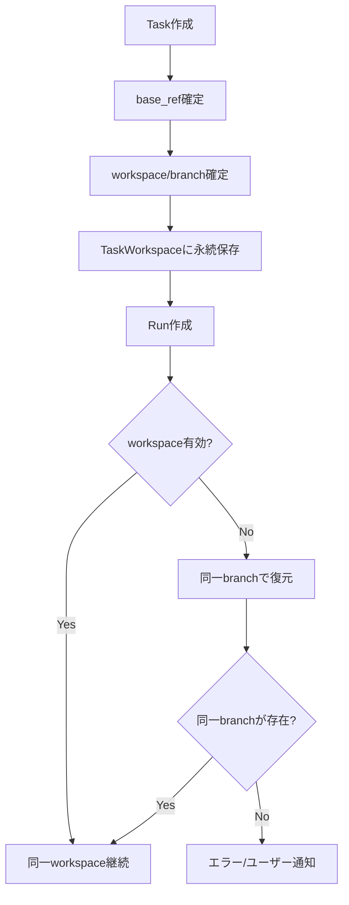

# Task 内でワークスペース/ブランチが切り替わる原因調査（v2）

## 調査対象と結論（要約）

**結論:** Task 内でワークスペース/ブランチが切り替わる主要因は、
1) **Task に workspace/branch が永続化されていない場合がある**こと、
2) **Run 作成時の base_ref が Task 基準と異なる場合に新規作成される**こと、
の複合要因です。以下にコードベースでの原因箇所と挙動を整理します。

---

## 1. 再利用ロジックの全体像（現行）

### 1.0 現状フロー（mermaid）

### 1.1 Run 作成時の既存ワークスペース探索

Run 作成時に `RunDAO.get_latest_worktree_run` が呼ばれ、**最新の「worktree_path がある Run」**を探します。【F:apps/api/src/zloth_api/services/run_service.py†L401-L418】【F:apps/api/src/zloth_api/storage/dao.py†L713-L753】

本システムの運用前提では **Task 内で executor_type は変えない**ため、executor_type 切替による影響は対象外です。

### 1.2 再利用可否の判定（RunWorkspaceManager）

取得した既存 Run に対して、`RunWorkspaceManager.get_reusable_workspace` が再利用可否を判定します。【F:apps/api/src/zloth_api/services/run_workspace_manager.py†L39-L90】

再利用を拒否する主な条件は以下です：

1. **worktree_path が無い/無効**（ディレクトリ消失・破損・非 git）【F:apps/api/src/zloth_api/services/run_workspace_manager.py†L45-L63】
2. **旧 worktree ルート配下のパス** → 「レガシー扱い」で強制的に再利用不可【F:apps/api/src/zloth_api/services/run_workspace_manager.py†L51-L57】
この結果、**既存の Task 内 Run があっても新規ワークスペースが作られる**ケースが発生します。

---

## 2. 主要原因の詳細分析

### 原因 A: Task に workspace/branch が永続化されていない

Task に workspace/branch が保存されていない場合、Run 作成時に **最新の Run から推測**して
workspace を再利用します。これにより、想定と異なる workspace が拾われる余地があります。【F:apps/api/src/zloth_api/services/run_service.py†L416-L489】

---

### 原因 B: 旧 worktree パスが「レガシー」として再利用不可

`RunWorkspaceManager.get_reusable_workspace` は、`git_service.worktrees_dir` 配下のパスを
**「レガシー worktree」として再利用拒否**します。【F:apps/api/src/zloth_api/services/run_workspace_manager.py†L51-L57】

過去に worktree ベースの workspace を使っていた Task の継続時は、
**意図せず新しい clone-based workspace が作成**され、別ブランチになります。

---

### 原因 C: base_ref が Task の固定値と異なる Run が作成される

`RunService.create_runs` は Run 作成時の base_ref を次の順で決定します：
1) リクエストの `data.base_ref`
2) Task にロックされた `task.base_ref`
3) `repo.selected_branch` / `repo.default_branch`
【F:apps/api/src/zloth_api/services/run_service.py†L275-L286】

そのため **API リクエストで base_ref が明示的に指定される**と、
Task 固定の base_ref と異なる Run が生成されます。【F:apps/api/src/zloth_api/services/run_service.py†L275-L286】

この場合、再利用判定が「別ブランチ起点」となるため、新規 workspace 生成に繋がります。

---

### 原因 D: ワークスペースが無効化された場合の新規作成

`get_reusable_workspace` では、`workspace_adapter.is_valid` が False になると
問答無用で新規 workspace を作ります。【F:apps/api/src/zloth_api/services/run_workspace_manager.py†L59-L63】

ワークスペース無効化の原因例：
- ディスククリーンアップで削除
- 手動削除/破損
- Git リポジトリとして壊れた

この場合、**同じブランチでの復元を試みる**ものの、
リモートにブランチが存在しない場合は **エラーとして扱う**必要があります。【F:apps/api/src/zloth_api/services/run_service.py†L449-L466】【F:apps/api/src/zloth_api/services/workspace_service.py†L744-L829】

---

## 3. 追加観測ポイント（調査時に確認すべきログ/DB）

### 3.1 ログ出力での判定

以下のログが出る場合に **「意図せぬ切り替え」**が発生します：

- `Skipping reuse of legacy worktree path` → 旧 worktree パスのため再利用不可【F:apps/api/src/zloth_api/services/run_workspace_manager.py†L51-L57】
- `Workspace invalid or broken, will create new` → 無効判定で新規作成【F:apps/api/src/zloth_api/services/run_workspace_manager.py†L59-L63】

### 3.2 DB で確認すべきカラム

- `runs.worktree_path` / `runs.working_branch`
- `runs.executor_type`
- `runs.base_ref`
- `tasks.base_ref`

これらを時系列で追うことで、切り替えのトリガーを追跡できます。
（`runs` は `created_at DESC` で最新が取得されます）【F:apps/api/src/zloth_api/storage/dao.py†L575-L584】

---

## 4. 問題の本質的構造

### 4.0 あるべきフロー（mermaid）

### 4.1 Task 単位での「固定 workspace」概念が弱い

- Task → Run の関係しかなく、**Task 単位で workspace/branch を固定する構造がない**。
- そのため base_ref 変更や再利用条件の分岐で別 workspace になる余地がある。

### 4.2 再利用ロジックが「安全側」に倒れている

- legacy worktree の排除
- workspace 無効判定

いずれも安全側の設計であり、**同一 Task 内のブランチ一貫性とはトレードオフ**になっています。

---

## 5. まとめ（原因一覧）

| 原因 | 直接のトリガー | 根拠コード |
| --- | --- | --- |
| Task に workspace/branch が未保存 | 最新 Run からの推測再利用 | RunService._create_cli_run【F:apps/api/src/zloth_api/services/run_service.py†L416-L489】 |
| legacy worktree 再利用拒否 | worktrees_dir 配下のパス | RunWorkspaceManager【F:apps/api/src/zloth_api/services/run_workspace_manager.py†L51-L57】 |
| base_ref の明示指定 | data.base_ref が Task と異なる | RunService.create_runs【F:apps/api/src/zloth_api/services/run_service.py†L276-L288】 |
| workspace 無効化 | 破損/削除 | RunWorkspaceManager + WorkspaceService【F:apps/api/src/zloth_api/services/run_workspace_manager.py†L59-L63】【F:apps/api/src/zloth_api/services/workspace_service.py†L744-L829】 |

---

## 6. あるべき設計（Task 内で決して変更されない保証）

### 6.1 必須要件

- **Task 内では workspace と working_branch が決して変わらない。**
- **リモート default_branch が更新されても Task の workspace/branch は変更しない。**
- **Task 内で executor_type を変えることはない前提**なので、executor_type 切替に依存した再利用条件は不要。
- **base_ref は Task 作成時に固定し、その後は上書き禁止。**

### 6.2 設計方針（強制固定）

1. **Task に `workspace_id`（または TaskWorkspace）を永続的に紐付ける**  
   Task 作成時に workspace/branch を確定し、以降の Run は必ずそれを使用する。  
   - Task -> TaskWorkspace を 1:1 で固定する（executor_type は固定値でよい）。  
   - TaskWorkspace に `working_branch`, `workspace_path`, `base_ref` を保存し、不変にする。

2. **default_branch との整合性チェックを再利用判定から除外**  
   `origin/default` が最新でなくても Task 内の workspace を維持する。  
   - 既存の「default_branch 更新判定」は Task 継続性の要件に反するため無効化する。

3. **workspace が壊れた場合も “同じ branch 名” で復元する**  
   例外時のみ workspace 再生成を行い、branch 名は TaskWorkspace に保存済みのものを必ず使用。  
   - リモートに該当ブランチが無い場合は **明示的にエラー**として扱い、勝手に新規 branch を作らない。

4. **base_ref の明示指定を禁止**  
   Run 作成時の `data.base_ref` は無視するか、Task の base_ref と一致する場合のみ許可。  
   一致しない場合はエラーで止める（Task の不変条件を破るため）。

### 6.3 あるべきフロー（厳密固定）

### 6.4 実装上の要点（既存コードへの影響）

- `RunService._create_cli_run` で **Task workspace/branch を固定保存**  
  （Task 以降は同一 workspace/branch を必ず使用）【F:apps/api/src/zloth_api/services/run_service.py†L416-L489】
- `RunService.create_runs` で **Task.base_ref を固定し、違反時は拒否**  
  （Run 作成時に base_ref が Task とズレるケースを排除）【F:apps/api/src/zloth_api/services/run_service.py†L276-L288】
- `WorkspaceService.restore_workspace` 失敗時の **新規 branch 作成は禁止**  
  （復元できない場合は明示的に失敗として扱う）【F:apps/api/src/zloth_api/services/workspace_service.py†L744-L829】

---

## 7. まとめ（原因一覧・修正後の前提）

| 原因 | 直接のトリガー | 対応方針 |
| --- | --- | --- |
| Task workspace 未保存 | 最新 Run の推測再利用 | Task workspace を永続化して固定 |
| legacy worktree 再利用拒否 | worktrees_dir 配下のパス | TaskWorkspace 永続化で回避 |
| base_ref の明示指定 | data.base_ref が Task と異なる | 一致しない場合は拒否 |
| workspace 無効化 | 破損/削除 | 同一branchで復元、失敗時はエラー |
