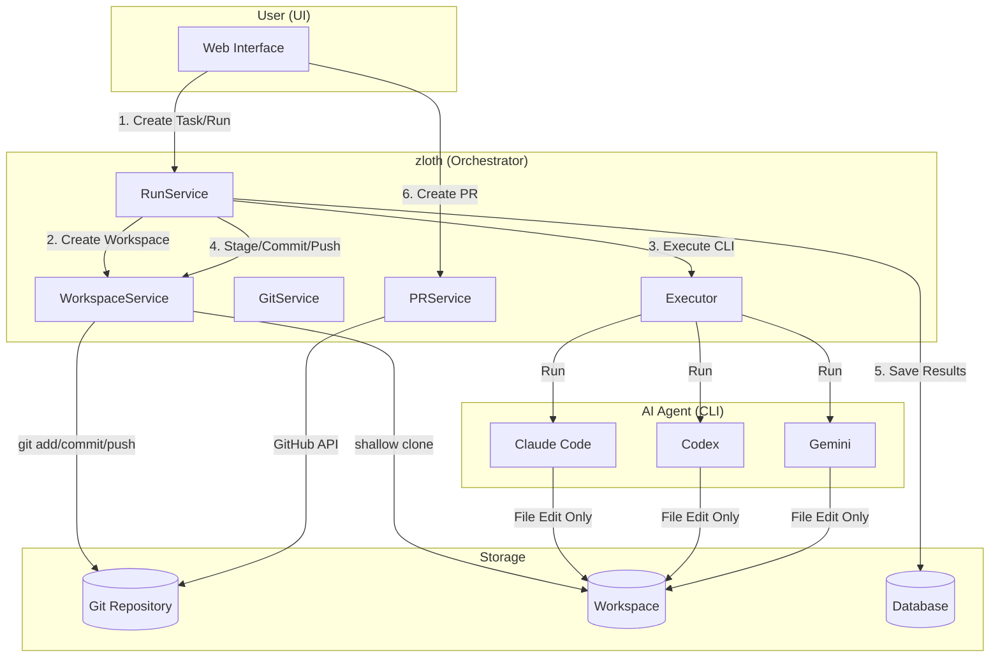
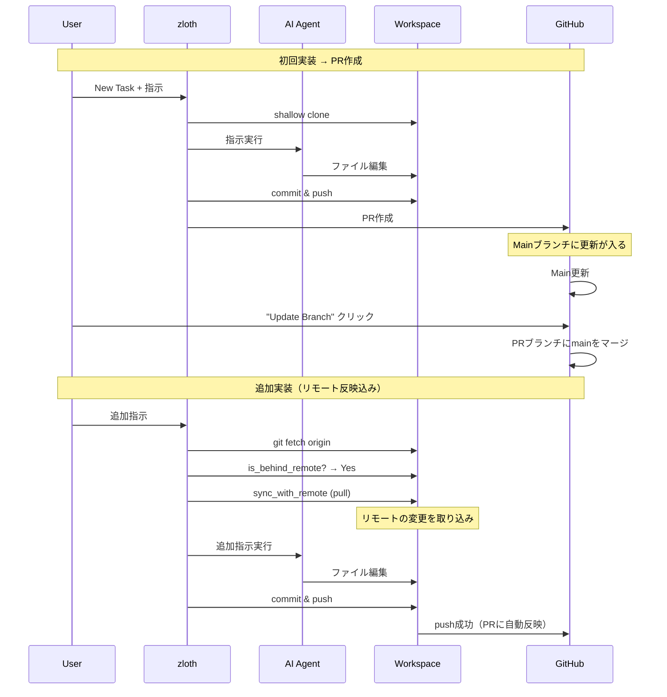
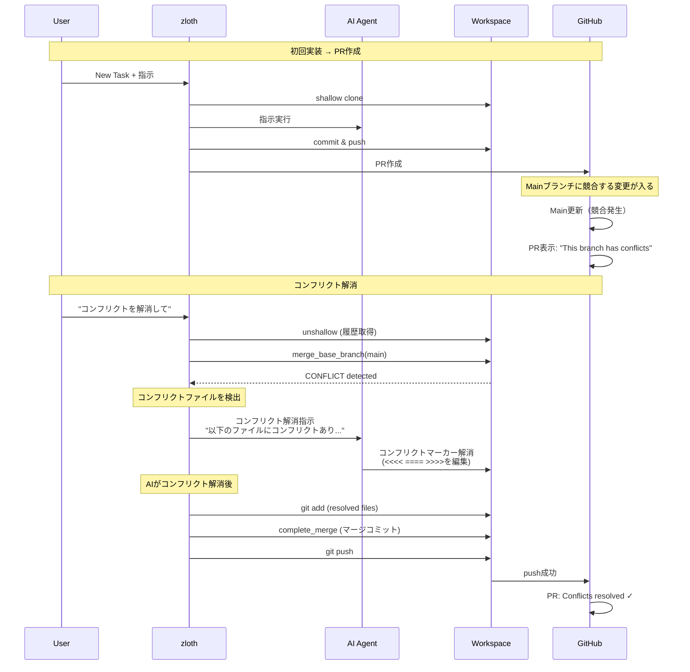
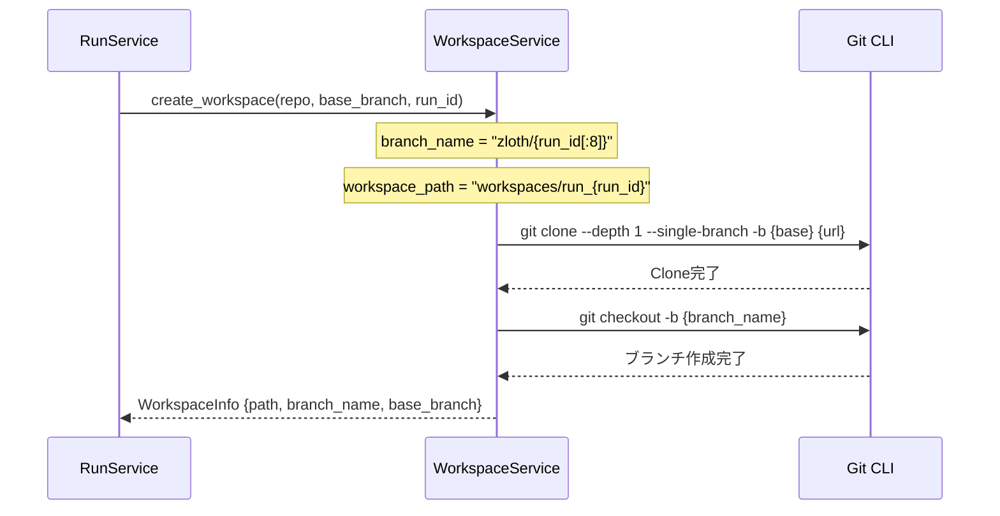
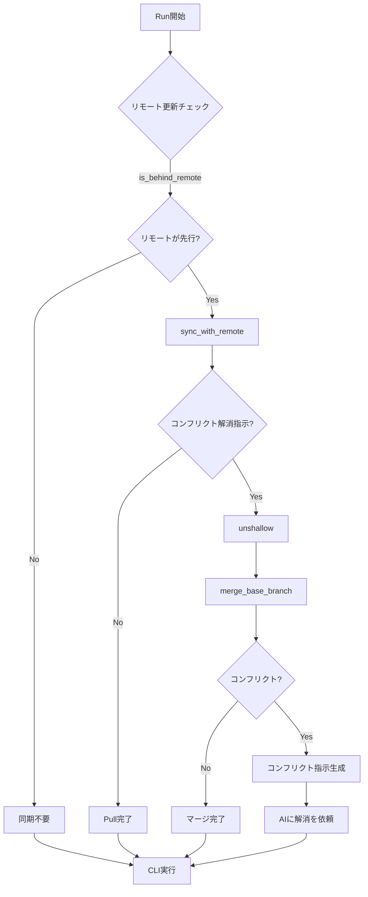
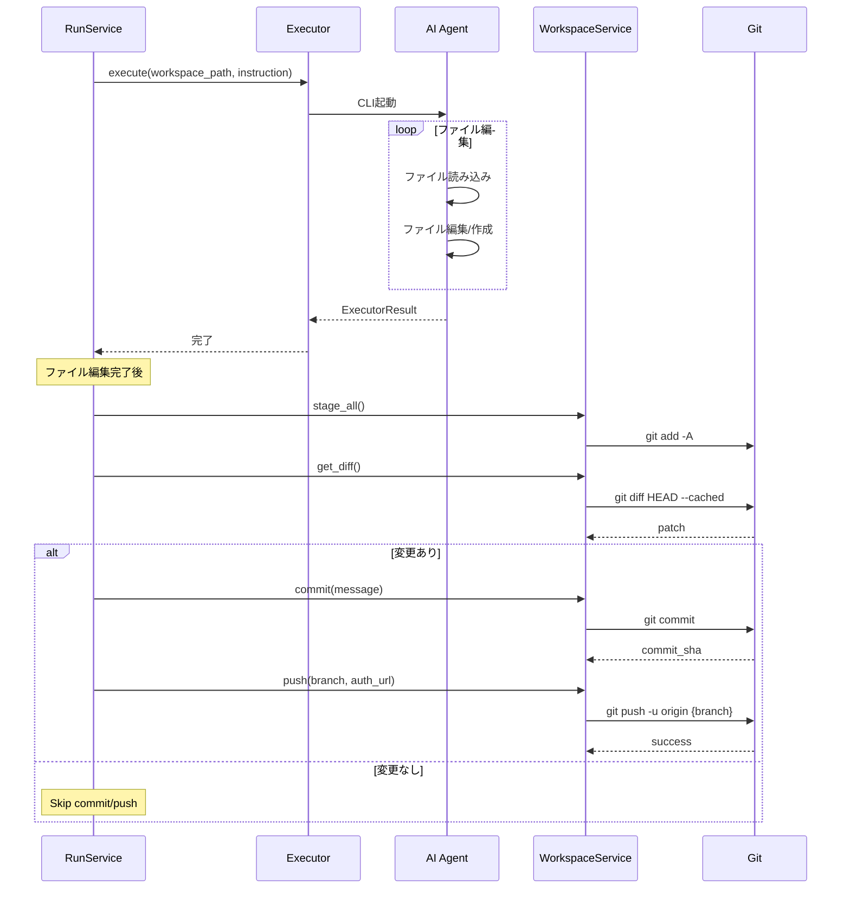
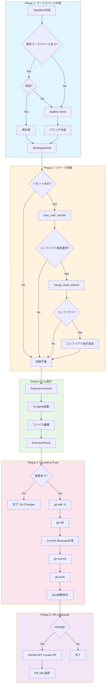

# Workspace Workflow Diagram

このドキュメントでは、zlothにおけるワークスペースの作成から実装、commit、pushまでの全体フローを図示します。

## 分離モード

zlothは2つのワークスペース分離モードをサポートしています：

| モード | 設定値 | 特徴 |
|--------|--------|------|
| **Clone方式** (推奨/デフォルト) | `use_clone_isolation=true` | フルgit clone。リモート同期・コンフリクト解消が容易 |
| **Worktree方式** (レガシー) | `use_clone_isolation=false` | git worktree。高速だがgit操作に制約あり |

## 全体アーキテクチャ



## サービス間の責務分担

| サービス | 責務 | Git操作 |
|---------|------|---------|
| **RunService** | Run実行の全体制御 | WorkspaceService/GitServiceを呼び出し |
| **WorkspaceService** | Clone方式のワークスペース管理 | clone, sync, merge, push |
| **GitService** | Worktree方式（レガシー） | worktree, add, commit, push |
| **Executor** | CLI実行 | なし（ファイル編集のみ） |
| **PRService** | PR作成・更新 | GitHub API経由 |

## ユースケース1: リモートブランチの更新

PRの「Update Branch」ボタンでベースブランチの更新を取り込む場合のフロー。



### Clone方式のポイント

- 独立したCloneなので`git pull`が問題なく動作
- `sync_with_remote()`でリモートの最新状態を取得
- 認証付きURLでプライベートリポジトリにも対応

## ユースケース2: ベースブランチとのコンフリクト解消

PRがベースブランチ（main/master）とコンフリクトを起こした場合の解消フロー。



### コンフリクト解消のポイント

1. **unshallow**: Shallow cloneを解除して完全な履歴を取得（merge-baseに必要）
2. **merge_base_branch**: ベースブランチをマージ、コンフリクトを検出
3. **AIへの指示**: コンフリクトファイルと解消方法を含む詳細な指示を生成
4. **complete_merge**: AIが解消後、マージコミットを完了

## Phase 1: ワークスペース作成



## Phase 2: リモート同期



## Phase 3: CLI実行とCommit/Push



## 全体ワークフロー（統合図）



## WorkspaceService主要メソッド

| メソッド | 用途 | Git操作 |
|---------|------|---------|
| `create_workspace()` | ワークスペース作成 | `git clone --depth 1` |
| `sync_with_remote()` | リモート同期 | `git fetch` + `git pull` |
| `is_behind_remote()` | リモート先行チェック | `git rev-list` |
| `unshallow()` | 浅いクローン解除 | `git fetch --unshallow` |
| `merge_base_branch()` | ベースブランチマージ | `git merge origin/{base}` |
| `get_conflict_files()` | コンフリクトファイル取得 | `git diff --name-only -U` |
| `complete_merge()` | マージ完了 | `git add` + `git commit` |
| `stage_all()` | 全変更ステージング | `git add -A` |
| `get_diff()` | Diff取得 | `git diff HEAD --cached` |
| `commit()` | コミット作成 | `git commit` |
| `push()` | プッシュ | `git push -u origin` |
| `cleanup_workspace()` | ワークスペース削除 | ディレクトリ削除 |

## 設定

`apps/api/src/zloth_api/config.py`:

```python
# Workspace Isolation Mode
use_clone_isolation: bool = Field(
    default=True,
    description="Use git clone instead of worktree for workspace isolation. "
    "Clone mode provides better support for remote sync and conflict resolution.",
)
```

環境変数での設定:

```bash
ZLOTH_USE_CLONE_ISOLATION=true  # Clone方式（推奨）
ZLOTH_USE_CLONE_ISOLATION=false # Worktree方式（レガシー）
```

### 互換メモ（Clone優先ポリシー）

- `use_clone_isolation=true` の場合、過去のRunで作成された「worktreeベースのワークスペース」は再利用しません。
- 既存のワークツリーが見つかった場合でも、Clone方式の新しいワークスペースを作成して実行します（安全なリモート同期のため）。

## 関連ファイル

| ファイル | 役割 |
|---------|------|
| `apps/api/src/zloth_api/services/workspace_service.py` | Clone方式のワークスペース管理 |
| `apps/api/src/zloth_api/services/git_service.py` | Worktree方式（レガシー） |
| `apps/api/src/zloth_api/services/run_service.py` | Run実行制御 |
| `apps/api/src/zloth_api/services/pr_service.py` | PR作成・更新 |
| `apps/api/src/zloth_api/config.py` | 設定 |
