# Worktree Workflow Diagram

このドキュメントでは、tazunaにおけるGit worktreeの作成から実装、commit、pushまでの全体フローを図示します。

## 全体アーキテクチャ

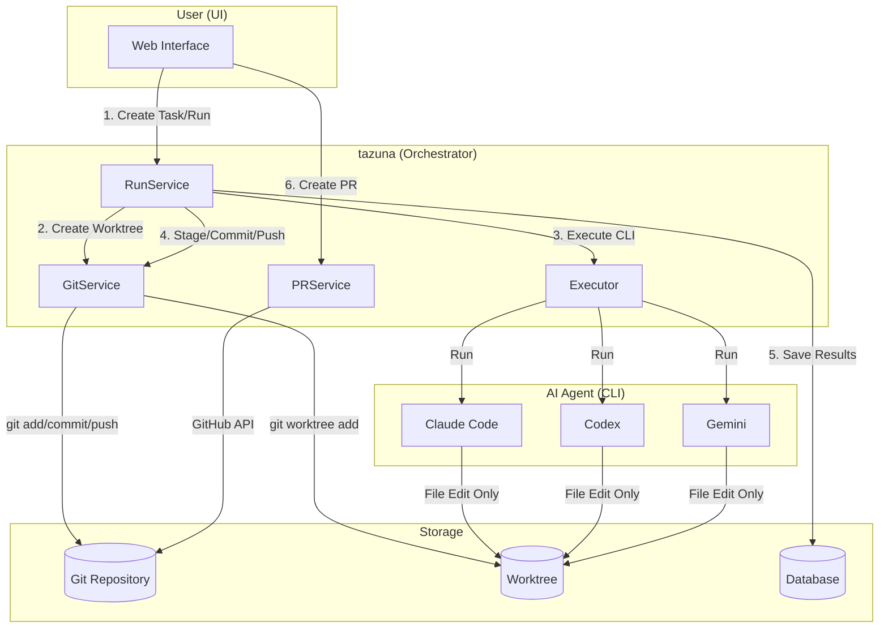

## サービス間の責務分担

| サービス | 責務 | Git操作 |
|---------|------|---------|
| **RunService** | Run実行の全体制御 | GitServiceを呼び出し |
| **GitService** | Git操作の集約 | worktree, add, commit, push, pull, fetch |
| **Executor** | CLI実行 | なし（ファイル編集のみ） |
| **PRService** | PR作成・更新 | GitHub API経由 |

## Phase 1: Worktree作成フロー

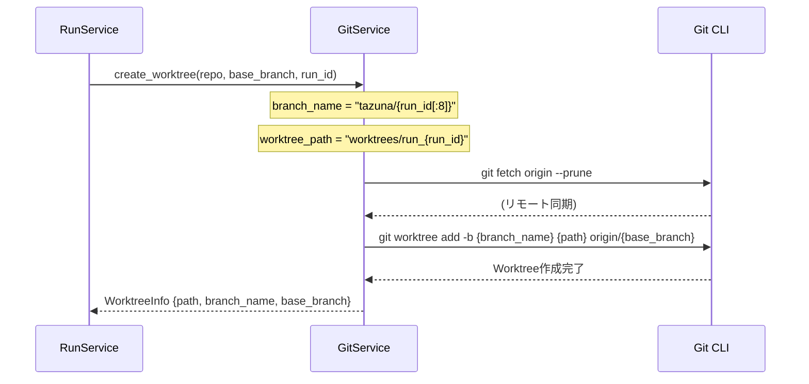

### Worktreeディレクトリ構造

```
workspaces/
├── {workspace_uuid}/                # メインリポジトリ
│   ├── .git/
│   │   └── worktrees/               # Worktree管理ディレクトリ
│   │       ├── run_{run_id_1}/
│   │       └── run_{run_id_2}/
│   └── [ソースファイル]
│
└── worktrees/
    ├── run_{run_id_1}/              # Worktree 1 (独立した作業領域)
    │   ├── .git                     # 親リポジトリへの参照ファイル
    │   └── [ソースファイル]
    │
    └── run_{run_id_2}/              # Worktree 2
        ├── .git
        └── [ソースファイル]
```

## Phase 2: CLI実行フロー

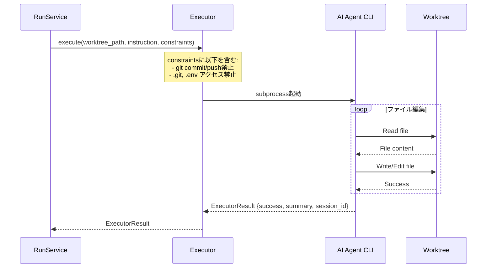

### Executor制約 (AgentConstraints)

```python
forbidden_commands = [
    "git commit",
    "git push",
    "git checkout",
    "git reset --hard",
    "git rebase",
    "git merge",
]

forbidden_paths = [
    ".git",
    ".env",
    ".env.*",
    "*.key",
    "*.pem",
]
```

## Phase 3: Commit & Pushフロー

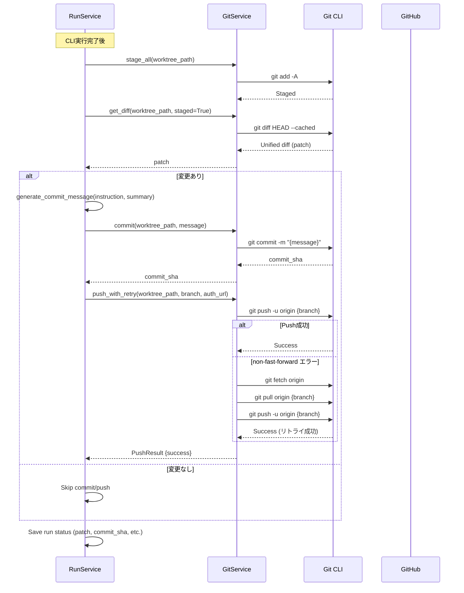

### Push With Retry ロジック

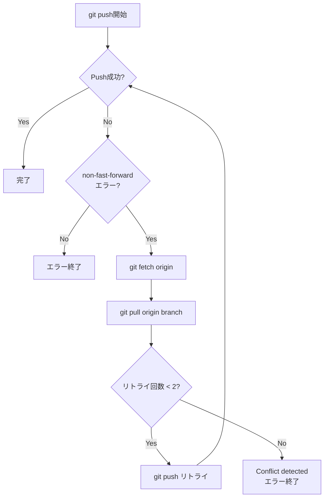

## Phase 4: 会話継続時のWorktree再利用フロー

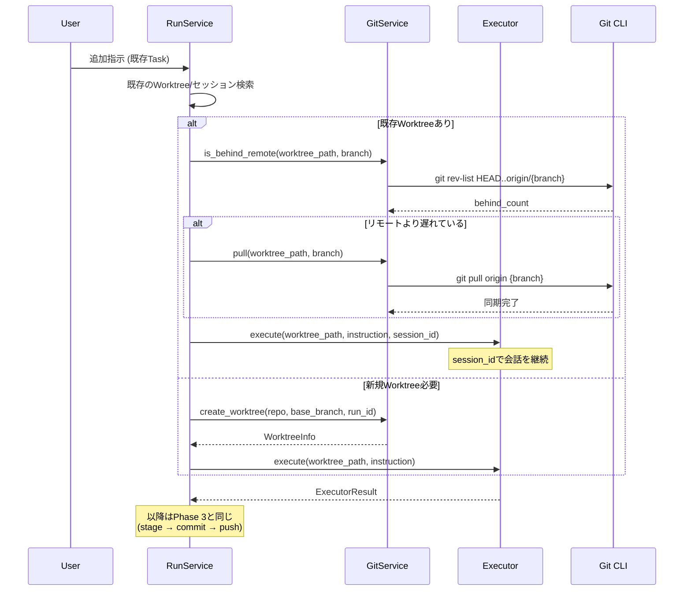

## 全体ワークフロー (統合図)

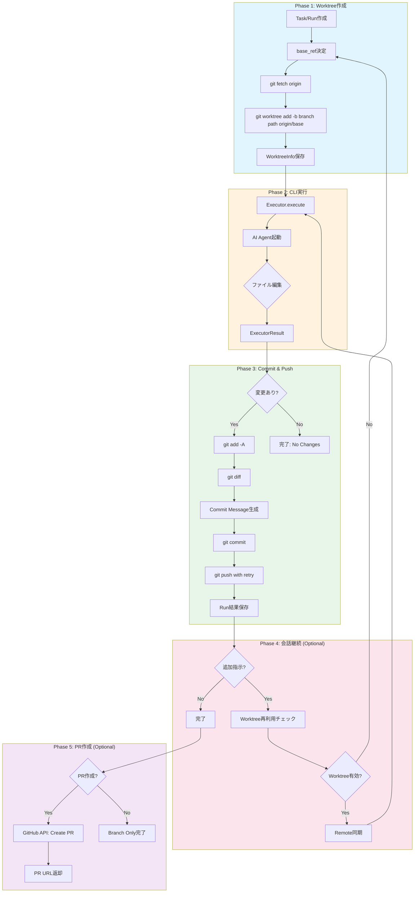

## PR作成フロー

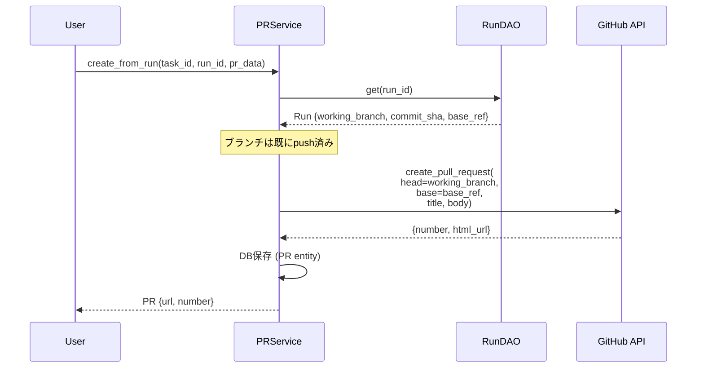

## Worktreeクリーンアップフロー

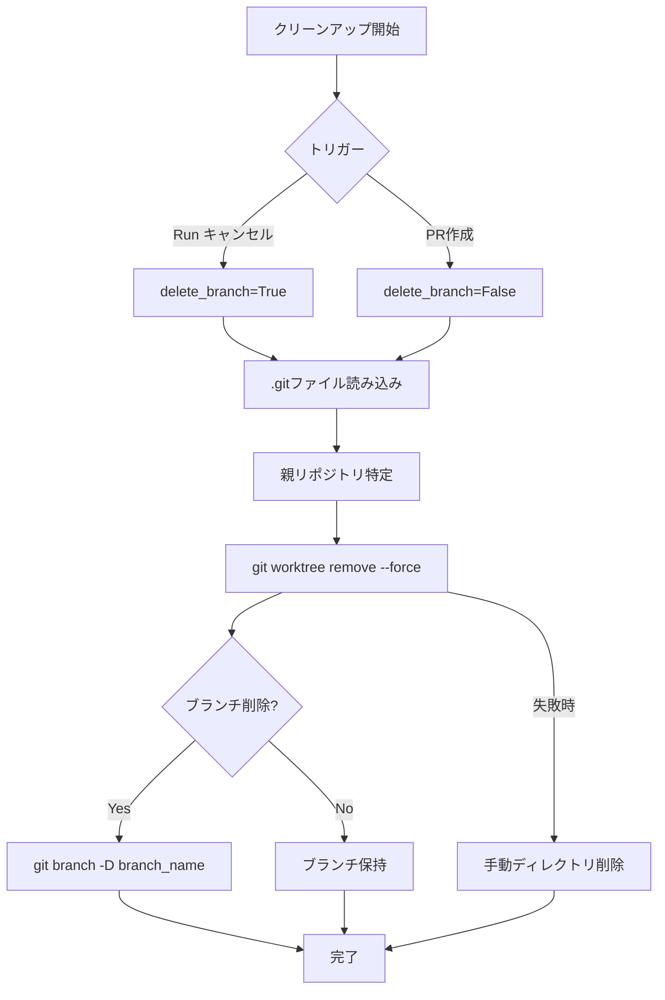

## サービス実装詳細

### GitService主要メソッド

| メソッド | 用途 | Git コマンド |
|---------|------|-------------|
| `create_worktree()` | Worktree作成 | `git worktree add -b` |
| `cleanup_worktree()` | Worktree削除 | `git worktree remove` |
| `stage_all()` | 全変更をステージング | `git add -A` |
| `get_diff()` | Diff取得 | `git diff HEAD --cached` |
| `commit()` | コミット作成 | `git commit -m` |
| `push()` | プッシュ | `git push -u origin` |
| `push_with_retry()` | リトライ付きプッシュ | `git push` + `git pull` + retry |
| `pull()` | プル | `git pull origin` |
| `is_behind_remote()` | リモートとの差分チェック | `git rev-list` |

### RunService実行フロー詳細

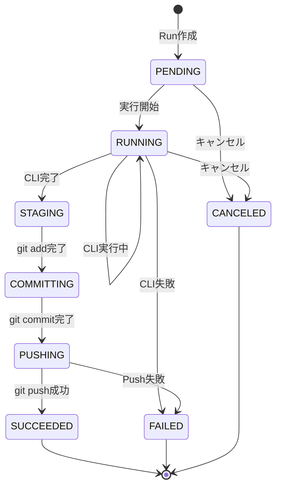

## 設計思想: Orchestrator管理パターン

tazunaでは「Orchestrator管理パターン」を採用しています。

### なぜAI AgentにGit操作させないのか

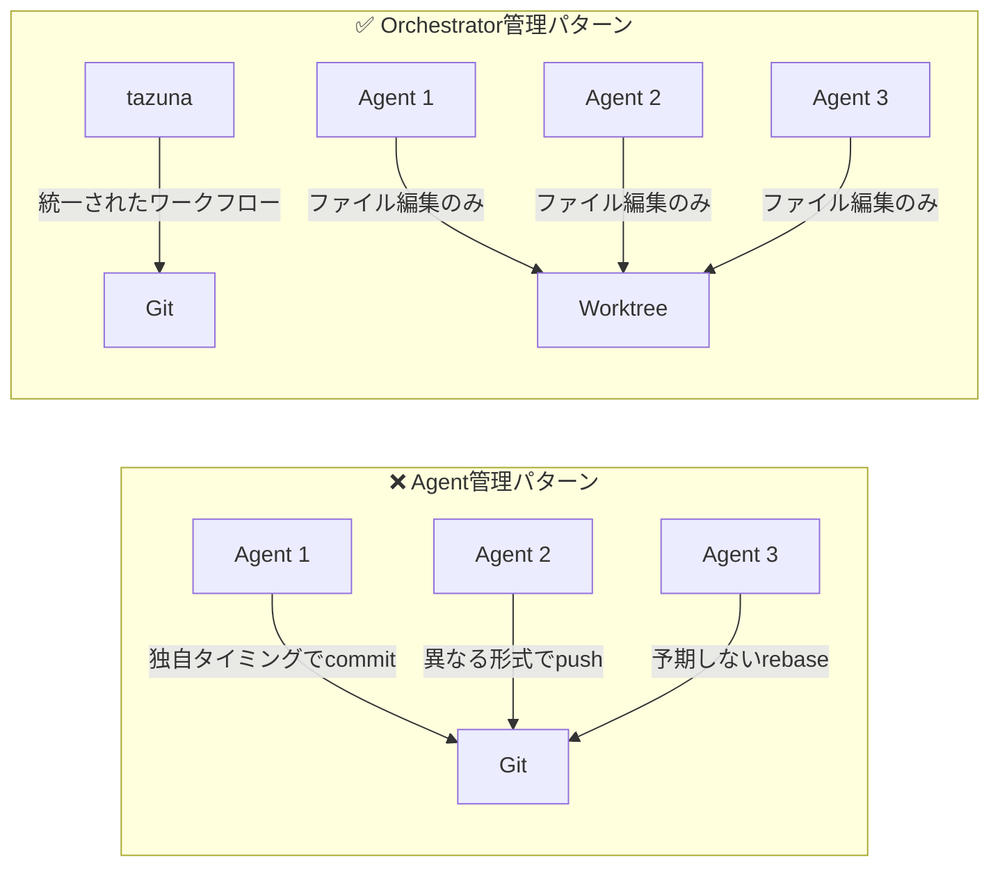

### メリット

| 観点 | Orchestrator管理 |
|-----|-----------------|
| **一貫性** | 全Agentで同一のGitワークフロー |
| **制御** | Commit/Pushタイミングが明確 |
| **デバッグ** | フェーズ分離で問題特定が容易 |
| **マルチモデル** | 統一形式でDiff比較が容易 |

## 関連ファイル

| ファイル | 役割 |
|---------|------|
| `apps/api/src/tazuna_api/services/git_service.py` | Git操作の集約 |
| `apps/api/src/tazuna_api/services/run_service.py` | Run実行制御 |
| `apps/api/src/tazuna_api/services/pr_service.py` | PR作成・更新 |
| `apps/api/src/tazuna_api/executors/base_executor.py` | Executor基底クラス |
| `apps/api/src/tazuna_api/executors/claude_code_executor.py` | Claude Code実行 |
| `apps/api/src/tazuna_api/domain/models.py` | ドメインモデル定義 |
