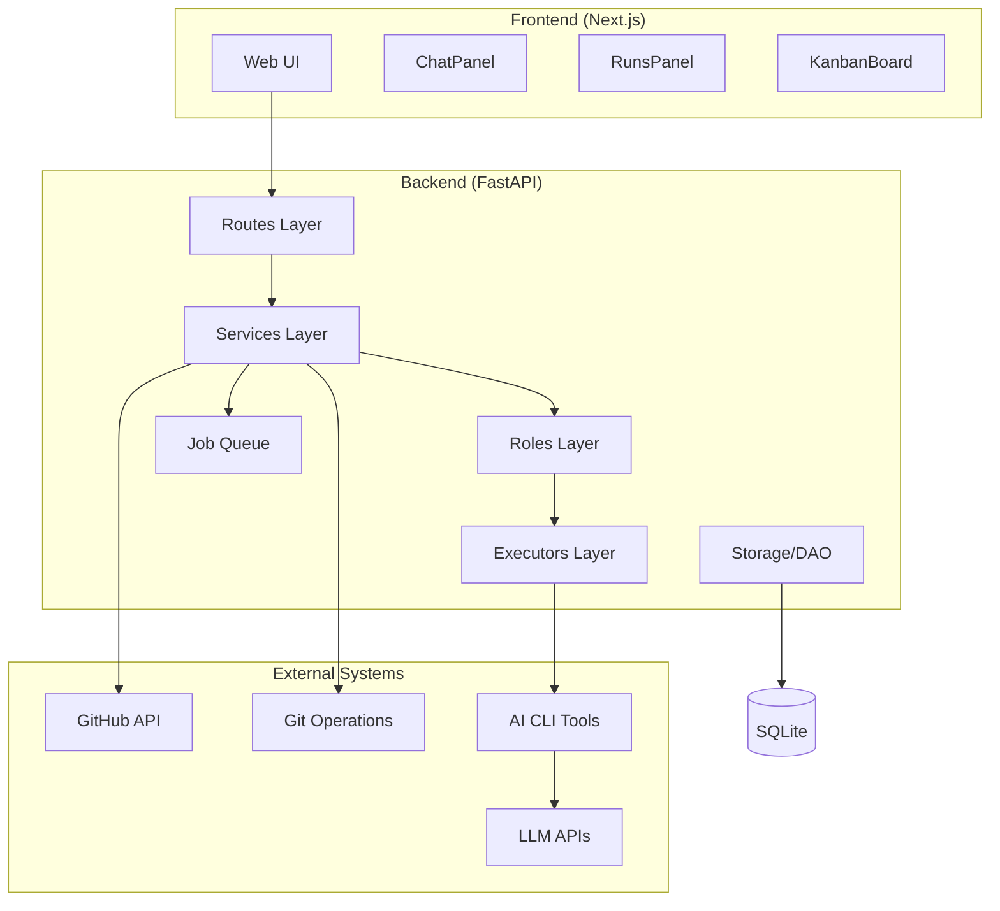
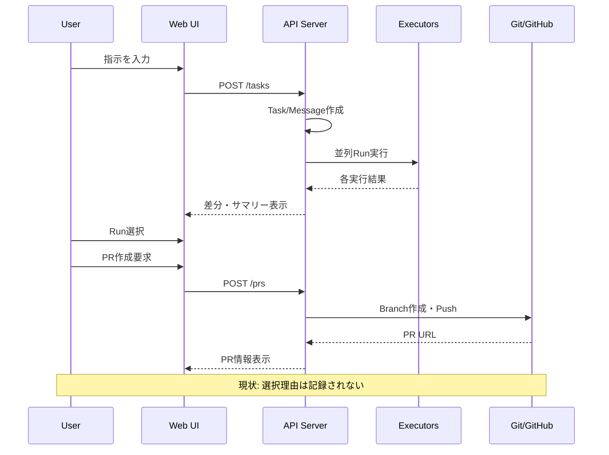
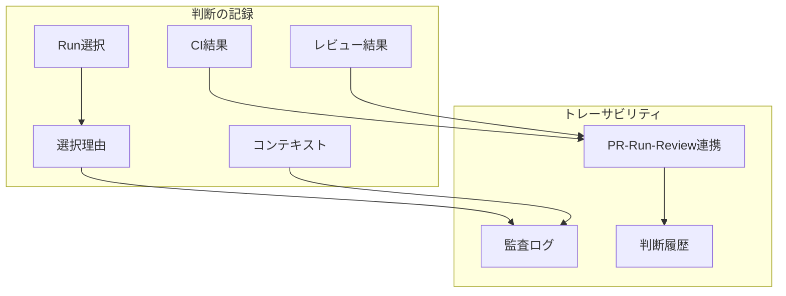
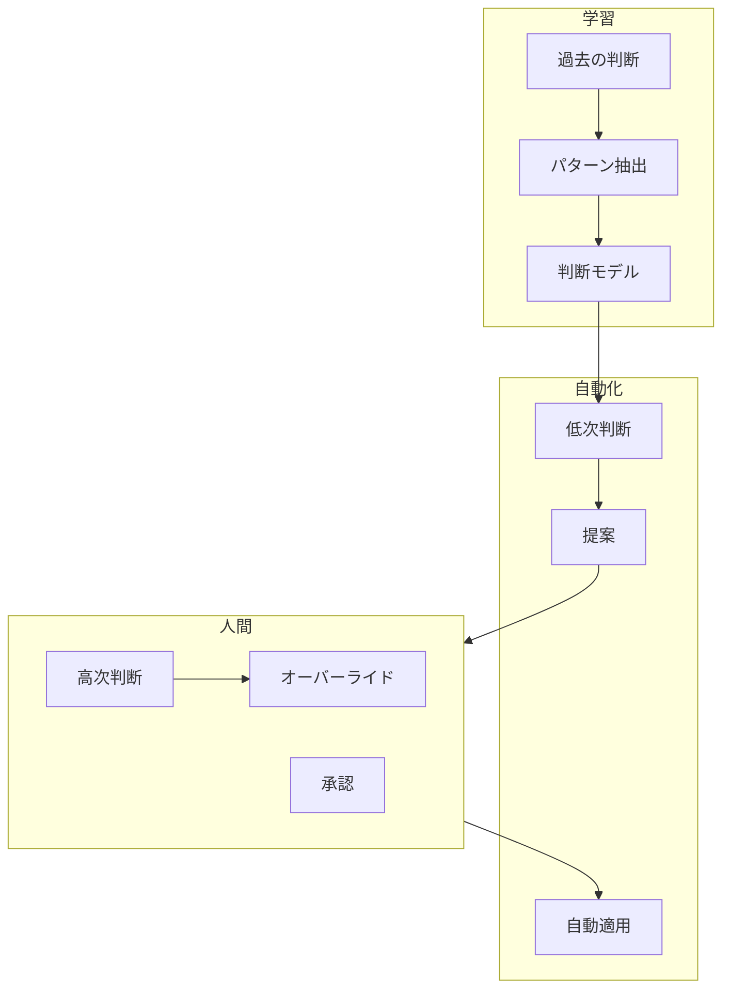
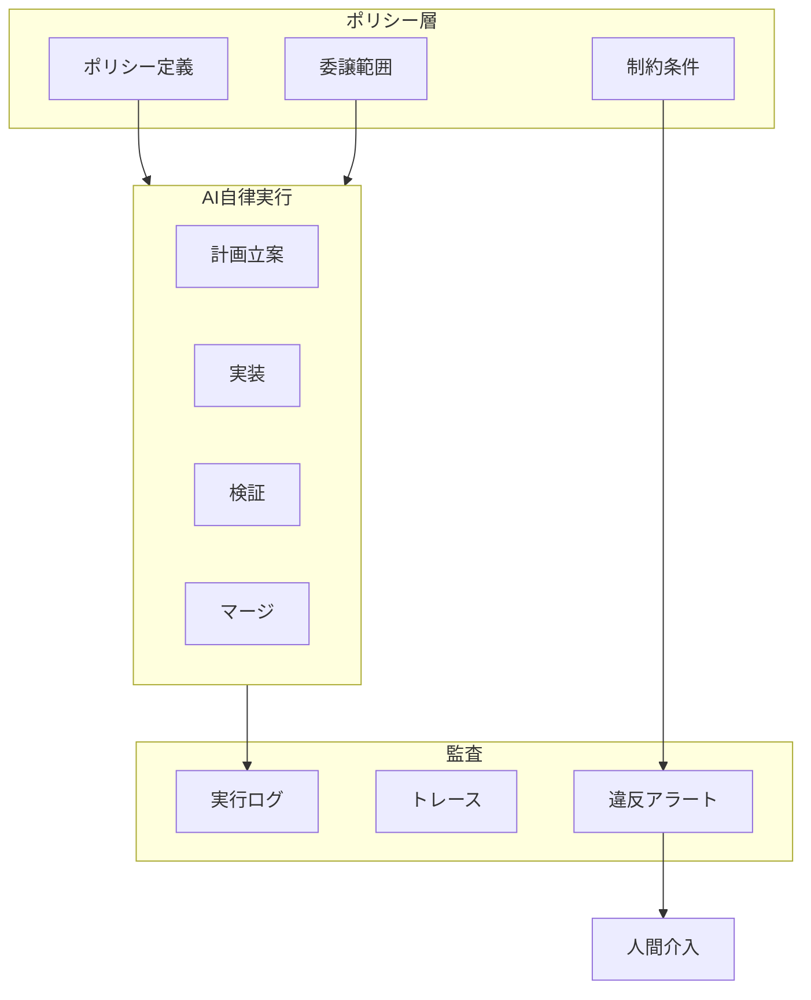
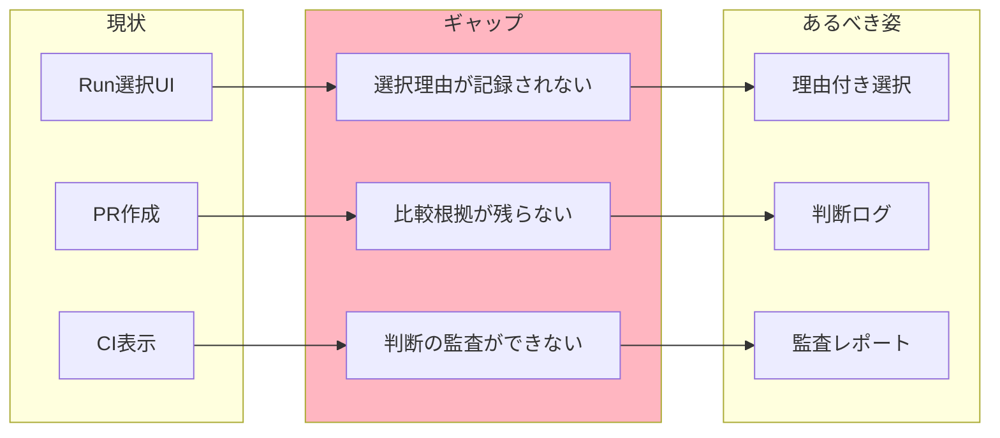
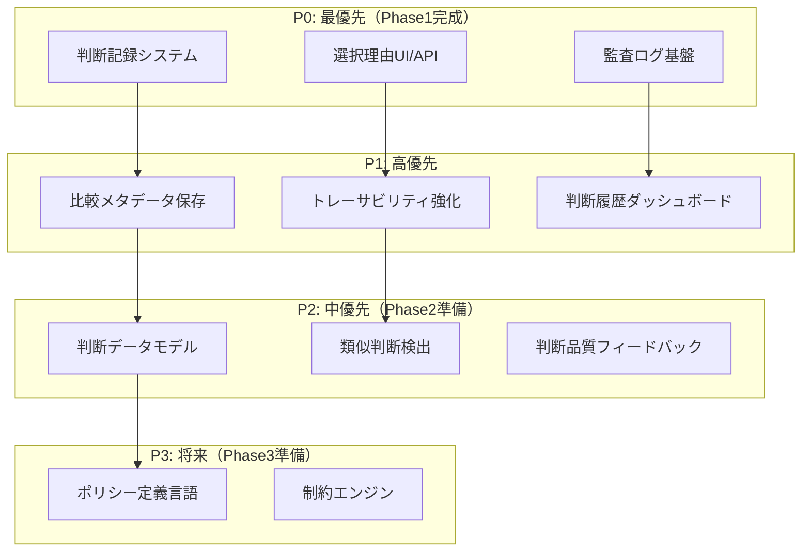
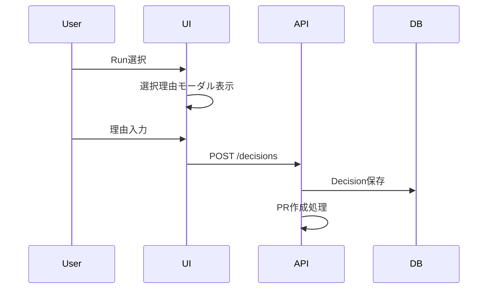
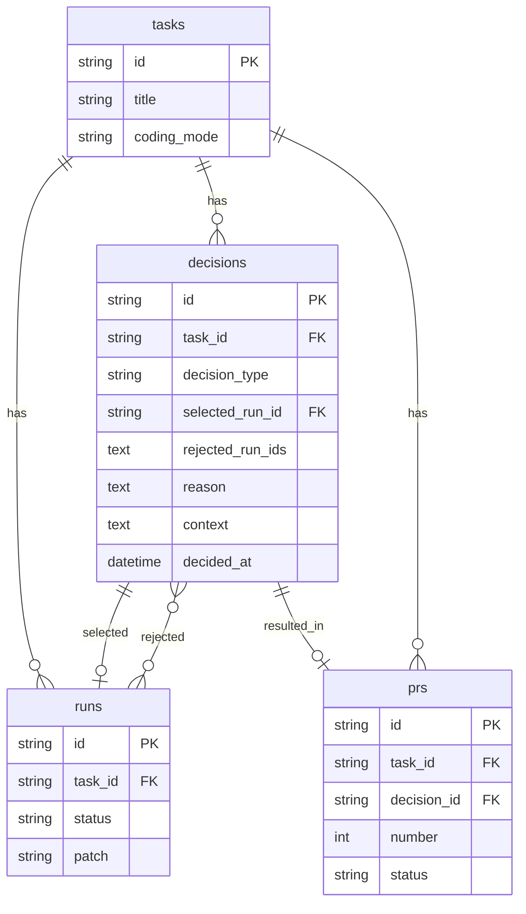

# zloth Gen2 戦略ドキュメント

## zloth の思想

### コアの問題設定

AIはコードを生成できるが、現実の開発で詰まるのは **賢さ**ではなく **責任** である。
誰が・何を・なぜ信頼して採用したのかが説明できない限り、チームはAI出力を本番に入れられない。

### 本質的な価値

zloth は **AIの"不確かな出力"を、チームが"納得して採用できる意思決定"に変換する装置**である。
これは単なるコード生成ツールではなく、**判断・合意形成・監査可能性を備えた意思決定インターフェース**。

### 長期ビジョンの軸

zloth の進化は「Human in the Loop → Human out of the Loop」ではない。
本質は **責任の所在を、人 → プロセス（ガバナンス）→ AI に段階的に移譲できる状態を作ること**。

**1行の定義:**
> **zloth は、人間の判断を"再利用可能なガバナンス"に変換し、AIが自律的に開発を進められる状態を作るシステム。**

---

## 進化フェーズと現在地

```mermaid
graph LR
    subgraph Phase1["Phase 1: Decision Visibility"]
        DV1[判断の可視化]
        DV2[選択理由の記録]
        DV3[差分・CI・レビュー連携]
    end

    subgraph Phase2["Phase 2: Decision Compression"]
        DC1[判断パターンの学習]
        DC2[低次判断の自動化]
        DC3[認知負荷の軽減]
    end

    subgraph Phase3["Phase 3: Delegated Responsibility"]
        DR1[ポリシー定義]
        DR2[範囲内自動遂行]
        DR3[責任の形式化]
    end

    subgraph Phase4["Phase 4: Autonomous Governance"]
        AG1[課題の自動発見]
        AG2[継続的改善]
        AG3[制約下の自律]
    end

    Phase1 --> Phase2 --> Phase3 --> Phase4

    style Phase1 fill:#90EE90,stroke:#228B22
    style Phase2 fill:#FFE4B5,stroke:#FF8C00
    style Phase3 fill:#E6E6FA,stroke:#9370DB
    style Phase4 fill:#E0E0E0,stroke:#808080
```



**現在地: Phase 1 途中（約60%達成）**

---

## 現状分析

### 実装済み機能マトリクス

| 機能カテゴリ | 実装状態 | Phase貢献 |
|------------|---------|----------|
| マルチエグゼキュータ並列実行 | ✅ 完了 | Phase1 |
| 差分可視化・比較 | ✅ 完了 | Phase1 |
| PR作成・更新 | ✅ 完了 | Phase1 |
| CI連携・ゲーティング | ✅ 完了 | Phase1 |
| AIコードレビュー | ✅ 完了 | Phase1 |
| Kanbanボード | ✅ 完了 | Phase1 |
| Agentic自動化 (SEMI_AUTO/FULL_AUTO) | ✅ 完了 | Phase1→2移行 |
| メトリクス・分析 | ✅ 完了 | Phase1 |
| **判断理由の記録** | ⚠️ 部分的 | Phase1 |
| **選択のトレーサビリティ** | ⚠️ 部分的 | Phase1 |
| 判断パターン学習 | ❌ 未着手 | Phase2 |
| ポリシー定義・適用 | ❌ 未着手 | Phase3 |
| 自律的課題発見 | ❌ 未着手 | Phase4 |

### 現状のアーキテクチャ



### 現状の主要フロー



---

## あるべき姿（Phase完了時）

### Phase 1 完了時: Decision Visibility



**あるべき状態:**
- ユーザーがRunを選択する際、「なぜこれを選んだか」を記録できる
- PR・Run・Review・CIがすべて紐づいて追跡可能
- 後から「誰が・いつ・なぜ」を説明できる

### Phase 2 完了時: Decision Compression



**あるべき状態:**
- 過去の判断パターンを学習し、類似ケースで提案
- 「以前このパターンではRun Aを選んだ」と表示
- 低次の判断（スタイル、フォーマット）は自動適用

### Phase 3 完了時: Delegated Responsibility



**あるべき状態:**
- 人間が事前にポリシー（許可範囲、禁止事項）を定義
- AIはポリシー内で自律的に計画→実装→検証→マージ
- 違反時のみ人間にエスカレーション

---

## ギャップ分析

### Phase 1 の残課題



| ギャップ | 詳細 | 影響度 |
|---------|------|-------|
| 選択理由の欠如 | Runを選ぶ理由を記録する仕組みがない | 高 |
| 比較メタデータ | 複数Runの比較観点・結果が保存されない | 高 |
| 監査証跡 | 「誰が・いつ・なぜ」の一貫したログがない | 中 |
| コンテキスト保存 | 判断時の状況（CI結果、レビュー内容）との紐づけが弱い | 中 |

### Phase 2 への準備課題

| 課題 | 詳細 | 優先度 |
|-----|------|-------|
| 判断データ構造 | 学習に使えるデータモデルがない | 高 |
| パターン抽出基盤 | 類似判断を検出する仕組みがない | 高 |
| フィードバックループ | 判断結果の良し悪しを記録できない | 中 |

### Phase 3 への準備課題

| 課題 | 詳細 | 優先度 |
|-----|------|-------|
| ポリシー言語 | 委譲範囲を記述する形式がない | 低（今後） |
| 制約エンジン | ポリシー違反を検出する仕組みがない | 低（今後） |

---

## 優先度付きロードマップ

### 優先度評価基準

- **思想貢献度**: zlothの本質的価値への貢献
- **実装難易度**: 技術的な複雑さ
- **依存関係**: 他機能への前提条件



---

## 具体的タスク（優先度順）

### P0: Phase 1 完成（最優先）

#### P0-1: 判断記録システムの構築

**目的**: すべての判断を追跡可能にする

**タスク:**
1. `decisions` テーブルの追加
   ```sql
   CREATE TABLE decisions (
       id TEXT PRIMARY KEY,
       task_id TEXT NOT NULL,
       decision_type TEXT NOT NULL,  -- 'run_selection', 'pr_creation', 'merge_approval'
       selected_run_id TEXT,
       rejected_run_ids TEXT,  -- JSON array
       reason TEXT,  -- ユーザーの選択理由
       context TEXT,  -- JSON: CI結果、レビューサマリー等
       decided_by TEXT,  -- 将来のマルチユーザー対応
       decided_at TEXT NOT NULL,
       FOREIGN KEY (task_id) REFERENCES tasks(id)
   );
   ```
2. `DecisionDAO` の実装
3. `DecisionService` の実装

#### P0-2: 選択理由UI/API

**目的**: ユーザーがRunを選択する際に理由を入力できるようにする

**タスク:**
1. `POST /v1/tasks/{id}/decisions` エンドポイント追加
2. Run選択モーダルに「選択理由」入力欄追加
3. 選択時に理由の入力を促すUX設計



#### P0-3: 監査ログ基盤

**目的**: 判断の監査証跡を提供する

**タスク:**
1. 判断履歴一覧APIの実装
2. 判断詳細ページの追加
3. エクスポート機能（CSV/JSON）

### P1: 高優先

#### P1-1: 比較メタデータ保存

**タスク:**
1. Run比較時のメタデータ構造定義
2. 比較観点（コード量、複雑性、カバレッジ）の自動計算
3. 比較結果のDecisionへの紐づけ

#### P1-2: トレーサビリティ強化

**タスク:**
1. PR → Decision → Run → Review の完全な紐づけ
2. 「この PRはなぜこのRunから作られたか」の表示
3. PRコメントに判断理由を自動追記

#### P1-3: 判断履歴ダッシュボード

**タスク:**
1. `/decisions` ページの追加
2. フィルタリング（期間、タスク、リポジトリ）
3. 判断パターンの可視化（棒グラフ、円グラフ）

### P2: 中優先（Phase 2 準備）

#### P2-1: 判断データモデル

**タスク:**
1. 判断を学習可能な形式に変換する仕組み
2. 特徴量抽出（コード特徴、コンテキスト）
3. 判断結果のラベリング構造

#### P2-2: 類似判断検出

**タスク:**
1. 過去の類似判断を検索するアルゴリズム
2. 「以前の類似ケースではこう判断した」の表示
3. 判断の一貫性レポート

#### P2-3: 判断品質フィードバック

**タスク:**
1. 「この判断は良かった/悪かった」の入力UI
2. マージ後のフィードバック収集
3. 判断品質スコアの算出

### P3: 将来（Phase 3 準備）

#### P3-1: ポリシー定義言語

**タスク:**
1. ポリシー記述DSLの設計
2. ポリシーエディタUI
3. ポリシーのバリデーション

#### P3-2: 制約エンジン

**タスク:**
1. ポリシー違反検出ロジック
2. 自動ブロック/エスカレーション
3. 違反レポート生成

---

## 技術的考慮事項

### データモデル拡張



### API拡張

```
# 新規エンドポイント
POST   /v1/tasks/{id}/decisions       # 判断を記録
GET    /v1/tasks/{id}/decisions       # タスクの判断履歴
GET    /v1/decisions                  # 全判断一覧
GET    /v1/decisions/{id}             # 判断詳細
POST   /v1/decisions/{id}/feedback    # フィードバック

# 既存エンドポイント拡張
POST   /v1/tasks/{id}/prs             # decision_id パラメータ追加
```

### マイグレーション戦略

1. 新テーブル追加（後方互換性維持）
2. 既存PR作成フローに任意の decision_id 紐づけ
3. UIで段階的に選択理由入力を導入
4. 将来的に必須化

---

## 成功指標

### Phase 1 完了の定義

| 指標 | 目標 |
|-----|------|
| 判断記録率 | PR作成の80%以上で理由が記録される |
| トレーサビリティ | 任意のPRから選択理由まで3クリック以内で到達 |
| 監査対応 | 「なぜこのコードが採用されたか」に30秒以内で回答可能 |

### Phase 2 完了の定義

| 指標 | 目標 |
|-----|------|
| 提案採用率 | 類似判断提案の50%以上が採用される |
| 認知負荷削減 | 判断あたりの平均時間が30%削減 |
| 一貫性スコア | 類似ケースでの判断一貫性が80%以上 |

---

## まとめ

zloth Gen2 の核心は「**判断のシステム化**」である。

現状のzlothは優れたコード生成・自動化ツールだが、**「なぜその選択をしたか」が記録されない**という根本的なギャップがある。これは思想の核心である「責任の所在を明確にし、段階的に委譲する」ことの前提条件を満たしていない。

**最優先タスク:**
1. 判断記録システムの構築
2. 選択理由UI/APIの実装
3. 監査ログ基盤の整備

これらを完了することで、Phase 1「Decision Visibility」を達成し、Phase 2 以降への基盤が整う。

**zloth の次の進化は、コード生成の改善ではなく、判断の可視化と蓄積である。**
