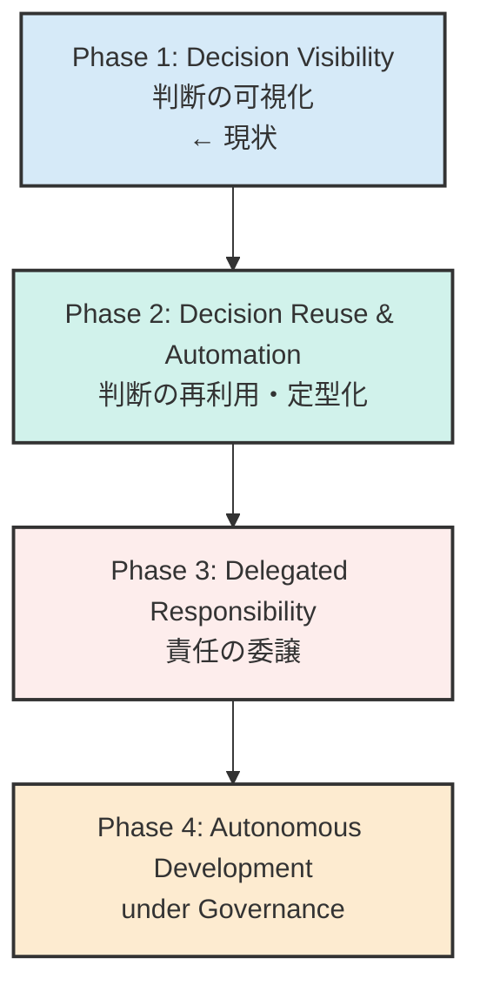
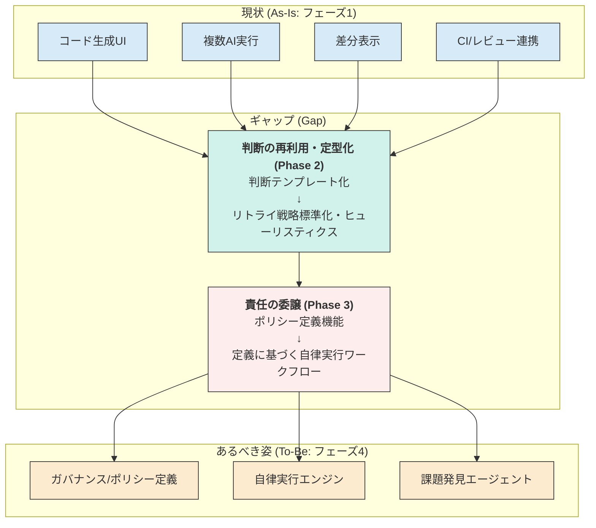
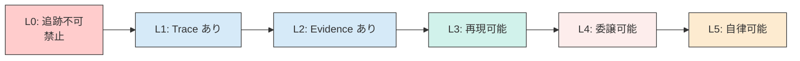

# zloth gen2: 構想とロードマップ

## 1. zlothの思想

### 1.1. コアの問題設定
AIはコードを生成できるが、現実の開発で詰まるのは **賢さ**ではなく **責任** である。
誰が・何を・なぜ信頼して採用したのかが説明できない限り、チームはAI出力を本番に入れられない。

### 1.2. 本質的な価値
zloth は **AIの"不確かな出力"を、チームが"納得して採用できる意思決定"に変換する装置**である。
これは単なるコード生成ツールではなく、**判断・合意形成・監査可能性を備えた意思決定インターフェース**。

### 1.3. 長期ビジョンの軸（自動化ではなく信頼の生成）
zloth の進化は「Human in the Loop → Human out of the Loop」ではない。
本質は **責任の所在を、人 → プロセス（ガバナンス）→ AI に段階的に移譲できる状態を作ること**。
つまり、狙うのは「人間を減らす」ではなく **承認を省略できるほどの合理的な信頼を構築すること**。

> **注意**: 責任主体は常に人間（組織）に残る。移譲されるのは「裁量」と「決定方式」である。
> AIが勝手に責任を持つことはなく、人間が設計したガバナンスの枠内で動作する。

---

## 2. 進化のフェーズ

zlothは、AIへの責任移譲を段階的に実現するため、以下の4つのフェーズで進化する。



- **1) 短期：Decision Visibility（判断の可視化）**
  - AIが実装し、人間が比較・選択する。
  - 選択理由・差分・CI結果・PRレビューを結びつけ、**判断のトレーサビリティ**を作る。
  - **責任の所在**: 人間（ただし証跡が残る）
- **2) 中期：Decision Reuse & Automation（判断の再利用・定型化）**
  - 過去の判断を**再利用可能な形（ルール・テンプレート・ヒューリスティクス）**に変換する。
  - 判断テンプレート化、リトライ戦略の標準化、「この条件なら自動採択」のヒューリスティクス、類似ケース検索（Embedding）。
  - 人間は責任者のまま、毎回の認知負荷だけを減らし、**判断を"繰り返し使える形"に定型化する**。
  - ※「学習」はPhase2後半。最初から前面に出すと戦略が重くなる。
  - **責任の所在**: 人間（判断の再利用で負荷だけ減る）
- **3) 長期：Delegated Responsibility（責任の委譲）**
  - 人間が事前に委譲範囲（ポリシー）を定義する。
  - AIはその範囲内で計画→実装→CI通過までを自動遂行し、**責任を形式化し、委譲可能にする**。
  - **責任の所在**: 人間（事前定義ポリシーにより委譲）
- **4) 理想：Autonomous Development under Governance**
  - **Self-directed improvement within human-defined constraints**
  - AIは自ら課題を発見し改善を継続する。
  - ただし自由に暴れるのではなく、**人間が設計したガバナンスの中で自律する**（自律 = 制約下での最適化）。
  - **責任の所在**: 人間（ガバナンス設計） + AI（制約下の裁量）

---

## 3. 現状(As-Is)・あるべき(To-Be)・ギャップ(Gap)

### 3.1. 現状 (As-Is)
現在のzlothは **フェーズ1: Decision Visibility** の段階にある。
- 複数のAI（Gemini, Claude）によるコード生成
- 生成コードの差分表示(Diff Viewer)
- CI結果やレビューコメントの表示
- 上記を通じ、人間がAIの出力を比較・検討し、採用を判断するための基本的なインターフェースが提供されている。

### 3.2. あるべき姿 (To-Be)
目指すは **フェーズ4: Autonomous Development under Governance**。
- 人間が定義したガバナンス・ポリシーの範囲内で、AIが自律的に開発タスク（課題発見、計画、実装、テスト、改善）を遂行するシステム。

### 3.3. ギャップ (Gap)
現状とあるべき姿の間には、フェーズ2と3に相当する大きなギャップが存在する。


- **ギャップ1: 判断の再利用・定型化 (Decision Reuse & Automation)**
  - 人間の判断（どのAIの提案を、なぜ、どのように修正して採用したか）がデータとして活用されていない。毎回ゼロから人間が判断する必要があり、認知負荷が高いまま。
  - 過去の採否判断をテンプレート化・ルール化・ヒューリスティクス化する仕組みがない。
- **ギャップ2: 責任の委譲 (Delegated Responsibility)**
  - AIに任せる作業範囲を形式的に定義し、委譲する仕組みが存在しない。AIはあくまで人間の指示待ちであり、自律的にタスクを進められない。

---

## 4. 優先度付きのやるべきこと

ギャップを埋め、進化のフェーズを進めるために、以下のタスクに優先度順で取り組む。

### P0: フェーズ1の完成度向上 (Decision Visibilityの強化)
*目的: 判断の材料を漏れなく提供し、トレーサビリティを確立する。フェーズ2のためのデータ収集基盤を構築する。*

**成功指標**: 任意のPRについて「採択理由・**Evidence（CI/静的解析/メトリクス/レビュー）**・比較軸・却下理由/根拠」を**1画面で説明できる**状態を実現する（Trust Ladder L2達成）。

- **[タスク1] 判断の関連付け強化:**
  - UI上で、AIの提案・差分・CI結果・レビューコメント・最終的な採用コード（あるいは手動修正）の繋がりを明確に可視化する。
- **[タスク2] 比較体験の向上:**
  - 複数AIの出力の優劣を判断しやすくするため、並列での差分表示や、コード品質メトリクス（循環的複雑度など）の自動算出・表示機能を実装する。
- **[タスク3] フィードバックデータ収集基盤:**
  - ユーザーの選択・修正アクションを「判断ログ」としてバックエンドに保存する仕組みを構築する。
    - 例: `(RunID, AgentID, ProposalID, status: 'accepted/rejected/modified', modified_code: '...')`
- **[タスク4] 判断説明画面の実装:**
  - PRごとに「なぜこの変更が採用されたか」を即座に確認できるダッシュボードを実装する。
  - 表示項目: 採択されたRun、却下されたRun（理由付き）、比較に使われた軸、CI結果、レビューコメント。

### P1: Phase 2への着手 (Decision Reuse & Automationの実装)
*目的: 蓄積した判断データを再利用可能な形に変換し、認知負荷を削減する。*

**Phase 2前半: 再利用・定型化（ML学習なし）**
- **[タスク1] 判断テンプレート化:**
  - よくある判断パターン（lint修正の採択、型エラー修正の採択など）をテンプレートとして定義・保存。
  - 「この種の変更は自動採択」「この条件なら差戻し」のヒューリスティクスを構築。
- **[タスク2] リトライ戦略の標準化:**
  - CI失敗時の再実行戦略を標準化（どのエラーなら即リトライ、どのエラーなら人間にエスカレート）。
  - 失敗パターン→対処法のマッピングを蓄積。
- **[タスク3] 類似ケース検索:**
  - 過去の判断記録をEmbedding化し、類似ケースを検索・提示。
  - 「過去にこの種の変更はこう判断された」を参考情報として表示。
- **[タスク4] 判断記録の構造化:**
  - P0-タスク3で収集した判断ログを分析・活用するためのデータベースを構築。
  - `decider_type`（`human` | `policy` | `ai`）を記録し、責任の所在を明確化。

**Phase 2後半: 学習・推薦（MLを活用）**
- **[タスク5] 判断パターンの学習と推薦:**
  - 蓄積データに基づき、「このリポジトリではこのAIの性能が良い」「この種のエラー修正は、このパターンが多い」といった傾向を学習する。
  - 学習結果を元に、次にユーザーが選びそうな選択肢をハイライトする、あるいは自動で選択する推薦機能を実装する (RAG / Fine-tuning)。
- **[タスク6] 低次判断の自動適用:**
  - 信頼度の高いパターン（例: linterエラーの自動修正）について、ユーザーの承認なしに自動で適用する（ただし後から確認・ロールバックは可能とする）機能を実験的に導入する。

### P2: フェーズ3の準備 (Delegated Responsibilityの構想)
*目的: 人間がAIに仕事を任せるための「契約」を定義する仕組みを設計する。*
- **[タスク1] ポリシー言語/UIの設計:**
  - 「`./src/components/**` 配下のファイル修正は許可するが、`./package.json` の変更は人間の承認が必須」のようなルールを定義できるYAMLファイルやGUIの仕様を設計する。
- **[タスク2] 自律実行ワークフローのプロトタイピング:**
  - 定義されたポリシーの範囲内で、AIが Plan & Execute モデルでタスク（例: Issueに対応するコードを生成し、テストを実行し、パスしたらPRを作成する）を自律的に進めるためのエージェント・ワークフローを構築する。

### P3: フェーズ4への展望 (Autonomous DevelopmentのR&D)
*目的: AIが自ら仕事を見つけ、改善サイクルを回すための技術的実現性を調査する。*
- **[タスク1] 課題発見エージェントの研究:**
  - コードベースを静的解析してリファクタリング候補を提案したり、`TODO`コメントをタスク化したり、パフォーマンスボトルネックを特定して改善案を出すような、自律的な課題発見機能の技術調査を行う。


---

## 5. 1行の定義

**zloth is a system that turns human judgment into reusable governance for autonomous AI development.**

**日本語：zloth は、人間の判断を"再利用可能なガバナンス"に変換し、AIが自律的に開発を進められる状態を作るシステム。**

---

## 6. Non-goals（やらないこと）

明確にスコープ外とすることで、戦略の焦点を保つ。

- **モデル訓練は当面しない**: LLMのFine-tuningやRL学習は行わない。既存モデルの活用に集中。
- **完璧な自律開発を最初から目指さない**: 段階的に責任を移譲し、各フェーズで価値を提供する。
- **意思決定の証跡がない自動化はしない**: 全ての自動化には監査可能な記録を残す。
- **汎用的なAIプラットフォームを作らない**: コード開発・PRワークフローに特化する。

---

## 7. Principles（原則）

zlothの設計・実装における不変の原則。

### No decision without trace
全ての判断（採用・却下・修正）には証跡を残す。理由・エビデンス・決定者を記録し、後から「なぜ？」に即答できる状態を維持する。

### Automation requires governance
自動化は常にガバナンス（ポリシー・制約・監査）とセットで導入する。ガバナンスなき自動化は許容しない。

### Escalate only on violations
正常系はスムーズに進行させ、人間の介入はポリシー違反・異常時のみ。ただしエスカレーション時には説明資料を自動生成。

---

## 8. 責任移譲の定義

各フェーズにおける責任の所在を明確化する。

| Phase | 責任の所在 | 説明 |
|-------|-----------|------|
| Phase 1: Decision Visibility | **人間** | 人間が全て判断。ただし証跡が残る。 |
| Phase 2: Decision Reuse & Automation | **人間** | 人間が責任者のまま。判断の再利用で負荷だけ減る。 |
| Phase 3: Delegated Responsibility | **人間（事前定義ポリシーにより委譲）** | 人間が委譲範囲をポリシー化。判断方式はpolicy-drivenになる。 |
| Phase 4: Autonomous under Governance | **人間（ガバナンス設計） + AI（制約下の裁量）** | ガバナンス下でAIが裁量判断。枠組みの責任は人間が持つ。 |

### 責任移譲の記録

DBレベルで責任の所在を記録するため、判断記録に `decider_type` を含める。

```
decider_type: 'human' | 'policy' | 'ai'
```

- `human`: 人間が直接判断（責任主体：人間）
- `policy`: 人間が事前に定義したポリシーに基づく自動判断（責任主体：人間）
- `ai`: ガバナンス下でAIが裁量判断（責任枠組みは人間が設計）

> **補足**: 「責任主体」と「決定方式」は分離して考える。
> - **責任主体** = 誰が最終的に説明責任を負うか
> - **決定方式** = 誰が（何が）判断を下したか
>
> Phase 3/4 でも責任主体は人間（または人間が設計した枠組み）であり、AIが勝手に責任を持つことはない。

---

## 9. Decision の粒度と種類

判断を構造化するため、以下の3種類に分類する。

| Decision Type | 説明 | 例 |
|---------------|------|-----|
| `selection_decision` | どのRunを採択したか | Run A を採択、Run B/C を却下 |
| `promotion_decision` | PR化するか（どの範囲まで） | Run A の変更をPR化、一部ファイルは除外 |
| `merge_decision` | マージするか（自動/人手） | CI通過 + レビューOK → 自動マージ |

この分類により、各判断の責任者（`decider_type`）を明確に記録できる。

### Decision Type ごとの必須フィールド

DB/API/画面設計で迷わないよう、各Decision Typeに必要なフィールドを定義する。

| Decision Type | 必須フィールド | 説明 |
|---------------|---------------|------|
| `selection_decision` | `reason`, `alternatives`, `evidence` | evidence には比較軸（comparison_axes）と主要メトリクス |
| `promotion_decision` | `reason`, `evidence`, `scope` | scope = どのファイル/変更をPR化したか（下記定義参照） |
| `merge_decision` | `evidence`, `decider_type`, `risk_level`, `risk_level_reason` | evidence には CI/レビュー/ポリシー適合を含む |

#### scope の定義（promotion_decision）

PR化の範囲を明確にするため、`scope` は以下の構造で記録する。
**P0ではパス単位で十分**。hunk単位は将来拡張として `refs` に逃がす。

```json
{
  "included_paths": ["src/components/Button.tsx", "src/utils/format.ts"],
  "excluded_paths": ["src/components/Modal.tsx"],
  "excluded_reasons": [
    {"path": "src/components/Modal.tsx", "reason": "変更が大きすぎるため別PRに分割"}
  ]
}
```

| フィールド | 型 | 必須 | 説明 |
|-----------|-----|------|------|
| `included_paths` | string[] | Yes | PR化するファイルパス |
| `excluded_paths` | string[] | No | 除外するファイルパス |
| `excluded_reasons` | {path, reason}[] | No | 除外理由（監査用） |

#### risk_level の定義（merge_decision）

`merge_decision` における変更のリスクレベル。自動マージの可否判断に使用。

| Level | 説明 | 自動マージ |
|-------|------|-----------|
| `low` | 軽微な変更（typo修正、コメント追加、lint修正など） | 可 |
| `medium` | 通常の変更（機能追加、バグ修正） | ポリシー次第 |
| `high` | 重大な変更（アーキテクチャ変更、セキュリティ関連、依存関係更新） | 不可（人間承認必須） |

#### risk_level 導出ルール（初期版）

主観を排除するため、以下のルールで `risk_level` を導出する。

| ルールID | 条件 | 判定 |
|----------|------|------|
| `R001` | 依存関係ファイル変更（package*.json, requirements*.txt, go.mod, Cargo.toml 等） | `high` |
| `R002` | セキュリティ関連パス（auth/, security/, crypto/, *.secret 等） | `high` |
| `R003` | インフラ関連（terraform/, kubernetes/, docker-compose.yml 等） | `high` |
| `R004` | ドキュメントのみ（docs/, *.md, README 等、コード変更なし） | `low` |
| `R005` | テストのみ（tests/, *_test.*, *.spec.* 等、プロダクションコード変更なし） | `low` |
| `R006` | フォーマット/lint修正のみ（機能変更なし） | `low` |
| `R007` | 上記以外 | `medium` |

`risk_level_reason` には適用されたルールID（例: `"R001: 依存関係ファイル変更"`）を記録する。
複数ルールが該当する場合は、最も高いリスクレベルを採用し、全ルールIDを記録。

### Decision スキーマ

監査・納得を成立させるには「理由」だけでなく **根拠（Evidence）** が必要。
各Decisionには以下の要素を記録する。

| フィールド | 型 | 必須 | 説明 |
|-----------|-----|------|------|
| `reason` | string | Yes | 人間による説明（なぜこの判断をしたか） |
| `evidence` | JSON | Yes | 機械的に検証可能な根拠 |
| `alternatives` | JSON | Yes | 比較対象（却下案と却下理由/根拠） |
| `outcome` | string | No | 判断の結果評価（Phase 2以降で活用） |
| `outcome_reason` | string | No | 結果の理由 |
| `outcome_refs` | string[] | No | 結果に関連するURL |

#### Outcome（判断結果の評価）

信頼は **結果（Outcome）** でしか強化できない。
Phase 2以降で判断の良し悪しを学習するため、結果を記録する枠組みを用意する。

| outcome 値 | 説明 | 例 |
|-----------|------|-----|
| `good` | 判断が正しかった | 本番で問題なく動作、追加修正不要 |
| `bad` | 判断が誤りだった | リバート発生、本番障害、追加修正PRが必要 |
| `unknown` | 評価未定または評価不能 | 未デプロイ、評価期間中 |

```json
{
  "outcome": "bad",
  "outcome_reason": "認証バグにより本番障害発生、リバートPRを作成",
  "outcome_refs": [
    "https://github.com/owner/repo/pull/99",
    "https://github.com/owner/repo/issues/100"
  ]
}
```

> **注意**: P0では Outcome の記録は必須ではない。ただし「計測する意思」をスキーマに組み込んでおくことで、Phase 2の学習基盤がスムーズに構築できる。

#### Evidence 格納方針

> **原則: Evidenceは「サマリ + リンク + ハッシュ」で保存し、詳細は外部参照に寄せる**

- **DBに保存するもの**: UI表示・条件判定に必要な最小サマリ（固定キー）
- **外部参照に寄せるもの**: ログ全文、チェック詳細、レビューコメント全文など
- **拡張フィールド**: 将来のフォーマット変更は `refs` に格納し、コアスキーマを壊さない

この方針により、Evidenceの肥大化を防ぎつつ、監査時には外部URLで詳細を追える。

#### Core Evidence Keys（v1 - P0必須）

P0の実装範囲を固定するため、L2達成に必要な**最小固定キーセット**を定義する。
静的解析や複雑度は P1 以降で拡張。

| キー | 型 | 必須 | 説明 |
|------|-----|------|------|
| `ci_results.status` | string | Yes | "passed" / "failed" / "pending" |
| `ci_results.failed_checks` | {name, reason}[] | No | 失敗したチェックのみ記録 |
| `metrics.lines_changed` | number | Yes | 変更行数 |
| `metrics.files_changed` | number | Yes | 変更ファイル数 |
| `review_summary.approvals` | number | Yes | 承認数 |
| `review_summary.change_requests` | number | Yes | 変更要求数 |
| `refs.ci_url` | string | Yes | CI結果へのURL |
| `refs.pr_url` | string | Yes | PRへのURL |

> **P0の最小セット = CI + diff規模 + review**。これで L2（Evidenceあり）を達成できる。

#### evidence の構造（P0版）

Core Evidence Keys に準拠した P0 向けの構造例。

```json
{
  "ci_results": {
    "status": "passed",
    "failed_checks": [],
    "check_names": ["lint", "test", "build"]
  },
  "metrics": {
    "lines_changed": 42,
    "files_changed": 3
  },
  "review_summary": {
    "approvals": 2,
    "change_requests": 0
  },
  "refs": {
    "ci_url": "https://github.com/owner/repo/actions/runs/123456",
    "pr_url": "https://github.com/owner/repo/pull/42"
  }
}
```

#### evidence の構造（拡張版 - P1以降）

静的解析やレビュー詳細を含む拡張版。

```json
{
  "ci_results": {
    "status": "failed",
    "failed_checks": [
      {"name": "test", "reason": "2 tests failed in auth module"}
    ],
    "check_names": ["lint", "test", "build"]
  },
  "static_analysis": {
    "complexity": {"avg": 3.2, "max": 12},
    "type_errors": 0,
    "lint_warnings": 2
  },
  "metrics": {
    "lines_changed": 42,
    "files_changed": 3
  },
  "review_summary": {
    "approvals": 1,
    "change_requests": 1,
    "approved_by": ["reviewer_id"],
    "comments_resolved": false
  },
  "refs": {
    "ci_url": "https://github.com/owner/repo/actions/runs/123456",
    "pr_url": "https://github.com/owner/repo/pull/42",
    "review_url": "https://github.com/owner/repo/pull/42#pullrequestreview-789"
  },
  "digest": "sha256:abc123..."
}
```

#### alternatives の構造

```json
{
  "rejected_runs": [
    {
      "run_id": "run_b",
      "reason": "テストが1件失敗",
      "evidence": {
        "ci_results": {"status": "failed", "checks": [{"name": "test", "status": "failed"}]}
      }
    },
    {
      "run_id": "run_c",
      "reason": "複雑度が高すぎる",
      "evidence": {
        "static_analysis": {"complexity": {"avg": 8.5, "max": 25}}
      }
    }
  ],
  "comparison_axes": ["ci_status", "complexity", "lines_changed"]
}
```

> **ポイント**: 「理由」だけだと後から弱い。「根拠」があると、Phase2の自動化が自然に生まれる（条件判定ができるため）。

---

## 10. Trust Ladder（信頼の梯子）

自動化を進める条件を明文化する。「今この自動化を入れていいか？」の即決基準。

| Level | 名称 | 説明 | 対応Phase |
|-------|------|------|-----------|
| **L0** | 追跡不可 | 判断の記録がない状態（**禁止**） | - |
| **L1** | Trace あり | Decision が記録され、後から参照可能 | Phase 1 |
| **L2** | Evidence あり | CI/metrics/review で判断を説明可能 | Phase 1 完了条件 |
| **L3** | 再現可能 | 同条件なら同判断が導かれる（※下記定義参照） | Phase 2 前半 |
| **L4** | 委譲可能 | ポリシーとして明文化され、人間の介入なしで実行可能 | Phase 3 |
| **L5** | 自律可能 | ポリシー内でAIが自己改善サイクルを回せる | Phase 4 |

#### L3「再現可能」の定義

> **同条件** = 以下の入力パラメータが同じ場合、zlothの推奨（採択/却下/再試行）が一致すること

| 条件カテゴリ | 具体例 |
|-------------|--------|
| リポジトリ | repo_id, base_branch |
| 変更タイプ | feat / fix / refactor / docs / test / chore（※下記 source 参照） |
| CI結果 | passed / failed / エラー種別 |
| 静的解析値 | complexity, type_errors, lint_warnings |
| 差分規模 | lines_changed, files_changed |
| ポリシースコープ | 対象パス、許可/禁止ルール |

##### change_type の分類ソース

再現性を担保するため、`change_type` は分類方法（source）を明記して記録する。

| フィールド | 型 | 説明 |
|-----------|-----|------|
| `change_type` | string | feat / fix / refactor / docs / test / chore |
| `change_type_source` | string | 分類方法を示す（下記参照） |

| source 値 | 説明 | 再現性 |
|-----------|------|--------|
| `commit_convention` | Conventional Commits のプレフィックスから自動抽出 | 高 |
| `pr_title` | PR タイトルから自動抽出 | 中 |
| `heuristic` | 変更ファイルのパターンから推定（例: docs/ → docs） | 中 |
| `manual` | 人間が手動で入力 | 低（再現性評価が必要） |

Phase 2 前半では **heuristic** を主に使用。`source` を記録することで、後から再現性の評価・改善ができる。

Phase 2 前半では ML を使わず、**ルール（if/then）・テンプレート・しきい値・エラー分類→対処マッピング** で再現性を担保する。



### 活用例

- 「この自動マージ機能を入れていいか？」→ L4 以上が必要 → ポリシーが定義されているか確認
- 「この lint 自動修正を入れていいか？」→ L3 以上が必要 → 再現可能な判断基準があるか確認
- 「この判断ログは十分か？」→ L2 以上が必要 → Evidence が記録されているか確認
