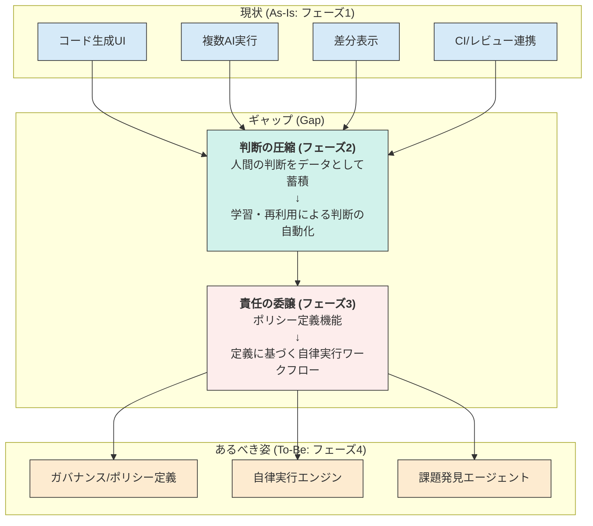

# zloth gen2: 構想とロードマップ

## 1. zlothの思想

### 1.1. コアの問題設定
AIはコードを生成できるが、現実の開発で詰まるのは **賢さ**ではなく **責任** である。
誰が・何を・なぜ信頼して採用したのかが説明できない限り、チームはAI出力を本番に入れられない。

### 1.2. 本質的な価値
zloth は **AIの“不確かな出力”を、チームが“納得して採用できる意思決定”に変換する装置**である。
これは単なるコード生成ツールではなく、**判断・合意形成・監査可能性を備えた意思決定インターフェース**。

### 1.3. 長期ビジョンの軸（自動化ではなく信頼の生成）
zloth の進化は「Human in the Loop → Human out of the Loop」ではない。
本質は **責任の所在を、人 → プロセス（ガバナンス）→ AI に段階的に移譲できる状態を作ること**。
つまり、狙うのは「人間を減らす」ではなく **承認を省略できるほどの合理的な信頼を構築すること**。

---

## 2. 進化のフェーズ

zlothは、AIへの責任移譲を段階的に実現するため、以下の4つのフェーズで進化する。

```mermaid
graph TD
    A[<b>フェーズ1: Decision Visibility</b><br>判断の可視化] --> B[<b>フェーズ2: Decision Compression</b><br>判断の圧縮]
    B --> C[<b>フェーズ3: Delegated Responsibility</b><br>責任の委譲]
    C --> D[<b>フェーズ4: Autonomous Development<br>under Governance</b><br>ガバナンス下での自律開発]

    style A fill:#D6EAF8,stroke:#333,stroke-width:2px
    style B fill:#D1F2EB,stroke:#333,stroke-width:2px
    style C fill:#FDEDEC,stroke:#333,stroke-width:2px
        style D fill:#FDEBD0,stroke:#333,stroke-width:2px
    
        note right of A: 現状のzlothはこのフェーズ
```

- **1) 短期：Decision Visibility（判断の可視化）**
  - AIが実装し、人間が比較・選択する。
  - 選択理由・差分・CI結果・PRレビューを結びつけ、**判断のトレーサビリティ**を作る。
- **2) 中期：Decision Compression（判断の圧縮）**
  - 過去の判断を学習・再利用し、低次の判断を自動化する。
  - 人間は責任者のまま、毎回の認知負荷だけを減らし、**判断を“繰り返し使える形”に圧縮する**。
- **3) 長期：Delegated Responsibility（責任の委譲）**
  - 人間が事前に委譲範囲（ポリシー）を定義する。
  - AIはその範囲内で計画→実装→CI通過までを自動遂行し、**責任を形式化し、委譲可能にする**。
- **4) 理想：Autonomous Development under Governance**
  - AIは自ら課題を発見し改善を継続する。
  - ただし自由に暴れるのではなく、**人間が設計したガバナンスの中で自律する**（自律 = 制約下での最適化）。

---

## 3. 現状(As-Is)・あるべき(To-Be)・ギャップ(Gap)

### 3.1. 現状 (As-Is)
現在のzlothは **フェーズ1: Decision Visibility** の段階にある。
- 複数のAI（Gemini, Claude）によるコード生成
- 生成コードの差分表示(Diff Viewer)
- CI結果やレビューコメントの表示
- 上記を通じ、人間がAIの出力を比較・検討し、採用を判断するための基本的なインターフェースが提供されている。

### 3.2. あるべき姿 (To-Be)
目指すは **フェーズ4: Autonomous Development under Governance**。
- 人間が定義したガバナンス・ポリシーの範囲内で、AIが自律的に開発タスク（課題発見、計画、実装、テスト、改善）を遂行するシステム。

### 3.3. ギャップ (Gap)
現状とあるべき姿の間には、フェーズ2と3に相当する大きなギャップが存在する。


- **ギャップ1: 判断の圧縮 (Decision Compression)**
  - 人間の判断（どのAIの提案を、なぜ、どのように修正して採用したか）がデータとして活用されていない。毎回ゼロから人間が判断する必要があり、認知負荷が高いまま。
- **ギャップ2: 責任の委譲 (Delegated Responsibility)**
  - AIに任せる作業範囲を形式的に定義し、委譲する仕組みが存在しない。AIはあくまで人間の指示待ちであり、自律的にタスクを進められない。

---

## 4. 優先度付きのやるべきこと

ギャップを埋め、進化のフェーズを進めるために、以下のタスクに優先度順で取り組む。

### P0: フェーズ1の完成度向上 (Decision Visibilityの強化)
*目的: 判断の材料を漏れなく提供し、トレーサビリティを確立する。フェーズ2のためのデータ収集基盤を構築する。*
- **[タスク1] 判断の関連付け強化:**
  - UI上で、AIの提案・差分・CI結果・レビューコメント・最終的な採用コード（あるいは手動修正）の繋がりを明確に可視化する。
- **[タスク2] 比較体験の向上:**
  - 複数AIの出力の優劣を判断しやすくするため、並列での差分表示や、コード品質メトリクス（循環的複雑度など）の自動算出・表示機能を実装する。
- **[タスク3] フィードバックデータ収集基盤:**
  - ユーザーの選択・修正アクションを「判断ログ」としてバックエンドに保存する仕組みを構築する。
    - 例: `(RunID, AgentID, ProposalID, status: 'accepted/rejected/modified', modified_code: '...')`

### P1: フェーズ2への着手 (Decision Compressionの実装)
*目的: 蓄積した判断データを活用し、定型的な判断を自動化して認知負荷を削減する。*
- **[タスク1] 判断データストアの設計と実装:**
  - P0-タスク3で収集した判断ログを分析・活用するためのデータベース/データウェアハウスを構築する。
- **[タスク2] 判断パターンの学習と推薦:**
  - 蓄積データに基づき、「このリポジトリではこのAIの性能が良い」「この種のエラー修正は、このパターンが多い」といった傾向を学習する。
  - 学習結果を元に、次にユーザーが選びそうな選択肢をハイライトする、あるいは自動で選択する推薦機能を実装する (RAG / Fine-tuning)。
- **[タスク3] 低次判断の自動適用:**
  - 信頼度の高いパターン（例: linterエラーの自動修正）について、ユーザーの承認なしに自動で適用する（ただし後から確認・ロールバックは可能とする）機能を実験的に導入する。

### P2: フェーズ3の準備 (Delegated Responsibilityの構想)
*目的: 人間がAIに仕事を任せるための「契約」を定義する仕組みを設計する。*
- **[タスク1] ポリシー言語/UIの設計:**
  - 「`./src/components/**` 配下のファイル修正は許可するが、`./package.json` の変更は人間の承認が必須」のようなルールを定義できるYAMLファイルやGUIの仕様を設計する。
- **[タスク2] 自律実行ワークフローのプロトタイピング:**
  - 定義されたポリシーの範囲内で、AIが Plan & Execute モデルでタスク（例: Issueに対応するコードを生成し、テストを実行し、パスしたらPRを作成する）を自律的に進めるためのエージェント・ワークフローを構築する。

### P3: フェーズ4への展望 (Autonomous DevelopmentのR&D)
*目的: AIが自ら仕事を見つけ、改善サイクルを回すための技術的実現性を調査する。*
- **[タスク1] 課題発見エージェントの研究:**
  - コードベースを静的解析してリファクタリング候補を提案したり、`TODO`コメントをタスク化したり、パフォーマンスボトルネックを特定して改善案を出すような、自律的な課題発見機能の技術調査を行う。


---

## 5. 1行の定義

**zloth is a system that turns human judgment into reusable governance for autonomous AI development.**

**日本語：zloth は、人間の判断を“再利用可能なガバナンス”に変換し、AIが自律的に開発を進められる状態を作るシステム。**
