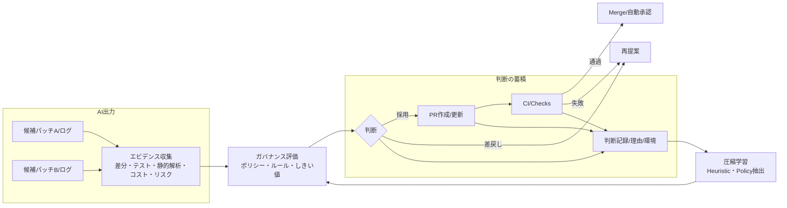
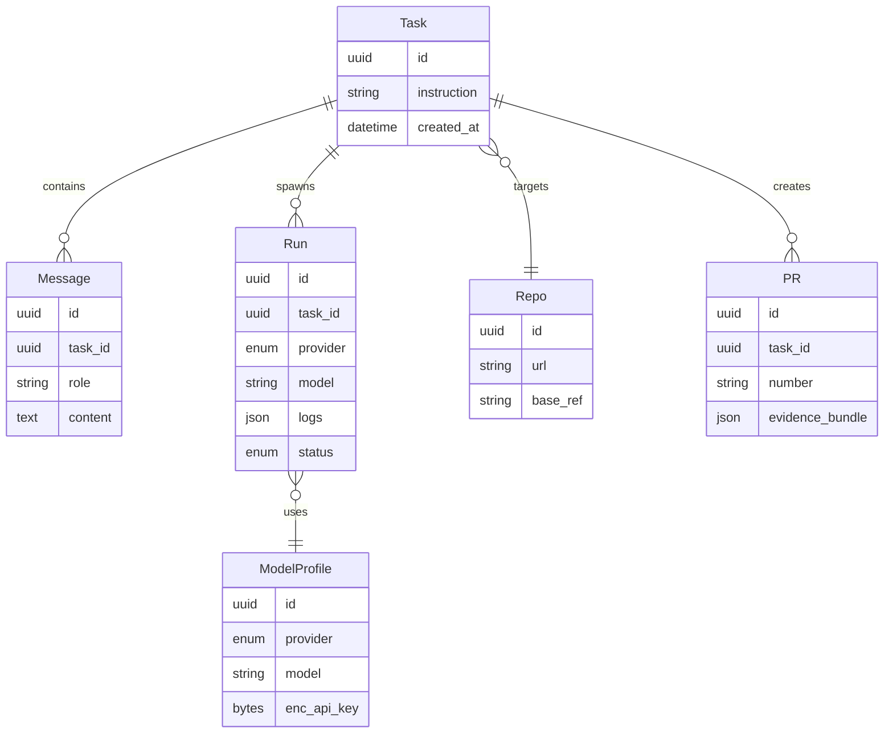
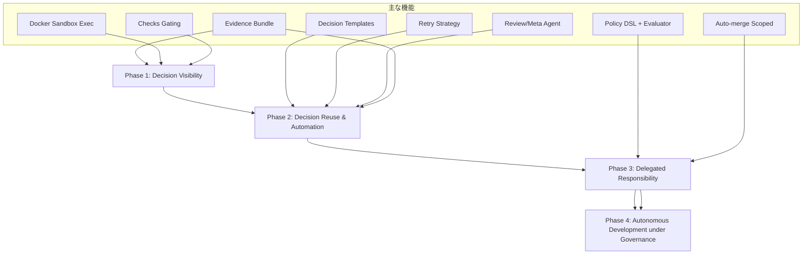

# zloth Gen2：判断ガバナンス設計（2026-02-04 現在）

## 1行の定義
- 英語: zloth is a system that turns human judgment into reusable governance for autonomous AI development.
- 日本語: zloth は、人間の判断を“再利用可能なガバナンス”に変換し、AIが自律的に開発を進められる状態を作るシステム。

## 背景となる思想（要約）
- コア問題: 詰まるのは賢さではなく責任。採用の説明可能性がないと本番投入できない。
- 本質価値: 不確かなAI出力 → 納得可能な意思決定（判断・合意形成・監査可能性）。
- ビジョン軸: Human→Process(ガバナンス)→AI へ段階的に責任を移譲。自律=制約下の最適化。


## 現状（As-Is, 2026-02-04）
- プロダクト基盤
  - マルチモデル並列実行（OpenAI/Anthropic/Google）、パッチ生成エージェント、差分ビューア、Runs/Tasks/PRs の概念とAPI。
  - GitHub App 認証（実装済）。SQLite + aiosqlite。API鍵はFernetで暗号化。単一ユーザー前提。
  - スコープ制限 v0.1: コマンド実行なし、パッチ出力のみ、GitHub連携前提。
  - UI: Next.js 14、チャット駆動でPR作成まで。Runログ/差分は可視化済み。
- 判断ガバナンス面
  - Decision Visibility: 部分的に達成。差分・モデル・Runログ・PRは紐づくが、選択理由の構造化・CI結果の一元トレース・レビューメタ情報の自動集約は未整備。
  - Decision Compression: 過去判断の学習/再利用の仕組みは未導入。
  - Delegated Responsibility: ポリシーに基づく自動承認/自動マージは未実装。Checkベースのゲーティングは構想段階。
- 運用・安全性
  - ワークスペース分離と禁則パスは導入済。コスト/予算管理は未実装。監査ログ/証跡の耐改ざん化は未実装。


## あるべき姿（To-Be, Gen2の目標）
- Decision Visibility（完成度を高める）
  - 代替案比較（モデル/プロンプト別）と採否理由の構造化（エビデンスバンドル）。
  - CI/静的解析/テスト結果/ベンチ/リスク評価をRun→PRに自動集約し、トレーサブルに永続化。
- Decision Reuse & Automation（判断の再利用・定型化）
  - 判断テンプレート化、リトライ戦略の標準化、「この条件なら自動採択」のヒューリスティクス。
  - 過去の採否記録から「再利用可能な判断単位（Policy/Rule/Heuristic）」を抽出。提案や自動ラベリングを行う。
  - ※「学習」はPhase2後半。最初から前面に出すと戦略が重くなる。
- Delegated Responsibility（責任の委譲）
  - ポリシー定義（スコープ・境界・KPI）に従い、計画→実装→検証→PR更新→CI通過→条件付き自動マージまでを自走。
  - 逸脱時は自動停止し、人間にエスカレーション（説明資料付き）。
- Autonomous Development under Governance（理想への布石）
  - **Self-directed improvement within human-defined constraints**
  - 定常的な課題検出（依存脆弱性、リンタ逸脱、パフォーマンス劣化）と改善提案をポリシー枠内で継続実行。


## 図1：判断ガバナンスの流れ



## 図2：主要エンティティ（ER）



## ギャップ（As-Is ↔ To-Be）
- 可視化/トレーサビリティ
  - 現状: 差分/Runログは閲覧可。CI連携と選択理由の構造化は弱い。
  - あるべき: エビデンスバンドル（差分/テスト/静的解析/コスト/リスク/レビューメタ）をPRに自動添付し、恒久参照可能。
- 圧縮/再利用
  - 現状: 過去判断を学習せず毎回ゼロベース。
  - あるべき: 採否特徴量の収集→ルール/ポリシー/ヒューリスティクス化→提案/自動分類。
- 委譲/自動化
  - 現状: 自動マージやポリシー駆動の意思決定は未実装。
  - あるべき: ポリシーDSLと評価器、条件付き自動マージ、逸脱時の安全停止/説明。
- 実行/検証基盤
  - 現状: コマンド実行不可。テスト/Lintは外部CI任せ。
  - あるべき: Dockerサンドボックスで安全に検証を自動実行し、結果を即時エビデンス化。
- 運用/監査
  - 現状: 単一ユーザー、コスト/予算管理なし、監査耐改ざんなし。
  - あるべき: 役割/権限、コスト可視化、監査ログの耐改ざん（ハッシュ/署名）。


## 優先度付きのやること（短→中期）

### P0（Gen2最小完成、v0.2 目安）
- Dockerサンドボックス実行
  - 目的: テスト/lint/型チェック/ベンチを安全実行し、Runごとの結果を収集。
  - 受入: `run -> evidence_bundle -> PR` にCI相当の結果が自動添付。
- エビデンスバンドル設計と永続化
  - スキーマ: diff, tests, lint, mypy, perf, cost, risk, rationale(選択理由)。
  - UI: Run/PR画面で一目比較（候補間並列比較）。
- PRゲーティング（Checks連携）
  - 目的: エビデンスの基準未達は自動ブロック。通過で自動ラベル付与。
  - 受入: GitHub Checks で Pass/Fail と詳細リンクを表示。
- Review/Metaエージェント
  - 目的: 候補パッチのリスク/影響範囲/追加テスト案を自動レビュー。
  - 受入: エビデンスにレビュー要約と推奨度を付与。
- PRコメントトリガー
  - 目的: `rerun`, `update-evidence` などコメントで再実行/更新。

### P1（Decision Reuse & Automation 初期, v0.3 目安）

**Phase 2前半: 再利用・定型化（ML学習なし）**
- 判断テンプレート化
  - 目的: よくある判断パターン（lint修正の採択、型エラー修正の採択など）をテンプレートとして定義・保存。
  - 受入: 「この種の変更は自動採択」「この条件なら差戻し」のヒューリスティクスが動作。
- リトライ戦略の標準化
  - 目的: CI失敗時の再実行戦略を標準化（どのエラーなら即リトライ、どのエラーなら人間にエスカレート）。
  - 受入: 失敗パターン→対処法のマッピングに基づく自動リトライが動作。
- 類似ケース検索
  - 目的: 過去の判断記録をEmbedding化し、類似ケースを検索・提示。
  - 受入: 「過去にこの種の変更はこう判断された」を参考情報として表示。
- 判断記録の構造化
  - 目的: 判断ログを分析・活用するためのデータベースを構築。
  - 受入: `decider_type`（`human` | `policy` | `ai`）を記録し、責任の所在を明確化。

**Phase 2後半: 学習・推薦（MLを活用）**
- 判断記録→特徴量抽出→ヒューリスティクス生成
  - 目的: 過去の採否理由/エビデンスから「再利用可能な判断単位」を作る。
  - 受入: 新規PRで自動推奨/スコアリングを提示。
- ポリシーDSL v1 + 評価器
  - YAML/JSONベースでしきい値/禁止事項/必要エビデンスを定義。
  - 受入: ポリシー不一致時に自動失敗・説明を返す。
- コスト/予算可視化
  - 目的: モデル実行/検証のコスト集計と予算アラート。

### P2（Delegated Responsibility の実用化）
- 条件付き自動マージ
  - 目的: ポリシー満たす微小変更は自動マージ。範囲・影響・リスクを制限。
- 役割/権限（Multi-user）
  - Reviewer/Owner/Operator で許可を分離。
- 監査強化
  - 目的: 判断記録にハッシュ付与/署名、改ざん検出可能化。

### P3（Governance下の自律）
- 定期スキャン→改善キュー化→自動実装（ポリシー境界内）
- 逸脱時の安全停止/説明レポート自動生成


## 成果物/変更点（実装観点の最小差分）
- API/DB
  - `evidence_bundle` を PR/Run に追加（スキーマとDAO）。
  - Checks連携のWebhook/更新エンドポイント。
- エージェント
  - Review/Metaエージェント（静的解析・変更影響・テスト提案）。
  - サンドボックス実行オーケストレーション（テスト/リンタ/mypy/ベンチ）。
- フロントエンド
  - 候補間比較ビュー（エビデンス軸で表形式/差分強調）。
  - ポリシー準拠/逸脱をバッジ表示。


## リスクと緩和
- 偽陰性/偽陽性による過剰ブロック
  - 初期は「警告→人手承認」モードで段階導入。
- サンドボックスのコスト
  - キャッシュ/差分実行/並列制御で抑制。閾値超え時は要承認。
- ポリシー過剰一般化
  - 例外申請/一時免除フローと根拠保存を用意。


## 成功指標（例）
- 人手レビュー時間/PRあたりの平均を30–50%削減。
- 逸脱によるロールバック率の低下。
- 自動承認（条件付き）比率の増加と事故ゼロ。
- エビデンス欠落のPR比率を5%未満に。
- **任意のPRについて「採択理由・比較軸・却下理由・CI結果」を1画面で説明できる。**


## Non-goals（やらないこと）

明確にスコープ外とすることで、戦略の焦点を保つ。

- **モデル訓練は当面しない**: LLMのFine-tuningやRL学習は行わない。既存モデルの活用に集中。
- **完璧な自律開発を最初から目指さない**: 段階的に責任を移譲し、各フェーズで価値を提供する。
- **意思決定の証跡がない自動化はしない**: 全ての自動化には監査可能な記録を残す。
- **汎用的なAIプラットフォームを作らない**: コード開発・PRワークフローに特化する。


## Principles（原則）

zlothの設計・実装における不変の原則。

### No decision without trace
全ての判断（採用・却下・修正）には証跡を残す。理由・エビデンス・決定者を記録し、後から「なぜ？」に即答できる状態を維持する。

### Automation requires governance
自動化は常にガバナンス（ポリシー・制約・監査）とセットで導入する。ガバナンスなき自動化は許容しない。

### Escalate only on violations
正常系はスムーズに進行させ、人間の介入はポリシー違反・異常時のみ。ただしエスカレーション時には説明資料を自動生成。


## 責任移譲の定義

各フェーズにおける責任の所在を明確化する。

| Phase | 責任の所在 | 説明 |
|-------|-----------|------|
| Phase 1: Decision Visibility | **人間** | 人間が全ての判断を行う。ただし証跡が残る。 |
| Phase 2: Decision Reuse & Automation | **人間** | 人間が責任者のまま。判断の再利用で負荷だけ減る。 |
| Phase 3: Delegated Responsibility | **ポリシー** | 人が事前にポリシーとして責任を委譲。AIはポリシー範囲内で自律。 |
| Phase 4: Autonomous under Governance | **ガバナンス + AI** | 制約下でAIが自律。ガバナンスが責任の枠組みを提供。 |

### 責任移譲の記録

DBレベルで責任の所在を記録するため、判断記録に `decider_type` を含める。

```
decider_type: 'human' | 'policy' | 'ai'
```

- `human`: 人間が直接判断
- `policy`: ポリシーに基づく自動判断（人間が事前に委譲）
- `ai`: AIによる自律判断（ガバナンス制約下）


## Decision の粒度と種類

判断を構造化するため、以下の3種類に分類する。

| Decision Type | 説明 | 例 |
|---------------|------|-----|
| `selection_decision` | どのRunを採択したか | Run A を採択、Run B/C を却下 |
| `promotion_decision` | PR化するか（どの範囲まで） | Run A の変更をPR化、一部ファイルは除外 |
| `merge_decision` | マージするか（自動/人手） | CI通過 + レビューOK → 自動マージ |

この分類により、各判断の責任者（`decider_type`）を明確に記録できる。


## 付録：段階的ロードマップ対応表


