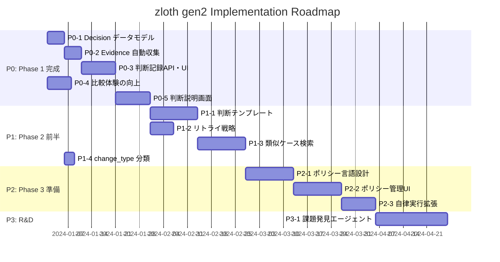

# zloth gen2 Implementation Roadmap

本ドキュメントは `docs/zloth_gen2.md` のビジョンを実現するための実装ロードマップです。
現在のコードベースを分析し、優先度付きでやるべきことを整理しています。

---

## 1. 現状分析サマリー

### 1.1. 実装済み機能

現在のzlothは **Phase 1: Decision Visibility** の基盤が整っている状態です。

| カテゴリ | 実装済み機能 |
|---------|-------------|
| **リポジトリ管理** | Clone, Branch選択, Workspace分離 |
| **タスク管理** | 会話ドリブン開発, チャットUI, Kanbanボード |
| **並列実行** | Claude Code, Codex, Gemini, PatchAgent対応 |
| **PR管理** | 作成, 更新, AI生成タイトル/説明, マージ |
| **コードレビュー** | AI レビュー, フィードバック, 修正指示生成 |
| **Agentic実行** | Semi-Auto/Full-Autoモード, フェーズ管理, イテレーション制限 |
| **CI連携** | GitHub Actions ポーリング, ステータス追跡 |
| **メトリクス** | PR/Run/CI/Review統計, リアルタイム活動 |

### 1.2. 未実装（Gen2で必要な機能）

| カテゴリ | 未実装機能 | 対応Phase |
|---------|-----------|-----------|
| **判断記録** | Decision エンティティ, Evidence記録 | P0 |
| **比較体験** | 並列差分表示, メトリクス自動算出 | P0 |
| **フィードバック収集** | 採用/却下/修正の判断ログ保存 | P0 |
| **判断説明画面** | PRごとの判断根拠ダッシュボード | P0 |
| **判断テンプレート** | ルールベース自動採択/却下 | P1 |
| **リトライ戦略** | エラーパターン→対処マッピング | P1 |
| **類似ケース検索** | Embedding検索 | P1 |
| **ポリシー定義** | YAML/GUIでの委譲範囲定義 | P2 |
| **自律実行** | ポリシー内でのPlan & Execute | P2 |

---

## 2. 優先度別タスク一覧

### P0: Phase 1 完成（Decision Visibility の強化）

**目標**: Trust Ladder L2 達成 - 任意のPRについて「採択理由・Evidence・比較軸・却下理由/根拠」を1画面で説明できる状態

#### P0-1: Decision データモデルの実装 [Backend]

**概要**: 判断を構造化して記録するためのデータモデルを追加

**タスク**:
1. `apps/api/src/zloth_api/domain/models.py` に Decision 関連モデル追加
   - `SelectionDecision`: Run選択の判断記録
   - `PromotionDecision`: PR化の判断記録
   - `MergeDecision`: マージの判断記録
   - `Evidence`: 機械的に検証可能な根拠
   - `Alternative`: 却下された選択肢

2. `apps/api/src/zloth_api/domain/enums.py` に追加
   - `DecisionType`: `selection`, `promotion`, `merge`
   - `DeciderType`: `human`, `policy`, `ai`
   - `OutcomeStatus`: `good`, `bad`, `unknown`
   - `RiskLevel`: `low`, `medium`, `high`

3. `apps/api/src/zloth_api/storage/schema.sql` にテーブル追加
   ```sql
   CREATE TABLE decisions (
       id TEXT PRIMARY KEY,
       task_id TEXT NOT NULL,
       decision_type TEXT NOT NULL,  -- selection/promotion/merge
       decider_type TEXT NOT NULL,   -- human/policy/ai
       reason TEXT NOT NULL,
       evidence JSON NOT NULL,
       alternatives JSON,
       outcome TEXT,                  -- good/bad/unknown
       outcome_reason TEXT,
       outcome_refs JSON,
       risk_level TEXT,
       risk_level_reason TEXT,
       scope JSON,                    -- promotion_decision用
       created_at TEXT NOT NULL,
       FOREIGN KEY (task_id) REFERENCES tasks(id)
   );
   ```

4. `apps/api/src/zloth_api/storage/dao.py` に `DecisionDAO` 追加

**依存関係**: なし
**見積もり**: 中規模

---

#### P0-2: Evidence 自動収集の実装 [Backend]

**概要**: CI結果・差分規模・レビュー情報を自動収集してEvidence構造に格納

**タスク**:
1. `apps/api/src/zloth_api/services/evidence_service.py` 新規作成
   - `collect_ci_evidence()`: CI結果を収集
   - `collect_metrics_evidence()`: 変更行数・ファイル数を算出
   - `collect_review_evidence()`: レビュー承認数・変更要求数を収集
   - `build_evidence()`: 上記を統合してEvidence構造を生成

2. `apps/api/src/zloth_api/services/risk_service.py` 新規作成
   - `calculate_risk_level()`: gen2.mdのルール(R001-R007)に基づくリスクレベル算出
   - 変更ファイルパスを分析し、該当ルールを適用

3. `PRService`, `RunService` にEvidence収集を統合

**依存関係**: P0-1
**見積もり**: 中規模

---

#### P0-3: 判断記録API・UIの実装 [Full-stack]

**概要**: ユーザーが採用/却下/修正を行う際に判断を記録

**タスク**:
1. **Backend API** (`apps/api/src/zloth_api/routes/decisions.py` 新規作成)
   - `POST /v1/tasks/{id}/decisions`: 判断を記録
   - `GET /v1/tasks/{id}/decisions`: 判断一覧取得
   - `GET /v1/decisions/{id}`: 判断詳細取得
   - `PATCH /v1/decisions/{id}/outcome`: Outcome更新（Phase 2準備）

2. **Frontend** (`apps/web/src/components/`)
   - Run選択時に理由入力モーダル表示
   - PR化時に除外ファイル選択と理由入力
   - マージ時に最終確認と承認理由入力

3. `apps/web/src/lib/api.ts` に `decisionsApi` 追加

**依存関係**: P0-1, P0-2
**見積もり**: 大規模

---

#### P0-4: 比較体験の向上 [Frontend]

**概要**: 複数Runの出力を比較しやすくするUI改善

**タスク**:
1. `apps/web/src/components/RunComparisonView.tsx` 新規作成
   - 2-3個のRunを横並びで差分表示
   - メトリクス（変更行数、ファイル数）を並列表示
   - CI結果をバッジで表示

2. `apps/web/src/components/RunDetailPanel.tsx` 拡張
   - メトリクスサマリー表示追加
   - 「比較モード」ボタン追加

3. 将来拡張用: 静的解析メトリクス（複雑度等）表示枠を確保（P1で実装）

**依存関係**: なし
**見積もり**: 中規模

---

#### P0-5: 判断説明画面（Decision Dashboard）の実装 [Frontend]

**概要**: PRごとに「なぜこの変更が採用されたか」を即座に確認できるダッシュボード

**タスク**:
1. `apps/web/src/app/tasks/[taskId]/decisions/page.tsx` 新規作成
   - タイムライン形式で判断履歴を表示
   - 各判断の理由・Evidence・比較軸を展開表示
   - 却下されたRunとその理由を表示

2. `apps/web/src/components/DecisionCard.tsx` 新規作成
   - Decision Type に応じた表示切り替え
   - Evidence の視覚化（CI結果、メトリクス、レビュー）
   - Alternativesの折りたたみ表示

3. `apps/web/src/components/EvidenceDisplay.tsx` 新規作成
   - CI結果表示（passed/failed/pending）
   - メトリクスバー表示
   - レビュー承認状況表示

**依存関係**: P0-3
**見積もり**: 大規模

---

### P1: Phase 2 前半（Decision Reuse & Automation の基盤）

**目標**: Trust Ladder L3 達成 - 同条件なら同判断が導かれる再現可能な状態

#### P1-1: 判断テンプレート機能 [Full-stack]

**概要**: よくある判断パターンをテンプレート化し、ヒューリスティクス適用

**タスク**:
1. **データモデル** (`domain/models.py`)
   - `DecisionTemplate`: 条件と推奨アクションのペア
   - `TemplateCondition`: 条件定義（ファイルパターン、CIステータス等）

2. **Backend** (`services/template_service.py` 新規作成)
   - `match_templates()`: 現在の状況にマッチするテンプレート検索
   - `apply_template()`: テンプレートに基づく推奨アクション生成
   - 組み込みテンプレート: lint修正、型エラー修正、ドキュメントのみ変更

3. **Frontend** (`components/TemplateManager.tsx`)
   - テンプレート一覧・作成・編集UI
   - マッチしたテンプレートの推奨表示

**依存関係**: P0完了
**見積もり**: 大規模

---

#### P1-2: リトライ戦略の標準化 [Backend]

**概要**: CI失敗時の再実行戦略を標準化

**タスク**:
1. **データモデル**
   - `RetryStrategy`: エラーパターン→対処法マッピング
   - `ErrorPattern`: エラー分類（lint, test, build, type等）

2. **Backend** (`services/retry_service.py` 新規作成)
   - `classify_error()`: CIログからエラーパターン分類
   - `get_retry_strategy()`: エラーに応じたリトライ戦略取得
   - `should_escalate()`: 人間にエスカレートすべきか判定

3. `AgenticOrchestrator` との統合
   - CI失敗時に自動でリトライ戦略適用
   - エスカレーション判定の改善

**依存関係**: P0完了
**見積もり**: 中規模

---

#### P1-3: 類似ケース検索（Embedding） [Backend]

**概要**: 過去の判断記録をEmbedding化し、類似ケースを検索

**タスク**:
1. **Embedding生成** (`services/embedding_service.py` 新規作成)
   - `generate_decision_embedding()`: 判断のEmbedding生成
   - LLM APIを利用（OpenAI/Anthropic）

2. **ベクトル検索** (`storage/vector_store.py` 新規作成)
   - SQLite + 拡張 or 軽量ベクトルDB（ChromaDB/LanceDB）
   - `search_similar_decisions()`: 類似判断検索

3. **UI統合**
   - 判断時に「過去の類似ケース」をサイドパネル表示
   - 類似度スコアと過去の判断結果を表示

**依存関係**: P0完了
**見積もり**: 大規模

---

#### P1-4: change_type 自動分類 [Backend]

**概要**: 変更タイプ（feat/fix/refactor等）を自動分類し、再現性を向上

**タスク**:
1. `services/change_classifier.py` 新規作成
   - `classify_by_commit_convention()`: Conventional Commitsから抽出
   - `classify_by_heuristic()`: ファイルパターンから推定
   - `classify_by_pr_title()`: PRタイトルから抽出

2. Decision記録に `change_type` と `change_type_source` を追加

**依存関係**: P0-1
**見積もり**: 小規模

---

### P2: Phase 3 準備（Delegated Responsibility の構想）

**目標**: Trust Ladder L4 への準備 - ポリシー定義と自律実行ワークフローの設計

#### P2-1: ポリシー言語の設計 [設計・Backend]

**概要**: 委譲範囲を定義するポリシー言語の設計と実装

**タスク**:
1. **ポリシースキーマ設計** (`docs/policy_schema.md`)
   ```yaml
   version: 1
   rules:
     - scope: "src/components/**"
       allow: [edit, create]
       auto_approve: false
     - scope: "package.json"
       allow: []  # 変更禁止
       require_human_approval: true
     - scope: "docs/**"
       allow: [edit, create]
       auto_approve: true  # 自動承認
   ```

2. **データモデル** (`domain/models.py`)
   - `Policy`: ポリシー定義
   - `PolicyRule`: 個別ルール
   - `PolicyScope`: スコープ定義

3. **Backend** (`services/policy_service.py` 新規作成)
   - `load_policy()`: YAMLからポリシー読み込み
   - `evaluate_changes()`: 変更がポリシーに適合するか評価
   - `get_required_approvals()`: 必要な承認を取得

**依存関係**: P1完了
**見積もり**: 大規模

---

#### P2-2: ポリシー管理UI [Frontend]

**概要**: ポリシーをGUIで定義・管理できるUI

**タスク**:
1. `apps/web/src/app/settings/policies/page.tsx` 新規作成
   - ポリシー一覧表示
   - ルール追加・編集・削除
   - スコープのglob入力補助
   - ポリシーのYAMLエクスポート/インポート

2. `apps/web/src/components/PolicyEditor.tsx`
   - ビジュアルルールエディタ
   - リアルタイムバリデーション

**依存関係**: P2-1
**見積もり**: 大規模

---

#### P2-3: 自律実行ワークフローの拡張 [Backend]

**概要**: ポリシーに基づく自律実行の拡張

**タスク**:
1. `AgenticOrchestrator` の拡張
   - ポリシー評価をフェーズ遷移に組み込み
   - ポリシー違反時のエスカレーション
   - 自動承認条件の評価

2. 監査ログの強化
   - ポリシー適用結果の記録
   - 自動判断の根拠記録

**依存関係**: P2-1
**見積もり**: 中規模

---

### P3: Phase 4 展望（R&D）

#### P3-1: 課題発見エージェントの研究 [R&D]

**概要**: AIが自ら課題を発見し改善を提案する機能の技術調査

**タスク**:
1. 技術調査
   - 静的解析ツール連携（SonarQube, CodeClimate等）
   - TODOコメント検出と自動タスク化
   - パフォーマンスボトルネック検出

2. プロトタイプ実装
   - コードベーススキャン機能
   - 改善提案の自動生成
   - 優先度付けアルゴリズム

**依存関係**: P2完了
**見積もり**: 研究フェーズ

---

## 3. 実装順序とマイルストーン



---

## 4. 技術的考慮事項

### 4.1. データベース設計

**新規テーブル**:
- `decisions`: 判断記録
- `decision_templates`: 判断テンプレート
- `retry_strategies`: リトライ戦略
- `policies`: ポリシー定義
- `policy_rules`: ポリシールール
- `decision_embeddings`: Embedding格納（または外部ベクトルDB）

**インデックス戦略**:
- `decisions(task_id, created_at)`: タスク別判断履歴
- `decisions(decision_type, decider_type)`: 統計分析用
- `decision_templates(is_active)`: アクティブテンプレート検索

### 4.2. API設計原則

- 既存の `/v1/` 名前空間を継続
- Decision関連は `/v1/tasks/{id}/decisions` 配下
- ポリシー関連は `/v1/policies` 配下
- 後方互換性を維持

### 4.3. フロントエンド設計

- 既存のコンポーネント構造を踏襲
- 新規ページは App Router のルーティングに従う
- 共通UIコンポーネントは `components/ui/` に追加
- 状態管理は既存パターン（React Query + ローカルstate）を継続

### 4.4. セキュリティ考慮

- ポリシー定義の改ざん防止
- 判断記録の監査ログ化（削除不可）
- Embedding生成時のデータ漏洩防止

---

## 5. 成功指標（KPI）

### P0 完了時点

| 指標 | 目標 |
|------|------|
| Decision記録率 | 100%（全てのRun選択/PR化/マージに記録） |
| Evidence付与率 | 100%（全Decisionに最小Evidence） |
| 判断説明画面アクセス | PRごとに1画面で判断根拠確認可能 |

### P1 完了時点

| 指標 | 目標 |
|------|------|
| テンプレートマッチ率 | 30%以上の判断がテンプレートにマッチ |
| 自動推奨採択率 | 推奨表示された判断の50%以上が採用 |
| 類似ケース表示率 | 80%以上の判断で類似ケースを表示 |

### P2 完了時点

| 指標 | 目標 |
|------|------|
| ポリシー定義率 | アクティブリポジトリの50%以上 |
| 自動承認率 | ポリシー適合変更の30%以上 |
| エスカレーション精度 | 誤エスカレート率5%以下 |

---

## 6. リスクと対策

| リスク | 影響 | 対策 |
|--------|------|------|
| Evidence収集の複雑化 | 実装遅延 | 最小限のCore Evidence Keysから開始 |
| Embedding検索の精度 | 類似ケースの有用性低下 | 段階的なチューニング、フィードバック収集 |
| ポリシー言語の複雑化 | 学習コスト増大 | シンプルなYAML構文、GUIエディタ優先 |
| 自動判断への過信 | 品質低下 | 全自動判断に監査ログ必須、ロールバック機能 |

---

## 7. 参照ドキュメント

- `docs/zloth_gen2.md`: ビジョンと詳細設計
- `CLAUDE.md`: 開発コンテキスト
- `apps/api/src/zloth_api/storage/schema.sql`: 現行DBスキーマ
- `apps/api/src/zloth_api/domain/models.py`: 現行ドメインモデル
